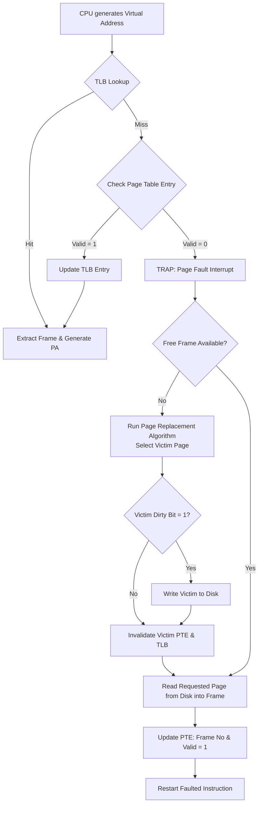

> [!definition] Demand Paging
> In demand paging, pages are brought into physical main memory only when they are referenced (demanded) by the CPU during execution[cite: 1, 2].
> * **Pure Demand Paging**: Execution starts with zero pages of the process in main memory; all pages reside initially on disk[cite: 2].
> * Even if only a single page frame of memory is allocated, execution can proceed, bringing pages on demand[cite: 1].

> [!definition] Page Fault Interrupt
> When the CPU generates an address for a page that is marked invalid or absent from physical main memory, the hardware MMU triggers a special internal hardware trap/interrupt called a **Page Fault Interrupt**[cite: 2, 6].

> [!theorem] Complete Page Fault Handling Flow
> When a virtual address referencing an unmapped page is issued:
> 1. **Virtual Address Inspection**: CPU generates a virtual address $(\text{Page Number } p, \text{Offset } d)$[cite: 2, 6].
> 2. **Page Table Lookup**: The MMU checks the corresponding Page Table Entry (PTE). The valid/invalid bit is set to $0$ (Invalid/Not Present)[cite: 1, 2, 6].
> 3. **Trap to OS**: MMU issues a page fault interrupt, shifting control to the OS page fault handler routine[cite: 2, 6].
> 4. **Free Frame Check & Allocation**:
>    * If a free frame exists in physical RAM, allocate it[cite: 3].
>    * If no free frame exists, a **Page Replacement Algorithm** selects a victim page[cite: 3, 6].
> 5. **Dirty Bit Evaluation**: If the victim page's dirty (modified) flag is $1$ (True), write it back to secondary storage (disk); if $0$ (False), overwrite without disk write[cite: 3, 6].
> 6. **Invalidate Old Entry**: Mark the victim page's PTE as invalid and flush any matching TLB entries[cite: 3, 6].
> 7. **Disk I/O Transfer**: Bring the required page from disk into the allocated physical frame[cite: 2, 3, 6].
> 8. **Update PTE**: Write the new frame number into the PTE, set valid bit to $1$, and update TLB[cite: 1, 3, 6].
> 9. **Restart Instruction**: Return control to the user process and restart the faulting instruction from scratch[cite: 2, 6].

> [!question] GATE CSE 1995: Pure Demand Paging Address Trace
> An address sequence generated by tracing execution in pure demand paging with $100\text{ records/page}$ and $1$ free main memory frame is given as:
> $$0100,\; 0200,\; 0430,\; 0499,\; 0510,\; 0530,\; 0560,\; 0120,\; 0220,\; 0240,\; 0120$$[cite: 2]
> Determine the number of page faults[cite: 2].
> 
> **Step-by-step Solution**:
> * $\text{Page Number} = \lfloor \frac{\text{Record Address}}{100} \rfloor$[cite: 2].
> * Page $1$ maps records $[0100, 0199]$[cite: 2].
> * Page $2$ maps records $[0200, 0299]$[cite: 2].
> * Page $4$ maps records $[0400, 0499]$[cite: 2].
> * Page $5$ maps records $[0500, 0599]$[cite: 2].
> 
> Trace with $1$ frame (each new page reference replaces the previous resident page)[cite: 2]:
> 1. Address $0100 \implies \text{Page } 1 \implies$ **Page Fault (1)** (Loads Page 1: records 100–199)[cite: 2]
> 2. Address $0200 \implies \text{Page } 2 \implies$ **Page Fault (2)** (Replaces with Page 2)[cite: 2]
> 3. Address $0430 \implies \text{Page } 4 \implies$ **Page Fault (3)** (Replaces with Page 4)[cite: 2]
> 4. Address $0499 \implies \text{Page } 4 \implies$ **Hit**[cite: 2]
> 5. Address $0510 \implies \text{Page } 5 \implies$ **Page Fault (4)** (Replaces with Page 5)[cite: 2]
> 6. Address $0530 \implies \text{Page } 5 \implies$ **Hit**[cite: 2]
> 7. Address $0560 \implies \text{Page } 5 \implies$ **Hit**[cite: 2]
> 8. Address $0120 \implies \text{Page } 1 \implies$ **Page Fault (5)** (Replaces with Page 1)[cite: 2]
> 9. Address $0220 \implies \text{Page } 2 \implies$ **Page Fault (6)** (Replaces with Page 2)[cite: 2]
> 10. Address $0240 \implies \text{Page } 2 \implies$ **Hit**[cite: 2]
> 11. Address $0120 \implies \text{Page } 1 \implies$ **Page Fault (7)** (Replaces with Page 1)[cite: 2]
> 
> Total Page Faults $= \mathbf{7}$[cite: 2].

> [!question] GATE IT 2007: Pure Demand Paging with Byte Spanning
> Page size $= 100\text{ bytes/page}$[cite: 2]. Pure demand paging with $1$ memory frame[cite: 2].
> When address $x$ causes a page fault, bytes from $x$ to $x + 99$ are loaded into memory[cite: 2].
> Address sequence:
> $$0100,\; 0200,\; 0430,\; 0499,\; 0510,\; 0530,\; 0560,\; 0120,\; 0220,\; 0240,\; 0260,\; 0320,\; 0410$$[cite: 2]
> Calculate the total number of page faults[cite: 2].
> 
> **Step-by-step Solution**:
> 12. $0100 \implies$ **PF (1)** $\implies$ Frame holds $[0100, 0199]$[cite: 2].
> 13. $0200 \implies$ **PF (2)** $\implies$ Frame holds $[0200, 0299]$[cite: 2].
> 14. $0430 \implies$ **PF (3)** $\implies$ Frame holds $[0430, 0529]$[cite: 2].
> 15. $0499 \implies$ **Hit** (Inside $[0430, 0529]$)[cite: 2].
> 16. $0510 \implies$ **Hit** (Inside $[0430, 0529]$)[cite: 2].
> 17. $0530 \implies$ **PF (4)** $\implies$ Frame holds $[0530, 0629]$[cite: 2].
> 18. $0560 \implies$ **Hit** (Inside $[0530, 0629]$)[cite: 2].
> 19. $0120 \implies$ **PF (5)** $\implies$ Frame holds $[0120, 0219]$[cite: 2].
> 20. $0220 \implies$ **PF (6)** $\implies$ Frame holds $[0220, 0319]$[cite: 2].
> 21. $0240 \implies$ **Hit** (Inside $[0220, 0319]$)[cite: 2].
> 22. $0260 \implies$ **Hit** (Inside $[0220, 0319]$)[cite: 2].
> 23. $0320 \implies$ **PF (7)** $\implies$ Frame holds $[0320, 0419]$[cite: 2].
> 24. $0410 \implies$ **Hit** (Inside $[0320, 0419]$)[cite: 2].
> 
> Total Page Faults $= \mathbf{7}$[cite: 2].
