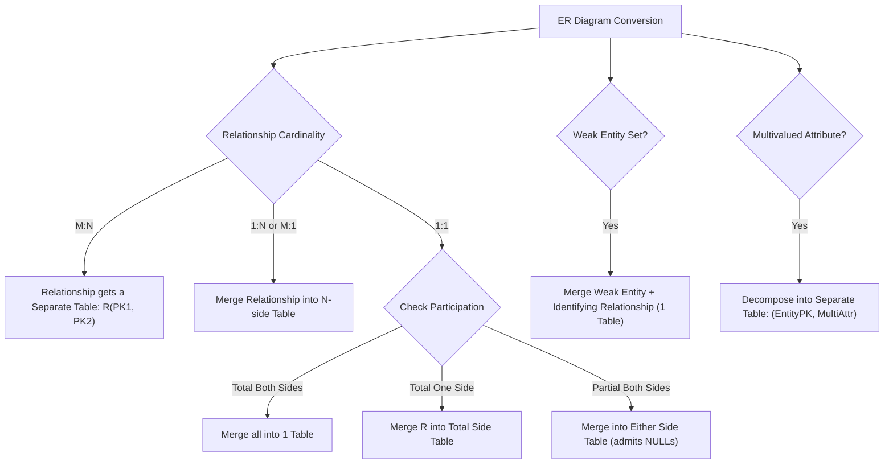

## 1. What is an ER Diagram?

An **Entity-Relationship (ER) Diagram** is a conceptual visual blueprint of a database before writing any SQL code. It maps business rules, real-world objects, and their connections.

* **ER Diagram:** The architectural floor plan sketch on paper.
* **Relational Database:** The actual physical walls and doors implemented in SQL tables.

### ER Concepts vs. Relational Concepts

| ER Diagram Concept (Drawing) | Relational Database Concept (Implementation) | Example |
| :--- | :--- | :--- |
| **Entity** | **Table / Relation** | `Student`, `Course` |
| **Entity Instance** | **Row / Tuple** | `(S1, 'Alice')` |
| **Attribute** | **Column / Field** | `StudentID`, `Name` |
| **Primary Key** | **Primary Key Constraint** | `StudentID PRIMARY KEY` |
| **Relationship** | **Foreign Key / Junction Table** | Links between tables |

---

## 2. ER Symbols & Visual Cheatsheet

| Symbol / Shape | ER Component | Relational Meaning | Intuition / Memory Trick |
| :--- | :--- | :--- | :--- |
| **Single Rectangle** | Entity | Independent table | **RE**ctangle = **RE**al thing / building. Concrete structure.[cite: 1, 2] |
| **Double Rectangle** | Weak Entity | Table borrowing PK from owner | Double border = Needs support; leans on a strong parent.[cite: 1, 2] |
| **Single Diamond** | Relationship | Foreign key or Junction table | Diamond ring = Spark / marriage connecting two entities.[cite: 1, 2] |
| **Double Diamond** | Identifying Rel | Collapses into Weak Entity table | Double diamond = Lock-and-key bond to pass identity.[cite: 1, 2] |
| **Single Oval** | Attribute | Table column | Round bubble attached to an entity.[cite: 1, 2] |
| **Double Oval** | Multivalued Attr | Separate decomposed table | Double border = A bunch of items/list in one place.[cite: 1, 2] |
| **Underlined Oval** | Key Attribute | Primary Key (`PK`) | Underline = The master key that opens everything.[cite: 1, 2] |
| **Dashed Oval** | Derived Attribute | Computed dynamically (no column) | Dashed outline = Temporary; compute dynamically over time (e.g., Age from DOB).[cite: 1, 2] |

---

## 3. Relational Schema Reduction Rules & Examples

**Relational Schema Reduction** is the formal translation of an ER diagram into a minimal set of normalized tables (3NF/BCNF) while preserving entity integrity and foreign key constraints[cite: 1, 2].

### 1. Many-to-Many ($M:N$) Relationships
* **Rule:** Always requires **3 tables** (2 entity tables + 1 relationship/junction table)[cite: 2].
* **Intuition:** A student cannot store a list of course IDs in a single cell (violates 1NF atomic values), and repeating student rows per course destroys the student's unique primary key.
* **Schema:**
  * $\text{Student}(\underline{\text{StudentID}}, \text{Name})$[cite: 2]
  * $\text{Course}(\underline{\text{CourseID}}, \text{Title})$[cite: 2]
  * $\text{Enrollment}(\underline{\text{StudentID}, \text{CourseID}}, \text{EnrollDate})$[cite: 2]

#### Tables Example:

##### Table 1: `Student`
| StudentID (PK) | Name |
| :--- | :--- |
| **S1** | Alice |
| **S2** | Bob |

##### Table 2: `Course`
| CourseID (PK) | Title |
| :--- | :--- |
| **C101** | Databases |
| **C102** | Algorithms |

##### Table 3: `Enrollment` (Junction Table)
| StudentID (FK) | CourseID (FK) | EnrollDate |
| :--- | :--- | :--- |
| **S1** | **C101** | 2026-08-01 |
| **S1** | **C102** | 2026-08-02 |
| **S2** | **C101** | 2026-08-01 |
| **S2** | **C102** | 2026-08-03 |

---

### 2. Many-to-One ($M:1$) or One-to-Many ($1:N$) Relationships
* **Rule:** Merge the relationship into the entity on the **$N$-side (Many side)** by placing the $1$-side's primary key as a Foreign Key (`FK`)[cite: 2].
* **Intuition:** Every employee has at most one department, so their row holds exactly one clean foreign key value. Putting employee IDs into the department table would require comma-separated lists or duplicate department rows.

#### Case A: Total Participation on the $N$-Side (No NULLs)
* **Rule:** Foreign key is marked `NOT NULL`[cite: 1, 2].
* **Schema:**
  * $\text{Department}(\underline{\text{DeptID}}, \text{DeptName})$[cite: 2]
  * $\text{Employee}(\underline{\text{EmpID}}, \text{EmpName}, \text{DeptID}_{\text{FK \textbf{NOT NULL}}})$[cite: 2]

##### Table: `Department`
| DeptID (PK) | DeptName |
| :--- | :--- |
| **D101** | Engineering |
| **D102** | Marketing |

##### Table: `Employee`
| EmpID (PK) | EmpName | DeptID (FK, NOT NULL) |
| :--- | :--- | :--- |
| **E1** | Alice | D101 |
| **E2** | Bob | D101 |
| **E3** | Charlie | D102 |

#### Case B: Partial Participation on the $N$-Side (Nullable)
* **Rule:** Foreign key permits `NULL` values for unassigned records[cite: 1, 2].
* **Schema:**
  * $\text{Employee}(\underline{\text{EmpID}}, \text{EmpName}, \text{DeptID}_{\text{FK \textbf{NULL}}})$[cite: 2]

##### Table: `Employee` (Partial Participation)
| EmpID (PK) | EmpName | DeptID (FK, Nullable) |
| :--- | :--- | :--- |
| **E1** | Alice | D101 |
| **E2** | Dave | **NULL** |

---

### 3. One-to-One ($1:1$) Relationships

#### Case A: Total Participation on Both Sides
* **Rule:** Merge everything into **1 single table**[cite: 2].
* **Schema:** $\text{CitizenPassport}(\underline{\text{CitizenID}}, \text{PassportNo}, \text{Name}, \text{IssueDate})$[cite: 2]

##### Table: `CitizenPassport`
| CitizenID (PK) | PassportNo (Unique) | Name | IssueDate |
| :--- | :--- | :--- | :--- |
| **C101** | P901 | Alice | 2024-01-15 |
| **C102** | P902 | Bob | 2025-06-20 |

#### Case B: Total Participation on One Side Only
* **Rule:** Merge relationship into the table with **total participation** to prevent `NULL` foreign keys[cite: 1, 2].
* **Schema:**
  * $\text{Citizen}(\underline{\text{CitizenID}}, \text{Name})$[cite: 2]
  * $\text{Passport}(\underline{\text{PassportNo}}, \text{IssueDate}, \text{CitizenID}_{\text{FK \textbf{NOT NULL}}})$[cite: 2]

##### Table 1: `Citizen`
| CitizenID (PK) | Name |
| :--- | :--- |
| **C101** | Alice |
| **C102** | Bob |
| **C103** | Charlie |

##### Table 2: `Passport`
| PassportNo (PK) | IssueDate | CitizenID (FK, NOT NULL, Unique) |
| :--- | :--- | :--- |
| **P901** | 2024-01-15 | C101 |
| **P902** | 2025-06-20 | C102 |

#### Case C: Partial Participation on Both Sides
* **Rule:** Merge into either table admitting `NULL`s, or maintain 3 separate tables if `NULL` constraints are strictly forbidden[cite: 2].

##### Table: `Department` (Chair Foreign Key Admits NULL)
| DeptID (PK) | DeptName | ChairEmpID (FK, Unique, Nullable) |
| :--- | :--- | :--- |
| **D1** | Computer Science | E101 |
| **D2** | Physics | **NULL** |

---

### 4. Weak Entity Sets
* **Rule:** A weak entity lacks its own primary key and depends on an owner entity[cite: 2]. The weak entity and its identifying relationship are merged into **1 table** with a composite primary key consisting of: `(OwnerPK, PartialKey)`[cite: 1, 2].
* **Schema:**
  * $\text{Employee}(\underline{\text{EmpID}}, \text{EmpName})$[cite: 2]
  * $\text{Dependent}(\underline{\text{EmpID}_{\text{FK}}, \text{DependentName}}, \text{Relationship}, \text{BirthDate})$[cite: 1, 2]

##### Table 1: Strong Entity (`Employee`)
| EmpID (PK) | EmpName |
| :--- | :--- |
| **E1** | Alice |
| **E2** | Bob |

##### Table 2: Weak Entity (`Dependent`)
| EmpID (FK) | DependentName | Relationship | BirthDate |
| :--- | :--- | :--- | :--- |
| **E1** | **Leo** | Son | 2018-03-12 |
| **E1** | **Mia** | Daughter | 2020-07-09 |
| **E2** | **Leo** | Son | 2019-11-25 |

---

### 5. Multivalued Attributes
* **Rule:** Relational attributes must be atomic (1NF)[cite: 1, 2]. A multivalued attribute cannot remain in the parent table; it must be decomposed into its own separate table[cite: 1, 2].
* **Schema:**
  * $\text{Employee}(\underline{\text{EmpID}}, \text{Name})$[cite: 1, 2]
  * $\text{EmployeePhone}(\underline{\text{EmpID}_{\text{FK}}, \text{PhoneNumber}})$[cite: 1, 2]

##### Table 1: `Employee`
| EmpID (PK) | Name |
| :--- | :--- |
| **E1** | Alice |
| **E2** | Bob |

##### Table 2: `EmployeePhone`
| EmpID (FK) | PhoneNumber |
| :--- | :--- |
| **E1** | 555-0101 |
| **E1** | 555-0102 |
| **E2** | 555-0201 |

---

## 4. Decision Logic Flow

