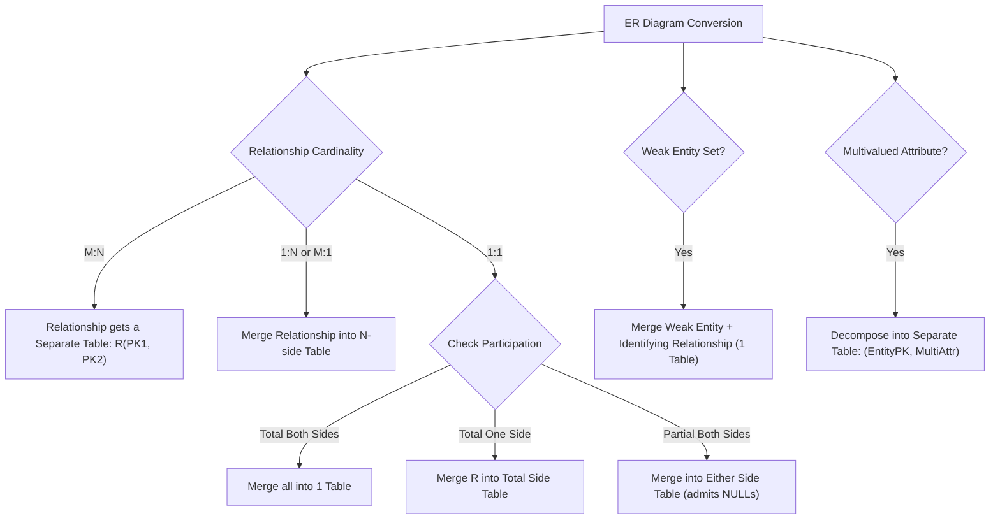

> [!definition]
> **Relational Schema Reduction** is the formal process of translating an Entity-Relationship (ER) diagram into a minimal set of relational tables satisfying normalization requirements (typically 3NF/BCNF) while preserving structural semantics, entity integrity, and foreign key referential integrity constraints[cite: 1, 2].

> [!theorem]
> **Table Minimization and Cardinality Mapping Rules:**
> 1. **Many-to-Many ($M:N$):** Requires a separate relation for the relationship set[cite: 2]. Given entities $E_1(\underline{A})$ and $E_2(\underline{B})$ with relationship $R$, the schema requires 3 tables: $E_1(\underline{A})$, $E_2(\underline{B})$, and $R(\underline{A, B})$[cite: 2].
> 2. **Many-to-One ($M:1$) or One-to-Many ($1:N$):** Relationship $R$ can be merged into the entity relation on the $N$-side (Many side)[cite: 2]. The primary key of the $1$-side becomes a foreign key in the $N$-side table[cite: 2].
>    * Total participation on the $N$-side: Merge cleanly into the $N$-side without generating `NULL` values[cite: 1, 2].
>    * Partial participation on the $N$-side: Merge generates `NULL`s for non-participating entities, or retains a separate table if `NULL` constraints are strictly forbidden[cite: 1, 2].
> 3. **One-to-One ($1:1$):**
>    * Total participation on both sides: Merge into a single relation ($1$ table)[cite: 2].
>    * Total participation on one side: Merge relationship $R$ into the entity on the side having total participation to prevent `NULL` foreign keys[cite: 1, 2].
>    * Partial participation on both sides: Merge into either entity table (which admits `NULL` values) or maintain 2 to 3 separate tables[cite: 2].
> 4. **Weak Entity Sets:** A weak entity set lacks a primary key and is identified via a discriminator (partial key) and the primary key of its identifying (owner) strong entity set[cite: 2]. It always participates totally in an identifying $1:M$ relationship[cite: 2]. The weak entity table and identifying relationship table are merged into 1 table: $\text{WeakTable}(\underline{\text{OwnerPK, PartialKey}}, \text{Attributes...})$[cite: 1, 2].
> 5. **Multivalued Attributes:** A multivalued attribute cannot be represented as a column in a 1NF relational table[cite: 1, 2]. It must be decomposed into a separate table containing the entity's primary key and the attribute value: $R_{\text{multi}}(\underline{\text{PK, AttributeValue}})$[cite: 1, 2].

> [!trap]
> **Merging $1:N$ Relationships with Participation Nuances:**
> Merging an entity $A$ with relationship $R$ when $R$ is $1:N$ ($A$ on the $1$-side) introduces multi-valued attributes or functional dependency violations violating 1NF/2NF[cite: 1, 2]. Always merge $R$ into the $N$-side[cite: 1, 2]. If participation of the $N$-side is total, foreign key entries can be set to `NOT NULL`[cite: 1, 2].

> [!question]
> **GATE / PSU Practice Drill:**
> An ER model consists of entity types $A$ and $B$ connected by a relationship $R$ which does not have its own attribute[cite: 1]. Under which one of the following conditions can the relational table for $R$ be merged with that of $A$[cite: 1]?
> (A) Relationship $R$ is $1:N$ and participation of $A$ in $R$ is total[cite: 1]
> (B) Relationship $R$ is $1:N$ and participation of $A$ in $R$ is partial[cite: 1]
> (C) Relationship $R$ is $M:1$ ($M$ on side $A$, $1$ on side $B$) and participation of $A$ in $R$ is total[cite: 1]
> (D) Relationship $R$ is $M:N$ and participation of $A$ in $R$ is total[cite: 1]
>
> **Step-by-Step Resolution:**
> 1. To merge the relationship table $R$ with entity table $A$, every tuple in $A$ must correspond to at most one tuple in $R$ (requiring $A$ to be on the Many side of an $M:1$ relationship) so that the key of $A$ can serve as the candidate key of the combined table without duplication[cite: 1, 2].
> 2. To avoid `NULL` values for foreign key references to $B$, entity $A$ must participate totally in $R$[cite: 1, 2].
> 3. Therefore, $R$ must be many-to-one ($M$ on $A$, $1$ on $B$) and participation of $A$ in $R$ must be total[cite: 1].
>
> **Correct Answer:** (C)[cite: 1]
