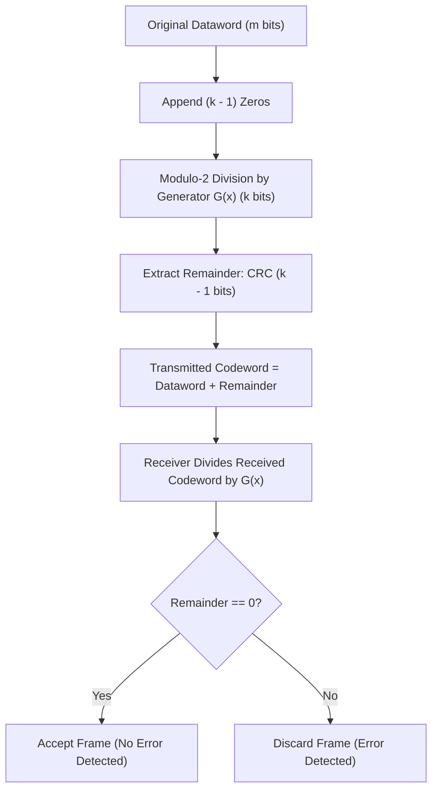

> [!definition]
> **Cyclic Redundancy Check (CRC)** is a polynomial division-based error detection method where binary strings are treated as polynomials with coefficients in $\text{GF}(2)$[cite: 1, 2]. Modulo-2 arithmetic uses bitwise XOR for addition and subtraction without carry or borrow[cite: 1].

> [!theorem]
> **Error Detection Properties of Generator Polynomial $G(x)$:**
> 1. **Single-bit Errors:** Detected if $G(x)$ has at least two terms and coefficient of $x^0$ is 1[cite: 2].
> 2. **Two Isolated Single-bit Errors:** Detected if $G(x)$ does not divide $x^t + 1$ for any $t$ between $1$ and $n-1$[cite: 2].
> 3. **Odd Number of Bit Errors:** Detected if $G(x)$ contains $(x + 1)$ as a factor[cite: 2].
> 4. **Burst Errors:** All burst errors of length $L \le (k - 1)$ are guaranteed to be detected (where $k$ is the divisor bit-length)[cite: 2].

> [!formula]
> Let dataword length $= n$, generator divisor length $= k$ bits (degree $k-1$)[cite: 2]:
> $$\text{Zeroes appended} = k - 1\text{ bits}$$
> $$\text{CRC Remainder bit-width} = k - 1\text{ bits}$$
> $$\text{Codeword Length} = n + (k - 1)\text{ bits}$$

> [!trap]
> In CRC binary division, do NOT perform standard decimal division! The quotient bit is determined strictly by the leading bit:
> - If the MSB of the current working dividend is `1`, the divisor is aligned and **XORed**[cite: 1].
> - If the MSB is `0`, XOR with all `0`s (or simply shift left until the next `1`)[cite: 1].

> [!question]
> **Q:** Given a dataword $D = 101101$ and a divisor generator $G = 1011$, determine the transmitted codeword at the sender side.  
> (A) $101101011$  
> (B) $101101101$  
> (C) $101101001$  
> (D) $101101111$  
>
> **Answer:** **(A)**  
> **Explanation:**  
> 1. Divisor $G = 1011$ has $k = 4$ bits, so append $k - 1 = 3$ zeroes to $D$: $101101000$[cite: 1].  
> 2. Step-by-step Modulo-2 XOR division[cite: 1]:  
>    - $101101000 \oplus (1011\dots)$:  
>      $1011 \oplus 1011 = 0000 \to$ bring down bits: working window becomes $0100$[cite: 1].  
>    - Align on first non-zero bit:  
>      $1000 \oplus 1011 = 0011 \to$ bring down last zero: $0110$[cite: 1].  
>    - Next bit XOR:  
>      Dividing $1100$ by $1011$: $1100 \oplus 1011 = 0111 \to$ remainder is `011`[cite: 1].  
> 3. Replace appended zeros with the remainder: Codeword $= 101101011$[cite: 1].
