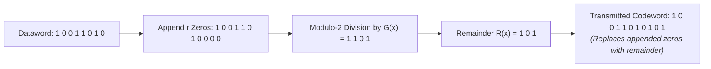

> [!definition] Cyclic Redundancy Check (CRC)
> CRC is an error-detecting code based on **polynomial division** over **Galois Field $\text{GF}(2)$**. 
> Data bits are treated as coefficients of a polynomial $D(x)$, which is divided by a agreed-upon **Generator Polynomial $G(x)$** using modulo-2 arithmetic (XOR) to produce a remainder $R(x)$ attached as the frame check sequence.

---

## 1. Core Intuition & Mathematical Base



### Key Invariants

1. **$\text{GF}(2)$ XOR Arithmetic:** Both addition and subtraction are replaced by the **XOR ($\oplus$)** operation. There are **no carries or borrows**.
   $$\begin{aligned} 1 \oplus 1 &= 0 & 0 \oplus 0 &= 0 \\ 1 \oplus 0 &= 1 & 0 \oplus 1 &= 1 \end{aligned}$$
2. **Degree Relationship:** If the Generator polynomial $G(x)$ has degree $r$, it consists of **$r + 1$ bits**. The resulting CRC remainder $R(x)$ has **$r$ bits**.
3. **Zero Remainder Invariant:** At the receiver, dividing the undamaged received codeword $C(x)$ by $G(x)$ yields a remainder of **exactly 0**.

---

## 2. Algebraic Formulation

Let:
* $D(x) = \text{Dataword polynomial of } m \text{ bits}$
* $G(x) = \text{Generator polynomial of degree } r \text{ (length } r + 1 \text{ bits)}$
* $R(x) = \text{Remainder polynomial of degree } < r \text{ (length } r \text{ bits)}$

### Sender Side Construction

1. Shift dataword left by $r$ bit positions: $D(x) \cdot x^r$ (appends $r$ zeros).
2. Perform modulo-2 long division:
   $$\frac{D(x) \cdot x^r}{G(x)} = Q(x) \oplus \frac{R(x)}{G(x)}$$
3. Transmit the codeword $C(x)$ by replacing the padded zeros with remainder $R(x)$:
   $$C(x) = D(x) \cdot x^r \oplus R(x)$$

### Receiver Side Verification

$$\frac{C(x)}{G(x)} = \frac{D(x) \cdot x^r \oplus R(x)}{G(x)} \equiv 0 \pmod{G(x)}$$

* **Remainder $= 0 \implies$ No transmission error detected.**
* **Remainder $\neq 0 \implies$ Transmission error detected (Frame discarded).**

---

## 3. Step-by-Step Worked Example

> [!question] Problem
> * **Dataword:** `10011010` ($m = 8\text{ bits}$)
> * **Generator $G(x)$:** $x^3 + x^2 + 1 \implies \mathbf{1101}$ ($r + 1 = 4\text{ bits} \implies \text{Degree } r = 3$)
> * Find the transmitted codeword $C(x)$.

### Execution Steps

1. **Pad $r = 3$ Zeros:** $10011010 \to \mathbf{10011010000}$
2. **Perform Modulo-2 Long Division:**
   Align `1101` under the leftmost `1` at each step:

```text
10011010000
1101|||||||   (XOR)
----|||||||
 1001||||||   (Bring down 1)
 1101||||||   (XOR)
 ----||||||
  1000|||||   (Bring down 0)
  1101|||||   (XOR)
  ----|||||
   1011||||   (Bring down 1)
   1101||||   (XOR)
   ----||||
    1100|||   (Bring down 0)
    1101|||   (XOR)
    ----|||
     001000   (Bring down remaining zeros)
       1101   (Align under leftmost 1)
       ----
        101   <-- Remainder R(x) = 101
```

3. **Form Transmitted Codeword $C(x)$:**
   $$C(x) = 10011010000 \oplus 101 = \mathbf{10011010101}$$

---

## 4. Error Detection Capabilities & Proofs

Let received word be $R_{rec}(x) = C(x) \oplus E(x)$, where $E(x)$ is the **Error Polynomial** (containing a `1` at every corrupted bit position).

At receiver:
$$\frac{R_{rec}(x)}{G(x)} = \frac{C(x) \oplus E(x)}{G(x)} = 0 \oplus \frac{E(x)}{G(x)}$$

> **Failure Condition:** An error goes undetected **if and only if** $G(x)$ divides $E(x)$ perfectly ($\frac{E(x)}{G(x)} = 0$).

### Generator Design Rules

#### 1. Single-Bit Errors ($E(x) = x^i$)
* $E(x)$ has only a single term $x^i$.
* As long as $G(x)$ contains at least two terms (e.g., $x + 1$), a multi-term polynomial can **never** divide a single-term monomial $x^i$.
* $\implies$ **100% Single-Bit Error Detection.**

#### 2. Odd-Numbered Bit Errors (1, 3, 5, ... bits)
* **Proof:** Evaluate any polynomial at $x = 1$ in $\text{GF}(2)$:
  $$E(1) = \text{Sum of terms } \pmod 2 = \begin{cases} 0 & \text{even number of terms} \\ 1 & \text{odd number of terms} \end{cases}$$
* If $(x + 1)$ is a factor of $G(x)$, then $G(1) = 0$.
* If $G(x)$ divides $E(x)$, then $E(x) = G(x) \cdot Q(x) \implies E(1) = G(1) \cdot Q(1) = 0$.
* Since odd-term errors give $E(1) = 1 \neq 0$, $G(x)$ can **never** divide an odd-term polynomial.
* $\implies$ **100% Odd-Count Error Detection if $(x + 1)$ is a factor of $G(x)$.**

#### 3. Burst Errors ($L \le r$)
* A burst error of length $L$ starting at index $i$ is represented as $E(x) = x^i \cdot B(x)$, where $\deg(B) = L - 1$.
* $\frac{E(x)}{G(x)} = \frac{x^i \cdot B(x)}{G(x)}$.
* $G(x)$ cannot divide $x^i$ (monomial).
* If burst length $L \le r$, then $\deg(B) = L - 1 < r = \deg(G)$.
* Since $\deg(B) < \deg(G)$, $G(x)$ **cannot** divide $B(x)$.
* $\implies$ **100% Burst Error Detection for all burst lengths $L \le r$.**

---

## 5. Summary Cheat-Sheet

| Property                    | Condition / Value                                    |
| :-------------------------- | :--------------------------------------------------- |
| **Arithmetic Type**         | Modulo-2 ($\text{GF}(2)$ / XOR without carry/borrow) |
| **Generator Size**          | $r + 1$ bits (where $r = \deg(G)$)                   |
| **CRC FCS Size**            | $r$ bits                                             |
| **Padded Zeros**            | $r$ zeros appended to dataword before division       |
| **Single-Bit Error**        | Caught if $G(x)$ has $>1$ term                       |
| **Odd-Count Error**         | Caught if $(x + 1)$ is a factor of $G(x)$            |
| **Burst Error ($\le r$)**   | 100% caught unconditionally                          |
| **Burst Error ($= r + 1$)** | Caught with probability $1 - (1/2)^{r-1}$            |
| **Burst Error ($> r + 1$)** | Caught with probability $1 - (1/2)^r$                |
