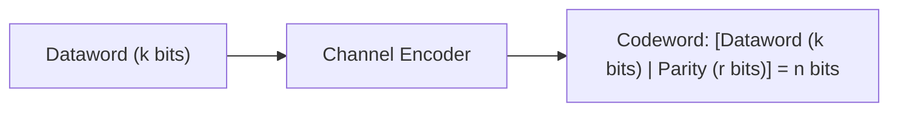

## Hamming Distance and Error Bounds

In block coding, a $k$-bit dataword is mapped to an $n$-bit codeword ($n > k$), adding $r = n - k$ redundant check/parity bits[cite: 1]. 

> [!definition] Hamming Distance
> * **Hamming Distance $d(c_1, c_2)$**: The number of bit positions in which two codewords of identical length differ (equivalent to the Hamming weight of their bitwise XOR: $W(c_1 \oplus c_2)$)[cite: 1].
> * **Minimum Hamming Distance ($d_{\min}$)**: The smallest Hamming distance between any two distinct valid codewords in a code set $C$[cite: 1]:
>   $$d_{\min} = \min \{ d(c_i, c_j) \mid c_i, c_j \in C, \, c_i \neq c_j \}$$[cite: 1]

> [!formula] Error Detection and Correction Bounds
> 1. **To detect up to $s$ bit errors**:
>    $$d_{\min} \ge s + 1$$[cite: 1]
> 2. **To correct up to $t$ bit errors**:
>    $$d_{\min} \ge 2t + 1$$[cite: 1]
> 3. **To detect $d$ errors AND correct $c$ errors simultaneously ($d \ge c$)**:
>    $$d_{\min} \ge d + c + 1$$[cite: 1]

### Geometric Proof of Bounds

* **Detection ($d_{\min} \ge s + 1$)**: If $s$ bits flip, the corrupted word moves a distance of $s$ from the transmitted codeword[cite: 1]. Since the nearest valid codeword is at distance at least $s + 1$, the corrupted string cannot land on another valid codeword, guaranteeing detection[cite: 1].
* **Correction ($d_{\min} \ge 2t + 1$)**: Centering Hamming spheres of radius $t$ around every valid codeword ensures no two spheres intersect[cite: 1]. Any corruption of $\le t$ bits remains strictly within the sphere of the original codeword, allowing unambiguous nearest-neighbor decoding[cite: 1].

> [!question] Codeword Minimum Distance Examples
> 1. What is $d_{\min}$ for the valid code set $\{000000, 000001, 000011, 000111, 111100\}$[cite: 1]?
>    * Pairwise distances: $d(000000, 000001) = 1$, $d(000001, 000011) = 1$, $d(000011, 000111) = 1$.
>    * Smallest distance is $1$, so $d_{\min} = 1$. (Detects $0$ errors reliably).
> 2. Find $d_{\min}$, detectable errors, and correctable errors for a **two-out-of-five code** (all 5-bit words containing exactly two $1$s)[cite: 1]:
>    * Examples: $11000$ and $10100$[cite: 1].
>    * To transition from one valid word to another, at least one $1$ must become $0$ and another $0$ must become $1$ (minimum $2$ bit flips)[cite: 1].
>    * $d_{\min} = 2$[cite: 1].
>    * Can detect up to $s = d_{\min} - 1 = 1\text{ bit error}$[cite: 1].
>    * Can correct $t = \left\lfloor \frac{d_{\min} - 1}{2} \right\rfloor = 0\text{ bit errors}$[cite: 1].
> 3. Find $d_{\min}$ for a **four-out-of-seven code**[cite: 1]:
>    * Valid words: $1111000$ and $1110001$ differ by two bit flips[cite: 1].
>    * $d_{\min} = 2$[cite: 1].
