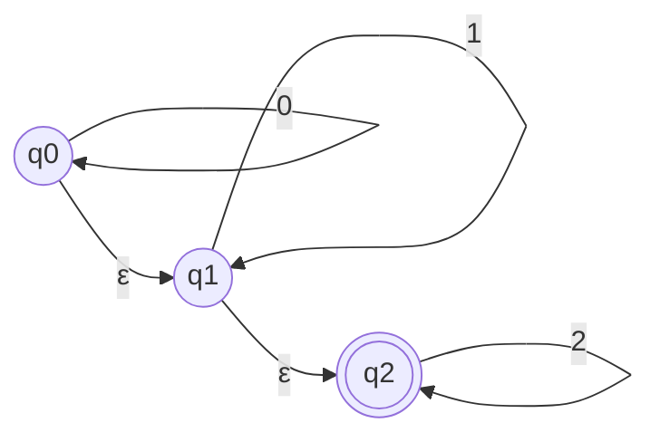

> [!definition]
> - **$\epsilon$-Closure / Null-Closure ($\epsilon\text{-NCLOSE}(q)$):** The set of all states reachable from state $q$ by taking zero or more $\epsilon$ (null) transitions without consuming any input symbol[cite: 1].
> - For every state $q$, $q \in \epsilon\text{-NCLOSE}(q)$ by definition ($0$-step reachability)[cite: 1].

> [!theorem]
> ### Final State Invariant in $\epsilon$-NFA to DFA Conversion
> When transforming an $\epsilon$-NFA $(Q, \Sigma, \delta, q_0, F)$ into an equivalent DFA:
> Any DFA subset state (or individual state mapped from the $\epsilon$-NFA) that contains **at least one state whose $\epsilon$-closure contains an original final state** becomes a **Final State**[cite: 1]:
> $$q \in F_{\text{DFA}} \iff \epsilon\text{-NCLOSE}(q) \cap F_{\epsilon\text{-NFA}} \ne \emptyset$$[cite: 1]

> [!formula]
> Evaluating the 3-state $\epsilon$-NFA above with alphabet $\Sigma = \{0, 1, 2\}$ and $F = \{q_2\}$[cite: 1]:
> 1. $\epsilon\text{-NCLOSE}(q_0) = \{q_0, q_1, q_2\}$[cite: 1]
> 2. $\epsilon\text{-NCLOSE}(q_1) = \{q_1, q_2\}$[cite: 1]
> 3. $\epsilon\text{-NCLOSE}(q_2) = \{q_2\}$[cite: 1]
>
> Since $q_2 \in F$[cite: 1]:
> - $\epsilon\text{-NCLOSE}(q_0)$ contains $q_2 \implies q_0$ acts as a final state[cite: 1].
> - $\epsilon\text{-NCLOSE}(q_1)$ contains $q_2 \implies q_1$ acts as a final state[cite: 1].
> - $\epsilon\text{-NCLOSE}(q_2)$ contains $q_2 \implies q_2$ is a final state[cite: 1].
>
> All three states $\{q_0, q_1, q_2\}$ correspond to accepting states[cite: 1].

> [!trap]
> **Initial State as Final State Trap:**
> If the null string $\epsilon$ belongs to language $L$ (which happens whenever $\epsilon\text{-NCLOSE}(q_0) \cap F \ne \emptyset$), the start state of the equivalent DFA **must be marked as a final state**[cite: 1]. Failing to mark $q_0$ as final rejects $\epsilon$, causing an incorrect conversion[cite: 1].

> [!question]
> **IOCL CBT Practice Question:**
> Given an $\epsilon$-NFA with states $\{q_0, q_1, q_2\}$, initial state $q_0$, and final state set $F = \{q_2\}$. If $\delta(q_0, \epsilon) = \{q_1\}$ and $\delta(q_1, \epsilon) = \{q_2\}$, which states in the converted machine possess the acceptance property?
> (A) Only $q_2$
> (B) Only $q_1, q_2$
> (C) All states $\{q_0, q_1, q_2\}$
> (D) Only $q_0$
>
> **Answer:** (C)
> **Step-by-Step Explanation:**
> 1. Calculate the $\epsilon$-closures:
>    - $\epsilon\text{-NCLOSE}(q_2) = \{q_2\}$[cite: 1]
>    - $\epsilon\text{-NCLOSE}(q_1) = \{q_1\} \cup \epsilon\text{-NCLOSE}(q_2) = \{q_1, q_2\}$[cite: 1]
>    - $\epsilon\text{-NCLOSE}(q_0) = \{q_0\} \cup \epsilon\text{-NCLOSE}(q_1) = \{q_0, q_1, q_2\}$[cite: 1]
> 2. Check overlap with $F = \{q_2\}$:
>    All three closures contain $q_2$[cite: 1].
> 3. Therefore, $q_0, q_1$, and $q_2$ all carry the acceptance property[cite: 1].
