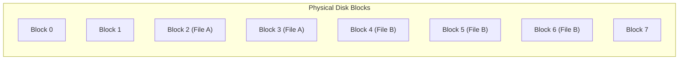

## Contiguous and Extent-Based Allocation

File allocation strategies determine how secondary storage blocks are assigned to user files[cite: 1].

### Contiguous Allocation

Under contiguous allocation, each file occupies a set of contiguous physical disk blocks[cite: 1].

* **Inode Representation**: Requires storing only the address of the first block (`Base`) and the total length of the file in blocks (`Length`)[cite: 1].
* **Overhead**: Minimal storage overhead in the inode[cite: 1].

#### Trade-offs

* **Advantages**:
  * Simple implementation[cite: 1].
  * High sequential access speed (minimal disk arm seek distance)[cite: 1].
  * Direct random access: The physical address of the $k^{\text{th}}$ block of a file starting at base $B$ is computed directly as $B + k$ in $O(1)$ time[cite: 1].
* **Disadvantages**:
  * Severe **external fragmentation** as files are created and deleted over time[cite: 1].
  * Inflexible file growth: A file cannot expand beyond its allocated boundary if the adjacent disk block is already occupied by another file[cite: 1].

### Extent-Based Allocation

Extent-based allocation is a modified contiguous allocation scheme that eliminates the single-block contiguity constraint, operating similarly to segmentation in memory management[cite: 1].

> [!definition] Extent
> An **extent** is a contiguous sequence of disk blocks allocated to a file as an indivisible run[cite: 1].

* **Inode Representation**: Instead of a single base address, the inode stores an array of extents, where each entry defines `(Start Block Address, Length in Blocks)`[cite: 1].
* **File Growth**: When an existing extent fills up, the file system allocates a new contiguous extent anywhere on the disk and appends its descriptor to the inode[cite: 1].

#### Trade-offs

* **Advantages**:
  * Files can grow dynamically over time[cite: 1].
  * Low inode metadata storage overhead compared to purely linked or indexed approaches[cite: 1].
  * Fast sequential access within extents[cite: 1].
  * Straightforward random address calculation using cumulative extent lengths[cite: 1].
* **Disadvantages**:
  * External fragmentation is mitigated but not entirely eliminated[cite: 1].
