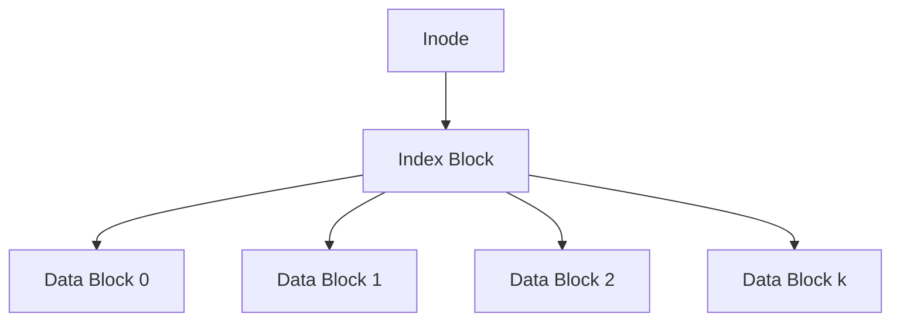
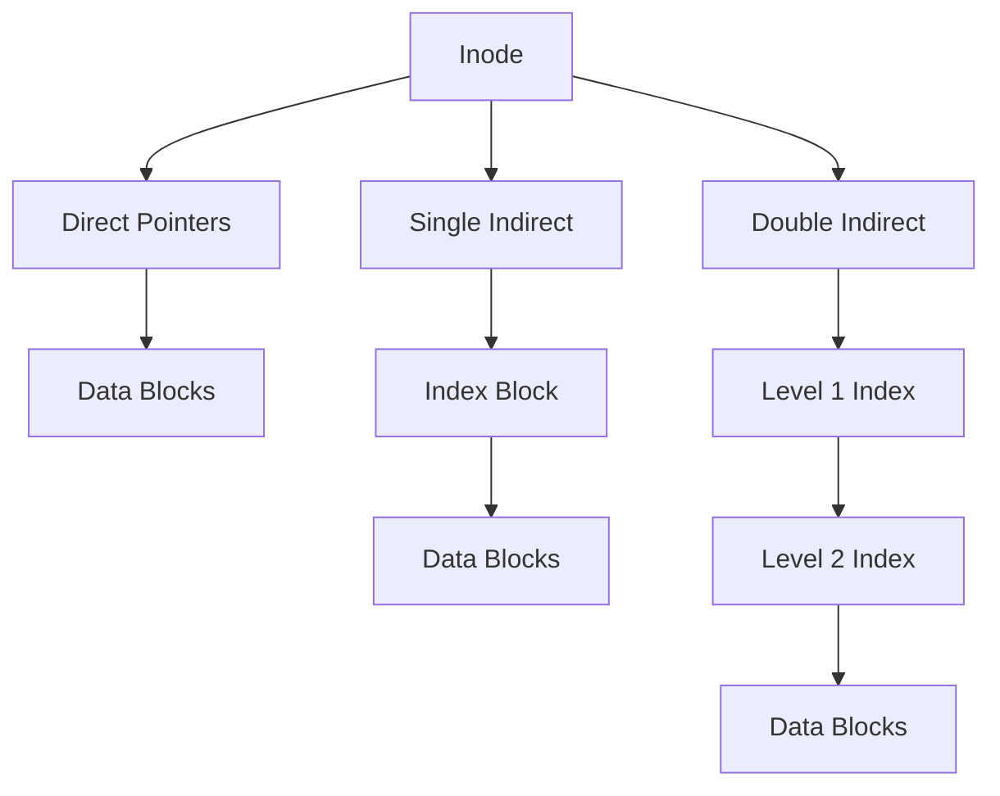

## Indexed and Multilevel Allocation

Indexed allocation eliminates external fragmentation while providing efficient random access by consolidating all pointer references into dedicated indexing structures[cite: 1].

* **Index Block**: A disk block containing an array of direct pointers to physical data blocks[cite: 1].
* **Access Model**: Supports direct random access ($O(1)$ block lookups) as well as sequential reads[cite: 1].
* **Limitation**: If a file requires more blocks than can fit in a single index block, single-level indexing cannot support it without extension[cite: 1].

> [!definition] Multilevel Indexing
> In multilevel indexed allocation, an index block contains pointers to secondary index blocks, which in turn point to data blocks or tertiary index blocks[cite: 1].
> * **Direct Pointer**: Points directly to a physical data block[cite: 1].
> * **Single Indirect Pointer**: Points to an index block containing direct pointers[cite: 1].
> * **Double Indirect Pointer**: Points to an index block containing single indirect pointers[cite: 1].
> * **Triple Indirect Pointer**: Points to an index block containing double indirect pointers[cite: 1].

> [!theorem] External Fragmentation Invariant
> External fragmentation is strictly absent in both linked allocation and indexed allocation schemes because any free disk block can be bound to any logical position in a file[cite: 1].
