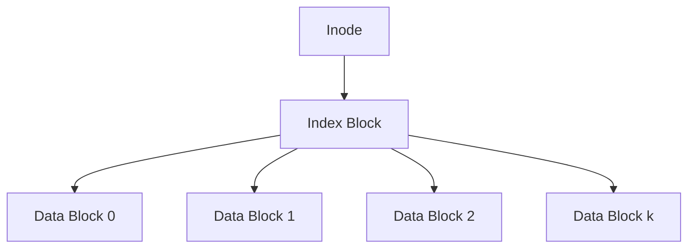
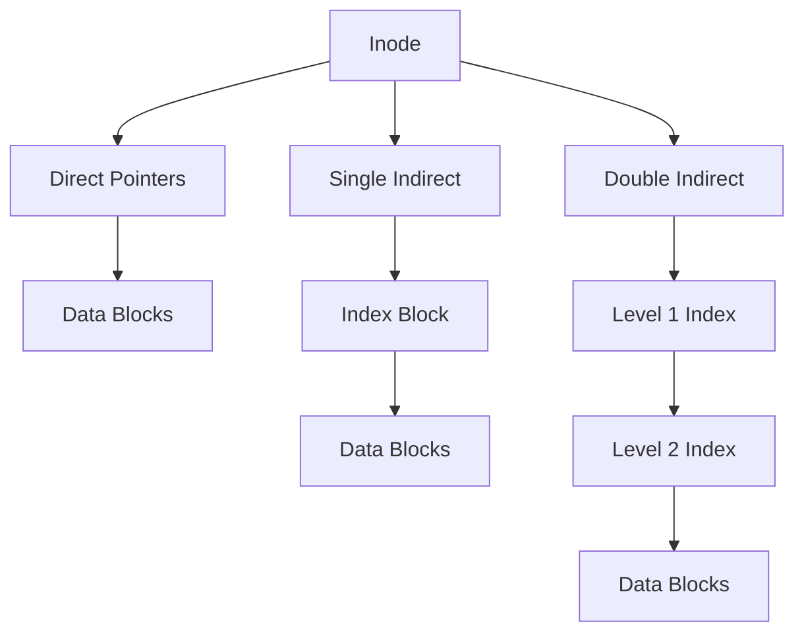

## Indexed and Multilevel Allocation

Linked allocation eliminated external fragmentation but it did not provide random acces.
Indexed allocation eliminates external fragmentation while providing efficient random access by consolidating all pointer references into dedicated indexing structures: indexing block.
![[File Allocation - Indexed and Multilevel-1790428556761.webp]]

```mermaid
flowchart TD
    Inode["Inode"] --> IB["Index Block"]
    IB --> DB0["Data Block 0"]
    IB --> DB1["Data Block 1"]
    IB --> DB2["Data Block 2"]
    IB --> DBk["Data Block k"]
```

* **Index Block**: A disk block containing an array of direct pointers to physical data blocks.
* **Access Model**: Supports *direct random access* ($O(1)$ block lookups) as well *as sequential reads.*
* **Limitation**: Same problem as with one level paiging.
	1. **Large Possible File Size $\rightarrow$ Wasted Space:** A flat mapping table sized for maximum possible file sizes (e.g., $2^{20}$ entries) leaves most entries idle/unused for typical small files[cite: 2]. 
	2. **Large Contiguous Space Required:** Allocating a massive contiguous array for the index table introduces the same allocation fragmentation problem that indexing was meant to solve[cite: 1, 2]. ---

## The Multilevel Solution

> [!definition] Multilevel Indexing
> In multilevel indexed allocation, an index block contains pointers to secondary index blocks, which in turn point to data blocks or tertiary index blocks.
> * **Direct Pointer**: Points directly to a physical data block.
> * **Single Indirect Pointer**: Points to an index block containing direct pointers.
> * **Double Indirect Pointer**: Points to an index block containing single indirect pointers.
> * **Triple Indirect Pointer**: Points to an index block containing double indirect pointers.

```mermaid
flowchart TD
    Inode["Inode"]
    Inode --> DP["Direct Pointers"] --> D1["Data Blocks"]
    Inode --> SIP["Single Indirect"] --> IB1["Index Block"] --> D2["Data Blocks"]
    Inode --> DIP["Double Indirect"] --> IB2["Level 1 Index"] --> IB3["Level 2 Index"] --> D3["Data Blocks"]
```
![[File Allocation - Indexed and Multilevel-1790429866134.webp]]
> [!theorem] External Fragmentation Invariant
> External fragmentation is strictly absent in both linked allocation and indexed allocation schemes because any free disk block can be bound to any logical position in a file.
