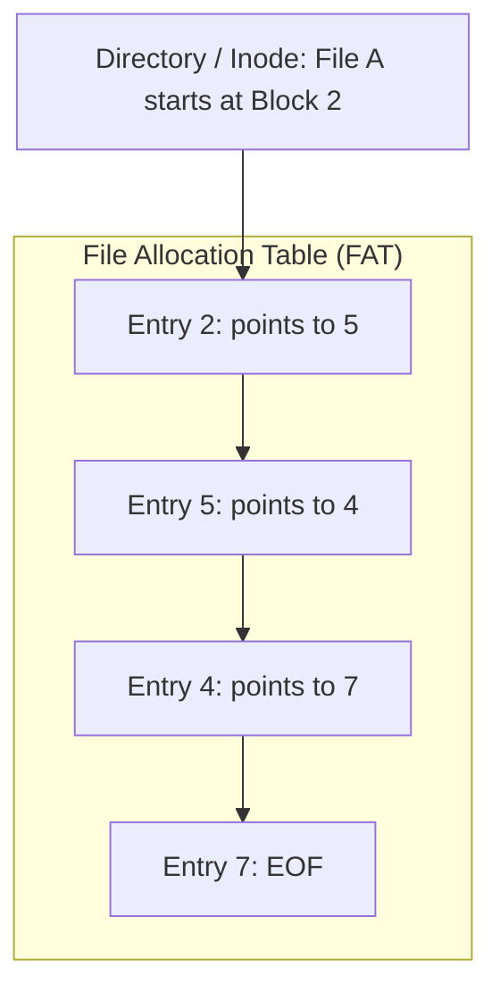

## Linked Allocation and the File Allocation Table (FAT)

### Pure Linked Allocation

In linked allocation, each file is organized as a linked list of disk blocks scattered across the disk[cite: 1].

* **Disk Block Structure**: Each physical disk block contains data bytes and a pointer to the next disk block in the chain[cite: 1].
* **Inode Structure**: The inode stores only two pointers: a pointer to the first block (`Start`) and a pointer to the terminal block (`End`), or just the start pointer[cite: 1].
* **End-of-File**: The final data block stores an explicit End-of-File marker (such as `EOF` or `NULL`) in its pointer field[cite: 1].

#### Trade-offs

* **Advantages**:
  * Completely eliminates external fragmentation; any free block satisfies an allocation request[cite: 1].
  * Dynamic file growth requires no advance declaration of size[cite: 1].
  * Simple directory implementation[cite: 1].
* **Disadvantages**:
  * **No Direct/Random Access**: Locating logical block $k$ requires traversing the preceding $k-1$ blocks sequentially from disk, causing severe seek latencies[cite: 1].
  * **Storage Overhead**: Every physical block sacrifices internal capacity to store the pointer field[cite: 1].
  * **Reliability Risk**: A single corrupt pointer or damaged block breaks the entire remaining file chain.

### File Allocation Table (FAT)

FAT is a variation of linked allocation that moves all block pointers out of the physical data blocks into an in-memory or dedicated disk table[cite: 1].

* **Structure**: A centralized table where every entry corresponds to one physical disk block[cite: 1].
* **Chaining**: Entry $i$ contains the block number of the next block in the file's sequence[cite: 1].
* **Directory / Inode Entry**: Stores only the starting block number of the file[cite: 1].

#### Operational Mechanics and Invariants

* **Pointer Chasing Without Disk I/O**: Following a file chain does not require reading physical data blocks into main memory[cite: 1]. Pointer chasing is performed entirely within the FAT[cite: 1].
* **Caching Requirement**: For optimal throughput, the FAT must be cached in RAM[cite: 1].
* **Random Access**: Faster than pure linked allocation because pointer traversal occurs in RAM rather than across mechanical disk sectors, though still slower than contiguous or direct indexed lookups[cite: 1].
