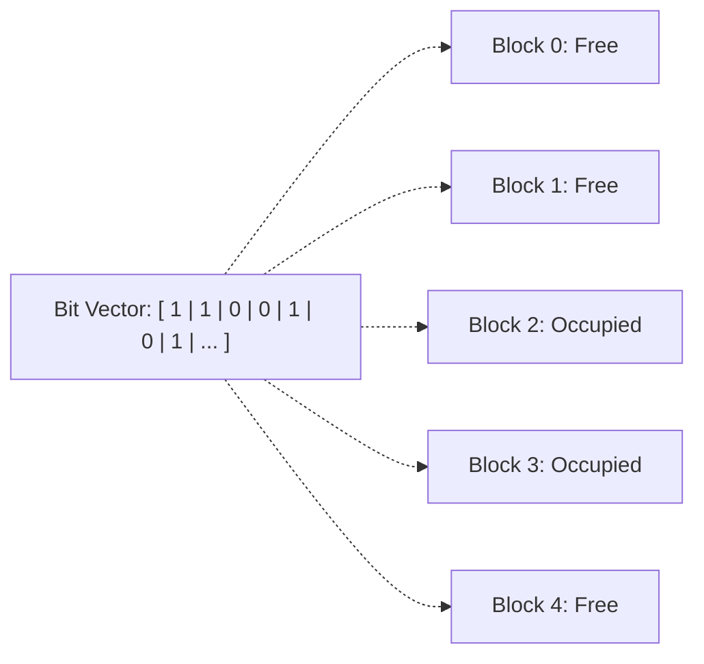

## Free Space Management Techniques

To allocate disk blocks quickly, the operating system tracks all unallocated blocks using dedicated free-space structures[cite: 1].

### 1. Bit Vector (Bitmap)

The free space is represented as a bit array where each bit represents a physical disk block[cite: 1]:
* Bit value `0` indicates that the corresponding block is allocated[cite: 1].
* Bit value `1` indicates that the block is free[cite: 1].

* **Advantage**: Fast location of the first contiguous run of free blocks via hardware bit-scan instructions.
* **Disadvantage**: Memory storage overhead to keep the bitmap resident in RAM[cite: 1].

### 2. Free Space Linked List

All free disk blocks are linked together into a chain[cite: 1].

* **Structure**: The system maintains an in-memory head pointer to the first free block[cite: 1, 2].
* This free block stores a pointer to the next free block, which points to the next, and so forth[cite: 1, 2].
* **Advantage**: Zero dedicated table storage overhead because pointers reside inside the unused free blocks themselves[cite: 1, 2].
* **Disadvantage**: Slow traversal; allocating multiple blocks requires chasing pointers across physical disk blocks[cite: 1, 2].

### 3. Grouping

An optimization over the simple free-space linked list[cite: 1, 2]:
* The first free block stores the addresses of $n$ free disk blocks[cite: 1, 2].
* The first $n-1$ entries point to completely empty free blocks[cite: 1, 2].
* The $n^{\text{th}}$ entry points to another free block that contains addresses for the next batch of $n$ free blocks[cite: 1, 2].
* Allows batch allocation of multiple free blocks with a single disk read[cite: 1, 2].

### 4. Counting

Optimized for workloads that allocate and free blocks in contiguous runs[cite: 1, 2]:
* Rather than storing every block address individually, the free list maintains entries of the form `(Start Block Address, Contiguous Free Count)`[cite: 1, 2].
* Dramatically reduces list length when disk formatting or defragmentation preserves large contiguous runs[cite: 1, 2].

---

### Real-World Operating System File Systems

Operating systems use different underlying file system architectures, unified under an OS-level Virtual File System (VFS) abstraction[cite: 1, 2]:

| Operating System | Common Native File Systems |
| :--- | :--- |
| **Windows** | FAT16, FAT32, NTFS[cite: 2] |
| **macOS** | HFS, HFS+, APFS[cite: 2] |
| **Linux** | ext2, ext3, ext4, Btrfs, XFS[cite: 2] |
| **Unix / Solaris** | UFS, ZFS[cite: 2] |

> [!definition] Virtual File System (VFS)
> The **Virtual File System** is an operating system abstraction layer that defines a uniform interface for file operations, allowing a single OS kernel to transparently mount and access multiple disparate file systems concurrently[cite: 1].
