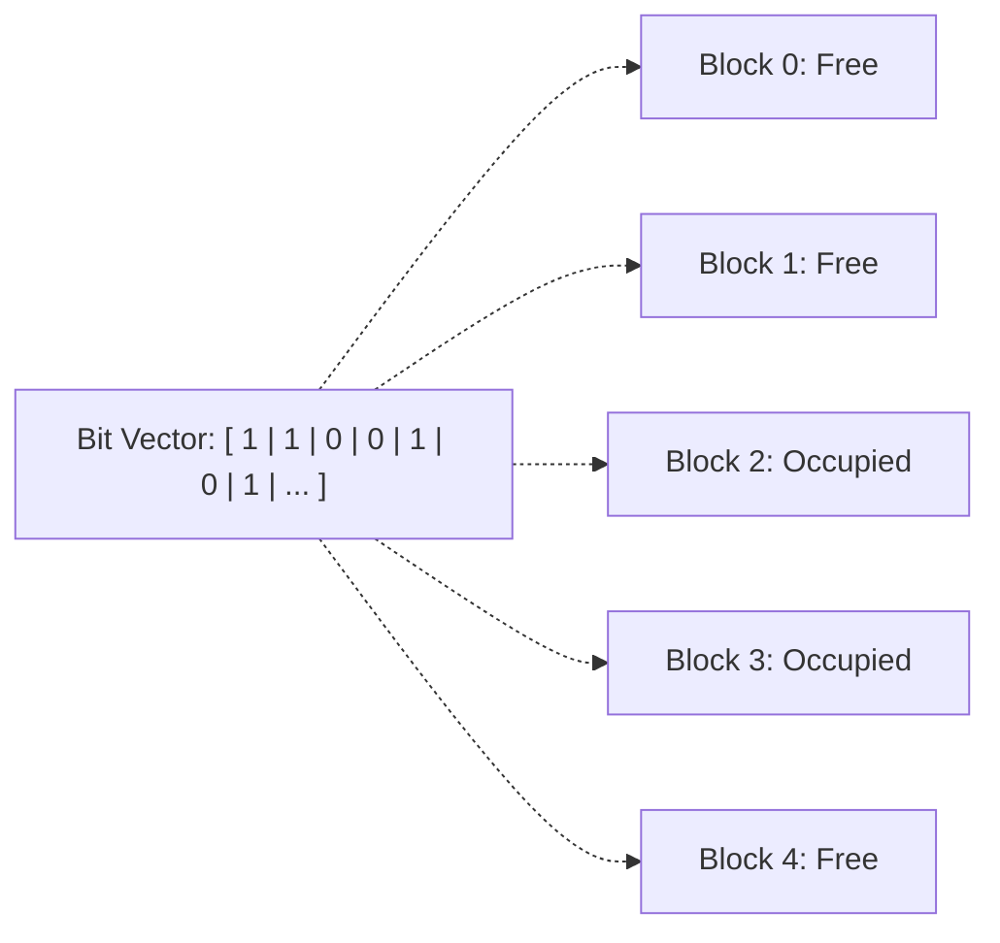

## Free Space Management Techniques

To allocate disk blocks quickly, the operating system tracks all unallocated blocks using dedicated free-space structures.

### 1. Bit Vector (Bitmap)

The free space is represented as a bit array where each bit represents a physical disk block:
* Bit value `0` indicates that the corresponding block is allocated.
* Bit value `1` indicates that the block is free.

```mermaid
flowchart LR
    BV["Bit Vector: [ 1 | 1 | 0 | 0 | 1 | 0 | 1 | ... ]"]
    B0["Block 0: Free"]
    B1["Block 1: Free"]
    B2["Block 2: Occupied"]
    B3["Block 3: Occupied"]
    B4["Block 4: Free"]
    BV -.-> B0
    BV -.-> B1
    BV -.-> B2
    BV -.-> B3
    BV -.-> B4
```

* **Advantage**: Fast location of the first contiguous run of free blocks via hardware bit-scan instructions.
* **Disadvantage**: Memory storage overhead to keep the bitmap resident in RAM.

### 2. Free Space Linked List

All free disk blocks are linked together into a chain.

* **Structure**: The system maintains an in-memory head pointer to the first free block.
* This free block stores a pointer to the next free block, which points to the next, and so forth.
* **Advantage**: Zero dedicated table storage overhead because pointers reside inside the unused free blocks themselves.
* **Disadvantage**: Slow traversal; allocating multiple blocks requires chasing pointers across physical disk blocks.

```mermaid
flowchart LR
    Head["Head Pointer in Memory"] --> FB1["Free Block 12"]
    FB1 --> FB2["Free Block 35"]
    FB2 --> FB3["Free Block 98"]
    FB3 --> EOF["EOF / Null"]
```

### 3. Grouping

An optimization over the simple free-space linked list:
* The first free block stores the addresses of $n$ free disk blocks.
* The first $n-1$ entries point to completely empty free blocks.
* The $n^{\text{th}}$ entry points to another free block that contains addresses for the next batch of $n$ free blocks.
* Allows batch allocation of multiple free blocks with a single disk read.

### 4. Counting

Optimized for workloads that allocate and free blocks in contiguous runs:
* Rather than storing every block address individually, the free list maintains entries of the form `(Start Block Address, Contiguous Free Count)`.
* Dramatically reduces list length when disk formatting or defragmentation preserves large contiguous runs.

---

### Real-World Operating System File Systems

Operating systems use different underlying file system architectures, unified under an OS-level Virtual File System (VFS) abstraction:

| Operating System   | Common Native File Systems            |
| :----------------- | :------------------------------------ |
| **Windows**        | FAT16, FAT32, NTFS[cite: 2]           |
| **macOS**          | HFS, HFS+, APFS[cite: 2]              |
| **Linux**          | ext2, ext3, ext4, Btrfs, XFS[cite: 2] |
| **Unix / Solaris** | UFS, ZFS[cite: 2]                     |

> [!definition] Virtual File System (VFS)
> The **Virtual File System** is an operating system abstraction layer that defines a uniform interface for file operations, allowing a single OS kernel to transparently mount and access multiple disparate file systems concurrently.
