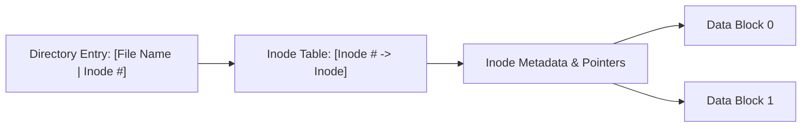

A file system manages files on secondary storage, handling organization, retrieval, storage of data, and metadata. Files store data in a uniform format, while directories (folders) are treated internally as special files flagged with a distinctive attribute. 

The sector (or file system block) serves as the minimum unit of transfer between disk and main memory, defining the basic unit of atomicity for I/O operations.

> [!definition] File Metadata and Inode
> **Metadata** is the data describing a file or directory, including file name, file size, actual disk block addresses, access permissions, creation/modification timestamps, and ownership.
> 
> An **inode** (index node) is the primary data structure that stores all metadata of a file or directory, except for the file's user-facing name and actual data contents.

### Inode and Directory Invariants

* Every file and directory on a disk partition has exactly one corresponding inode.
* Each inode is uniquely identified within a file system by an **inode number**.
* A directory file contains a table mapping human-readable file names to their corresponding inode numbers.
* The operating system maintains an **inode table** containing metadata and physical block pointers for each inode.
* The primary operational task of a file system path traversal is translating a user-supplied file path and name into its inode number, and subsequently into the physical disk block addresses.

### Physical Disk Layout

A typical disk partition or file system layout is divided into dedicated functional zones:

| Disk Region     | Functional Purpose                                                                                                      |
| :-------------- | :---------------------------------------------------------------------------------------------------------------------- |
| **Boot Block**  | Contains the bootstrap loader code required to boot the operating system.                                               |
| **Superblock**  | Stores file system geometry, block size, total block count, free block counts, inode counts, and allocation boundaries. |
| **Inode Table** | Contiguous array of inodes storing metadata for all existing files and directories.                                     |
| **Data Blocks** | Storage blocks containing actual file contents and directory payloads.                                                  |
| **Swap Space**  | Dedicated partition used by virtual memory for paging out active frames.                                                |
![[File Systems - Fundamentals and Inodes-1790394643912.webp]]
### Directory Structures

1. **Single-Level Directory**: A single directory shared by the entire system; prone to name collisions.
2. **Two-Level Directory**: A root directory containing a separate master directory for each user.
3. **Hierarchical (Tree/Graph) Directory**: Arbitrary directory nesting forming a tree or directed acyclic graph (allowing hard and symbolic links); standard across modern operating systems.

| **Feature**               | **Hard Link**                                  | **Symbolic Link (Soft Link)**               |
| ------------------------- | ---------------------------------------------- | ------------------------------------------- |
| **Inode**                 | Shares the **same inode** as the target        | Has its **own separate inode**              |
| **Target Representation** | Direct pointer to metadata/inode               | Path string (text) to target file/folder    |
| **Cross-Filesystem?**     | **No** (limited to single filesystem)          | **Yes** (any path accessible to OS)         |
| **Links to Directories?** | No (restricted by OS to prevent cycles)        | **Yes**                                     |
| **Target Deleted?**       | Data persists via link until link count is $0$ | Becomes a **dangling / broken link**        |
| **Storage Overhead**      | Only a directory entry (no extra disk space)   | Consumes an inode and block for path string |