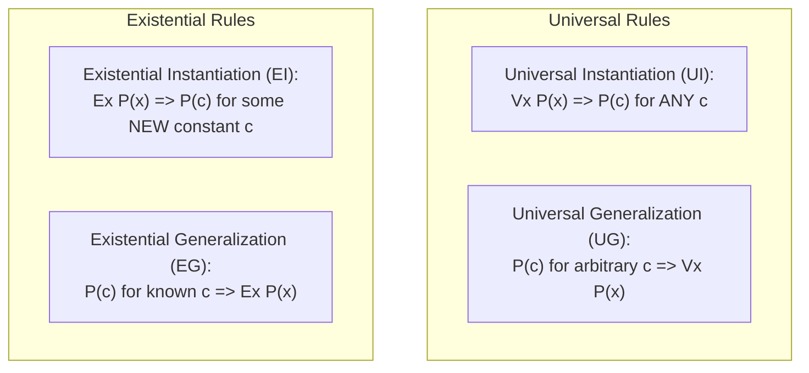

An argument in First-Order Logic consists of a sequence of premises $\{P_1, P_2, \dots, P_n\}$ and a conclusion $C$[cite: 1].

> [!definition] Valid Argument in FOL
> An argument with premises $P_1, P_2, \dots, P_n$ and conclusion $C$ is **Valid** if and only if the conditional statement:
> $$(P_1 \wedge P_2 \wedge \dots \wedge P_n) \to C$$[cite: 1]
> is a **Valid First-Order Formula**[cite: 1].
> That is, in every interpretation where all premises evaluate to $\text{True}$, the conclusion $C$ must also evaluate to $\text{True}$[cite: 1].

### Classical Inference Rules

1. **Universal Instantiation ($\text{UI}$)**: If $\forall x \, P(x)$ is true, then $P(c)$ is true for **any arbitrary constant $c$** in the domain[cite: 1].
2. **Universal Generalization ($\text{UG}$)**: If $P(c)$ is proven true for an **arbitrary, unspecified element $c$**, then $\forall x \, P(x)$ is true[cite: 1].
3. **Existential Instantiation ($\text{EI}$)**: If $\exists x \, P(x)$ is true, then $P(c)$ is true for **some specific, freshly introduced constant $c$** in the domain (where $c$ has not been used previously in the proof)[cite: 1].
4. **Existential Generalization ($\text{EG}$)**: If $P(c)$ is true for a known element $c$, then $\exists x \, P(x)$ is true[cite: 1].

> [!question] Worked Argument Validity Traces
> **Argument 1**:
> Premises: $\forall x \, P(x)$, $\forall x \, Q(x)$
> Conclusion: $\exists x [P(x) \wedge Q(x)]$[cite: 1]
> *Trace*: Since the domain is non-empty, choose an element $a \in U$[cite: 1]. By $\text{UI}$, $P(a)$ is True and $Q(a)$ is True[cite: 1]. Thus $P(a) \wedge Q(a)$ is True[cite: 1]. By $\text{EG}$, $\exists x [P(x) \wedge Q(x)]$ holds[cite: 1]. 
> *Verdict*: **Valid**[cite: 1].
> 
> **Argument 2**:
> Premises: $\exists x \, P(x)$, $\exists x \, Q(x)$
> Conclusion: $\exists x [P(x) \wedge Q(x)]$
> *Trace*: By $\text{EI}$, $P(a)$ is true for some element $a$. For the second premise, $\text{EI}$ requires a distinct witness $b$, so $Q(b)$ is true. There is no guarantee that $a = b$.
> *Verdict*: **Invalid** (Fallacy of Existential Instantiation).
