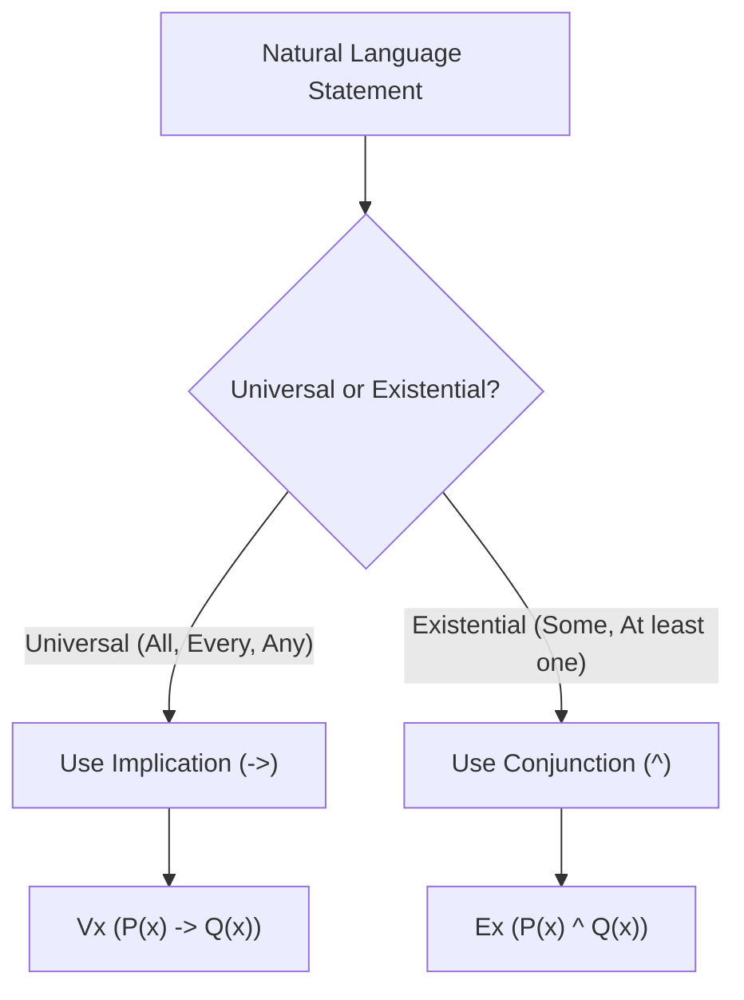

Translating natural language statements into First-Order Logic requires identifying the correct domain, predicates, and logical connectives[cite: 1].

### Standard Translation Paradigms

> [!trap] Connective Mismatch Trap
> A standard error in predicate logic translation is using conjunction with universal quantifiers or implication with existential quantifiers[cite: 1]:
> * Translating *"Every animal is cute"* as $\forall x [A(x) \wedge C(x)]$ asserts that **every single entity in the universe is an animal and is cute**, which is false if non-animals exist[cite: 1]. The correct form is:
>   $$\forall x [A(x) \to C(x)]$$[cite: 1]
> * Translating *"Some animal is cute"* as $\exists x [A(x) \to C(x)]$ is trivially made true by any object that is **not an animal** (since $\text{False} \to \text{Anything} \equiv \text{True}$)[cite: 1]. The correct form is:
>   $$\exists x [A(x) \wedge C(x)]$$[cite: 1]

### Common Categorical Forms

| English Statement | Logical Translation | Semantic Expansion / Meaning |
| :--- | :--- | :--- |
| **All $P$'s are $Q$'s**[cite: 1] | $\forall x [P(x) \to Q(x)]$[cite: 1] | If an object satisfies $P$, it must satisfy $Q$[cite: 1]. |
| **Some $P$'s are $Q$'s**[cite: 1] | $\exists x [P(x) \wedge Q(x)]$[cite: 1] | There is at least one entity satisfying both $P$ and $Q$[cite: 1]. |
| **No $P$'s are $Q$'s**[cite: 1] | $\forall x [P(x) \to \neg Q(x)]$[cite: 1] | If an object satisfies $P$, it cannot satisfy $Q$[cite: 1]. |
| **Some $P$'s are not $Q$'s**[cite: 1] | $\exists x [P(x) \wedge \neg Q(x)]$[cite: 1] | There exists an entity that satisfies $P$ but fails $Q$[cite: 1]. |
| **Only $P$'s are $Q$'s**[cite: 1] | $\forall x [Q(x) \to P(x)]$[cite: 1] | All $Q$'s are $P$'s (reversed condition)[cite: 1]. |
| **All and only $P$'s are $Q$'s**[cite: 1] | $\forall x [P(x) \leftrightarrow Q(x)]$[cite: 1] | Exact set equivalence between $P$ and $Q$[cite: 1]. |

> [!theorem] Domain Restriction Invariance
> Restricting a universal quantification over domain $U$ to a sub-domain satisfying predicate $P(x)$ requires an implication:
> $$\forall x \in \{t \mid P(t)\} : Q(x) \iff \forall x [P(x) \to Q(x)]$$[cite: 1]
> Restricting an existential quantification requires a conjunction:
> $$\exists x \in \{t \mid P(t)\} : Q(x) \iff \exists x [P(x) \wedge Q(x)]$$[cite: 1]
