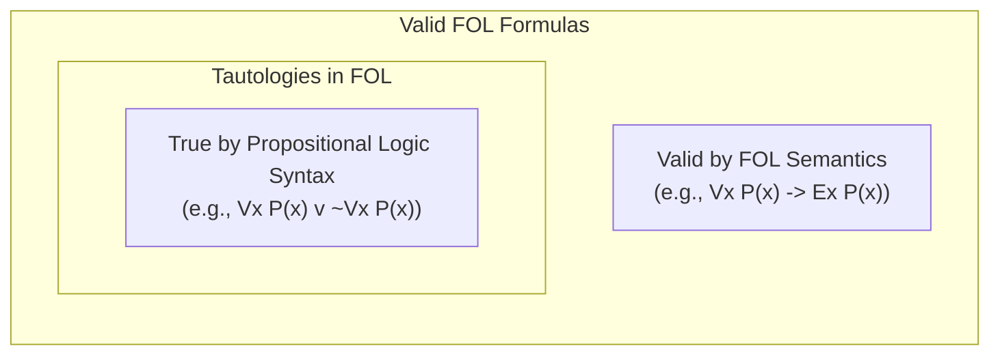

While every tautology in First-Order Logic is valid, not every valid First-Order formula is a tautology[cite: 1].

> [!definition] Tautology in FOL
> A First-Order Logic formula is a **Tautology** if and only if it can be derived as an instance of a Propositional Logic tautology by substituting predicate formulas uniformly for propositional variables[cite: 1].
> * A tautology is true strictly by virtue of its **propositional syntactic structure**, without reference to the semantics of quantifiers, equality, or domain objects[cite: 1].

> [!theorem] Tautology Subsumption Invariant
> $$\text{Tautologies in FOL} \subset \text{Valid FOL Formulas}$$[cite: 1]
> * Every FOL tautology is a valid formula[cite: 1].
> * Not every valid FOL formula is a tautology[cite: 1].

### Comparative Examples

1. **Formula**: $\forall x \, P(x) \vee \neg \forall x \, P(x)$[cite: 1]
   * Replace $\forall x \, P(x)$ with propositional variable $A$:
     $$A \vee \neg A$$[cite: 1]
   * $A \vee \neg A$ is a tautology in Propositional Logic[cite: 1].
   * *Classification*: **Both a Tautology and Valid in FOL**[cite: 1].

2. **Formula**: $\forall x \, P(x) \to \exists x \, P(x)$[cite: 1]
   * Replace components with propositional variables: Let $A \equiv \forall x \, P(x)$ and $B \equiv \exists x \, P(x)$[cite: 1].
   * The propositional abstraction is $A \to B$[cite: 1].
   * In Propositional Logic, $A \to B$ is not a tautology (it evaluates to False when $A$ is True and $B$ is False)[cite: 1].
   * However, in First-Order Logic over non-empty domains, whenever all elements satisfy $P$, at least one element satisfies $P$, making the formula true under every interpretation[cite: 1].
   * *Classification*: **Valid in FOL, but NOT a Tautology**[cite: 1].
