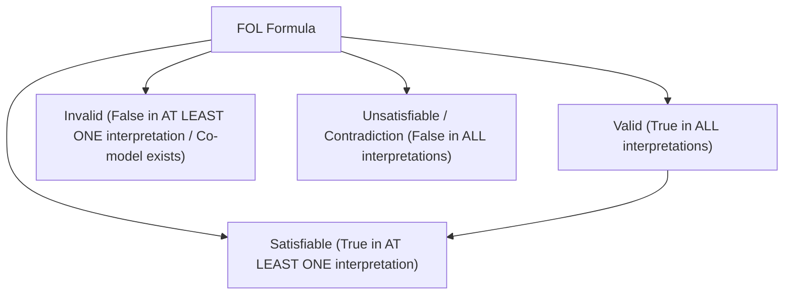

Semantic evaluation in First-Order Logic requires an explicit structure or interpretation[cite: 1].

> [!definition] Interpretation, Model, and Co-Model
> An **Interpretation** $\mathcal{I}$ of a First-Order Logic formula consists of[cite: 1]:
> 1. A non-empty domain of discourse $D$[cite: 1].
> 2. An assignment of domain elements to constants, functions to function symbols, and relations over $D^n$ to $n$-ary predicate symbols[cite: 1].
> 
> * **Model**: An interpretation under which the $\text{FOL}$ formula evaluates to $\text{True}$[cite: 1].
> * **Co-Model (Counter-Model)**: An interpretation under which the $\text{FOL}$ formula evaluates to $\text{False}$[cite: 1].
> * **Row Analogy**: In Propositional Logic, each row of a truth table is an interpretation[cite: 1]. In First-Order Logic, the total number of possible interpretations equals the sum of its models and co-models[cite: 1].

### Classification of First-Order Formulas

* **Valid**: A formula is valid if and only if it evaluates to $\text{True}$ in **every possible interpretation** (across all non-empty domains and all predicate assignments)[cite: 1].
* **Satisfiable**: A formula is satisfiable if and only if there is **at least one interpretation** (a model) in which it evaluates to $\text{True}$[cite: 1].
* **Invalid**: A formula is invalid if there exists **at least one interpretation** (a co-model) that makes it $\text{False}$[cite: 1].

> [!theorem] Systematic Validity Disproof Procedure
> To prove an expression invalid:
> 1. Select a small abstract domain (e.g., $D = \{a, b\}$)[cite: 1].
> 2. Construct an interpretation (define predicates $P(a), P(b)$) that makes the antecedent True and the consequent False[cite: 1].
> 3. If a counter-model can be constructed, the formula is **Invalid**[cite: 1]. If no counter-model can exist mathematically, it is **Valid**[cite: 1].

> [!definition] Logical Equivalence ($\equiv$) in FOL
> Two formulas $\alpha$ and $\beta$ are logically equivalent ($\alpha \equiv \beta$) if and only if $\alpha \leftrightarrow \beta$ is valid (i.e., $\alpha$ and $\beta$ evaluate to the same truth value under every possible interpretation)[cite: 1].
