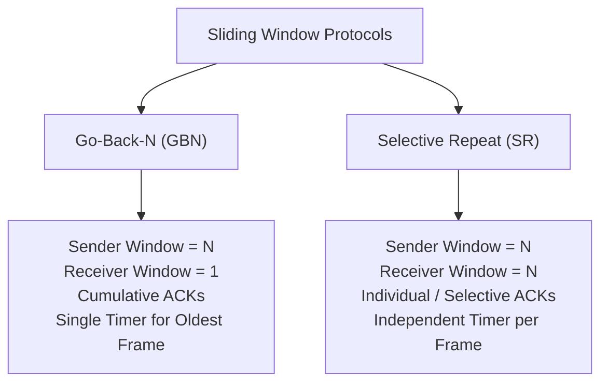

## Sliding Window Protocols: Go-Back-N and Selective Repeat

Sliding window protocols allow multiple frames to be in flight before requiring acknowledgments[cite: 1].

> [!formula] Efficiency of Sliding Window Protocols
> If sender window size is $W_s$ and no packets are lost[cite: 1]:
> $$\eta = \min \left\{ 1, \, \frac{W_s \cdot T_t}{T_t + 2T_p} \right\} = \min \left\{ 1, \, \frac{W_s}{1 + 2a} \right\}$$[cite: 1]
> To achieve $100\%$ link utilization ($\eta = 1$), the required optimal window size is:
> $$W_{\text{optimal}} = \frac{Total cycle time}{Transmission time}= 1 + 2a = 1 + \frac{2T_p}{T_t}$$[cite: 1]

> [!tip] Sliding Window Efficiency Intuition
> * **Denominator ($T_t + 2T_p$):** Represents the fixed **total round-trip cycle time** required to send the first bit and receive its ACK.
> * **Numerator ($W_s \cdot T_t$):** Represents the actual **useful time spent transmitting** data bits during that total cycle window.
> * **Core Principle:** Efficiency is simply the fraction of the round-trip cycle during which the channel is actively pushing data; when $W_s \cdot T_t \ge T_t + 2T_p$, the channel never pauses, hitting $100\%$ utilization.

### Comparison of Protocol Invariants

| Protocol Dimension                   | Stop-and-Wait[cite: 1]                | Go-Back-N (GBN)[cite: 1]                               | Selective Repeat (SR)[cite: 1]                              |
| :----------------------------------- | :------------------------------------ | :----------------------------------------------------- | :---------------------------------------------------------- |
| **Sender Window ($W_s$)**[cite: 1]   | $1$[cite: 1]                          | $N$[cite: 1]                                           | $N$[cite: 1]                                                |
| **Receiver Window ($W_r$)**[cite: 1] | $1$[cite: 1]                          | $1$[cite: 1]                                           | $N$[cite: 1]                                                |
| **ACK Type**[cite: 1]                | Individual (alternating bit)[cite: 1] | Cumulative (`ACK n` confirms all up to $n-1$)[cite: 1] | Individual / Selective (`ACK n` confirms only $n$)[cite: 1] |
| **Out-of-Order Frames**[cite: 1]     | Discarded[cite: 1]                    | Discarded unconditionally[cite: 1]                     | Buffered in receiver window[cite: 1]                        |
| **Retransmission on Loss**[cite: 1]  | Single lost frame[cite: 1]            | Entire window from lost packet onwards[cite: 1]        | Only the specific lost/corrupted frame[cite: 1]             |
| **Timer Hardware**[cite: 1]          | Single timer[cite: 1]                 | Single timer (tracks base frame)[cite: 1]              | Multiple timers (one per unacked frame)[cite: 1]            |

> [!question] Frame Count on Retransmission: GBN vs. SR
> Transmit $10$ frames with window size $W = 3$, where every $5^{\text{th}}$ transmission attempt is lost[cite: 1].
> * **GBN Execution Trace**:
>   * Transmit: $1, 2, 3, 4$
>   * $5^{\text{th}}$ transmission ($5$) is lost[cite: 1].
>   * Window drops: Frames $5, 6, 7$ must be retransmitted[cite: 1].
>   * Total transmissions required $= 18$[cite: 1].
> * **SR Execution Trace**:
>   * Only the lost frame ($5$) is retransmitted; subsequent frames $6, 7, \dots$ are buffered[cite: 1].
>   * Total transmissions required $= 12$[cite: 1].
