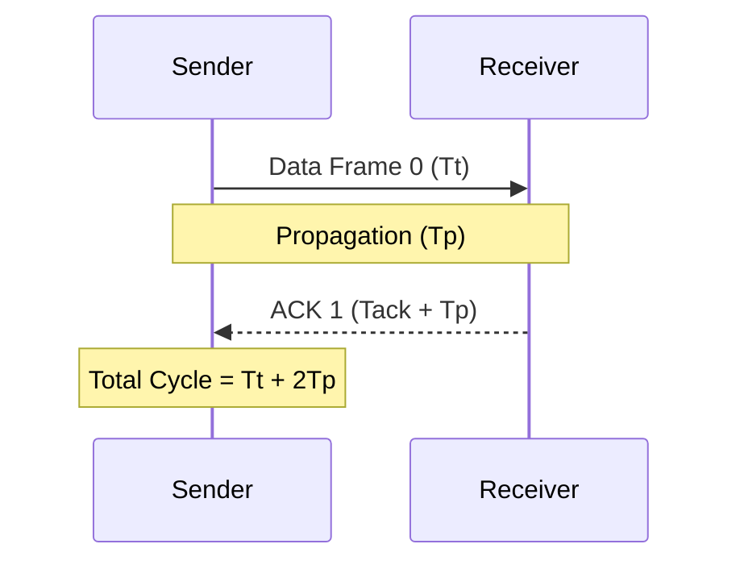

## Stop-and-Wait ARQ

In Stop-and-Wait Automatic Repeat reQuest (ARQ), the sender transmits exactly one data frame and halts, awaiting an acknowledgment (ACK) before transmitting the subsequent frame or timing out to retransmit[cite: 1].



> [!formula] Efficiency and Throughput in Stop-and-Wait
> For data frame transmission time $T_t$, round-trip propagation $2T_p$, and negligible ACK transmission time:
> 1. **Round Trip Time (RTT)**:
>    $$\text{RTT} = T_t + 2T_p$$[cite: 1]
> 2. **Link Utilization / Efficiency ($\eta$)**:
>    $$\eta = \frac{\text{Useful Time}}{\text{Total Cycle Time}} = \frac{T_t}{T_t + 2T_p} = \frac{1}{1 + 2a}$$[cite: 1]
>    Where $a = \frac{T_p}{T_t}$ is the link latency ratio[cite: 1].
> 3. **Throughput**:
>    $$\text{Throughput} = \eta \times \text{Bandwidth} = \frac{L}{T_t + 2T_p}\text{ bps}$$[cite: 1]

> [!question] Efficiency Calculation Under Distance
> A $1000\text{-mile}$ error-free link operates at $1\text{ Mbps}$ with a propagation delay of $5\text{ }\mu\text{s/mile}$[cite: 1]. Determine link utilization for $1250\text{-byte}$ frames[cite: 1].
> * Total $T_p = 1000 \times 5\text{ }\mu\text{s} = 5000\text{ }\mu\text{s} = 5\text{ ms}$[cite: 1].
> * $T_t = \frac{1250 \times 8\text{ bits}}{10^6\text{ bps}} = \frac{10000}{10^6}\text{ s} = 10\text{ ms}$[cite: 1].
> * Total cycle time $= T_t + 2T_p = 10 + 2(5) = 20\text{ ms}$[cite: 1].
> * Utilization $\eta = \frac{10}{20} = 50\%$[cite: 1].

### Stop-and-Wait Retransmission Under Error

When frames or ACKs drop with independent error probability $p$[cite: 1]:
* Probability of successful transfer per attempt $= 1 - p$[cite: 1].
* The number of attempts follows a geometric distribution with mean:
  $$E[\text{Transmissions per packet}] = \frac{1}{1 - p}$$
[cite: 1]

> [!question] Stop-and-Wait Duration with Retransmissions
> Send a $100\text{ KB}$ file in $1\text{ KB}$ frames[cite: 1]. RTT $= 50\text{ ms}$, Timeout $= 200\text{ ms}$[cite: 1]. Frame loss probability $= 10\%$, ACK loss probability $= 10\%$ (independent)[cite: 1].
> 1. Overall round success probability:
>    $$P_{\text{succ}} = (1 - 0.1)(1 - 0.1) = 0.9 \times 0.9 = 0.81$$[cite: 1]
> 2. Total attempts for $100$ successful deliveries:
>    $$\text{Attempts} = \frac{100}{0.81} \approx 123.46$$[cite: 1]
>    $$\text{Retransmissions} = 123.46 - 100 = 23.46$$[cite: 1]
> 3. Total expected duration:
>    $$\text{Duration} = (100 \times \text{RTT}) + (23.46 \times \text{Timeout}) = (100 \times 50\text{ ms}) + (23.46 \times 200\text{ ms})$$[cite: 1]
>    $$\text{Duration} = 5000\text{ ms} + 4692\text{ ms} = 9692\text{ ms} \approx 9.69\text{ seconds}$$[cite: 1]

The **Timeout** period already includes the RTT of the failed attempt (either consider it as the retransmission time for the failed frames or the time for time taken in orignally trasnfering them, it automatically adjusts)!
When the sender transmits a frame, it starts a single timer initialized to `Timeout = 200 ms`.
```
[t = 0 ms]  Sender transmits Frame. Timer starts running down from 200 ms.
            │
            ├── (If successful): ACK arrives at t = RTT (50 ms). Timer stops!
            │
            └── (If frame or ACK is lost): No ACK arrives. 
                Timer keeps ticking all the way until t = 200 ms.
```
When a loss occurs, the sender spends **a total of 200 ms** waiting before it triggers a retransmission.
It does **NOT** wait $50\text{ ms} + 200\text{ ms} = 250\text{ ms}$. The 200 ms timer _is the entire elapsed wall-clock time_ spent on that failed attempt.
