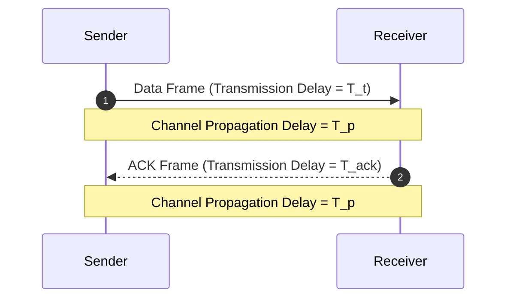

> [!definition]
> **Stop-and-Wait Flow Control** is a noiseless/noisy channel protocol where the sender transmits a single frame of size $L$ and halts transmission until an Acknowledgement (ACK) frame is received from the receiver[cite: 1, 2].

> [!revision] Revision
> **Core Timing and Parameter Metrics:**
> 1. **Transmission Delay ($T_t$):**
>    $$T_t = \frac{L}{B} = \frac{\text{Frame length in bits}}{\text{Bandwidth in bps}}$$
> 2. **Propagation Delay ($T_p$):**
>    $$T_p = \frac{d}{v} = \frac{\text{Link distance}}{\text{Signal propagation speed}}$$
> 3. **Total Cycle Time ($T_{\text{total}}$):**
>    $$T_{\text{total}} = T_t(\text{data}) + 2 \cdot T_p + T_t(\text{ACK}) + T_{\text{proc}} + T_{\text{queue}}$$
>    *(Assuming negligible $T_t(\text{ACK})$, $T_{\text{proc}}$, and $T_{\text{queue}}$)*:
>    $$T_{\text{total}} = T_t + 2T_p$$
> 4. **Propagation-to-Transmission Ratio ($a$):**
>    $$a = \frac{T_p}{T_t} = \frac{d \cdot B}{v \cdot L}$$
> 5. **Link Utilization / Efficiency ($\eta$):**
>    $$\eta = \frac{\text{Useful Time}}{\text{Total Cycle Time}} = \frac{T_t}{T_t + 2T_p} = \frac{1}{1 + 2a}$$
> 6. **Throughput ($S$):**
>    $$S = \eta \times \text{Bandwidth} = \frac{L}{T_t + 2T_p}$$

### Summary Checklist to Never Forget

|Term|What it really means|Everyday Analogy|
|---|---|---|
|**Bandwidth (B)**  TXT|Width of the pipe (bits pushed per sec)  TXT|How wide the highway toll gate is|
|**Tt​ (Transmission)**  TXT|Time taken to push all bits of a packet out of the port  TXT|Time for a 1,000-truck convoy to cross the toll gate|
|**Tp​ (Propagation)**  TXT|Time taken for a single bit to travel from sender to receiver  TXT|Drive time of one truck on the asphalt between cities|
|**a=Tt​Tp​​**  TXT|Ratio of travel time to pumping time  TXT|"Road trip duration" vs "toll booth exit duration"|
|**Efficiency (η=1+2a1​)**  TXT|% of time the sender is actually working instead of waiting  TXT|Full round-trip waiting timeTime toll booth is busy​  TXT|
|**Throughput (S=η⋅B)**  TXT|Real-world bit rate achieved after protocol waiting penalties  TXT|Actual trucks reaching Delhi per hour|
> [!trap]
> In PSU numericals, distinguish between **Round Trip Time (RTT)** and **One-way Propagation Delay ($T_p$)**[cite: 1]:
> $$\text{RTT} = 2 \cdot T_p \implies T_p = \frac{\text{RTT}}{2}$$
> If a question specifies $\text{RTT} = 45\text{ ms}$, do not double it again; direct total round-trip latency across the wire is already $45\text{ ms}$[cite: 1].

> [!question]
> **Q:** A channel has a bandwidth of $4\text{ kbps}$ and a one-way propagation delay of $20\text{ ms}$. If Stop-and-Wait protocol is used with negligible ACK transmission time, find the minimum frame size $L$ required to achieve an efficiency of at least $50\%$.  
> (A) 80 bits  
> (B) 160 bits  
> (C) 320 bits  
> (D) 640 bits  
>
> **Answer:** **(B)**  
> **Explanation:**  
> For $\eta \ge 50\% = 0.5$[cite: 1]:  
> $$\eta = \frac{1}{1 + 2a} \ge \frac{1}{2} \implies 1 + 2a \le 2 \implies 2a \le 1 \implies a \le 0.5$$  
> Since $a = \frac{T_p}{T_t}$[cite: 1]:  
> $$T_t \ge 2 T_p = 2 \times 20\text{ ms} = 40\text{ ms} = 0.04\text{ s}$$  
> Frame size $L = T_t \times B$[cite: 1]:  
> $$L \ge 0.04\text{ s} \times 4000\text{ bps} = 160\text{ bits}$$
