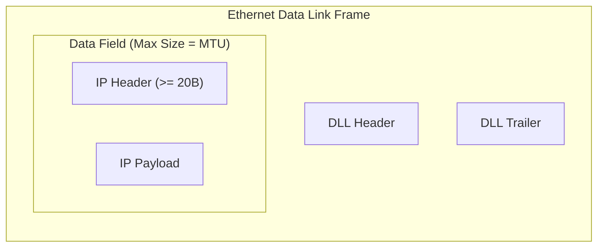

Different physical networks enforce distinct constraints on the maximum frame payload they can transmit[cite: 1].

> [!definition] Maximum Transfer Unit (MTU)
> The **MTU** is the maximum size of an IP datagram (IP Header $+$ IP Payload) that can be encapsulated within the data field of a physical data link layer frame[cite: 1]. It excludes the Data Link Layer (DLL) header and trailer[cite: 1].
> * Example: Standard Ethernet frames enforce an MTU of $1500\text{ Bytes}$[cite: 1].

### Fragmentation and Reassembly Rules
1. **Fragmentation Point**: An intermediate router fragments an IP datagram whenever the datagram's total length exceeds the MTU of the outgoing link[cite: 1]. A previously fragmented packet can be fragmented again by subsequent routers along its path[cite: 1].
2. **Reassembly Point**: Reassembly is performed **strictly at the destination host**[cite: 1]. Intermediate routers do not reassemble fragments because:
   * Independent fragments can take different paths through the network and may not all pass through the same router[cite: 1].
   * If an intermediate router reassembled fragments, downstream links with smaller MTUs might force the packet to be fragmented again, resulting in wasted computation[cite: 1].
