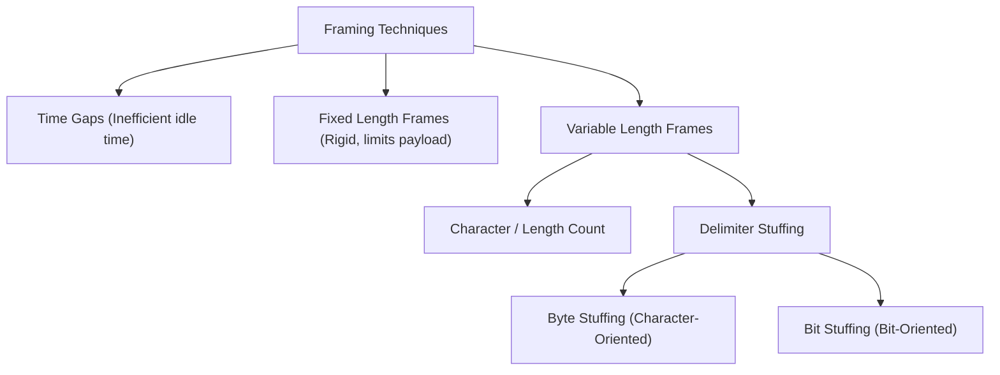

## Data Link Layer Framing Mechanics

The physical layer presents an unformatted, continuous stream of raw bits[cite: 1]. The data link layer encapsulates network-layer datagrams into discrete **frames**, requiring methods to signal where each frame begins and terminates[cite: 1].

### Framing Approaches

1. **Time Gaps**: Adding idle intervals between consecutive frames[cite: 1]. Highly inefficient because transmission pauses waste available link bandwidth[cite: 1].
2. **Fixed-Length Frames**: Every frame has an identical bit/byte count[cite: 1]. Rigid; forces internal fragmentation on small payloads while restricting larger datagrams[cite: 1].
3. **Character / Length Count**: Prepending a count field indicating the total bytes in the frame[cite: 1].
   * *Critical Vulnerability*: If a transmission error corrupts the count field, the receiver loses frame synchronization entirely, misinterpreting data bytes as new length headers[cite: 1].

### Stuffing Techniques

#### Byte Stuffing (Character-Oriented Framing)
Frames begin and end with dedicated sentinel **FLAG** bytes[cite: 1].
* If a byte matching the `FLAG` occurs inside the payload data, the sender escapes it by prepending an escape character (`ESC` byte)[cite: 1].
* If an `ESC` byte naturally occurs inside the data, the sender prepends another `ESC` byte[cite: 1].
* *Receiver Action*: On encountering `ESC`, discard the `ESC` byte and treat the next incoming byte purely as data payload[cite: 1].

| Data Before Stuffing[cite: 1] | Transmitted Stuffed Data[cite: 1] |
| :---------------------------- | :-------------------------------- |
| `FLAG`[cite: 1]               | `ESC FLAG`[cite: 1]               |
| `ESC`[cite: 1]                | `ESC ESC`[cite: 1]                |
| `ESC FLAG`[cite: 1]           | `ESC ESC ESC FLAG`[cite: 1]       |
| `ESC ESC`[cite: 1]            | `ESC ESC ESC ESC`[cite: 1]        |

#### Bit Stuffing (Bit-Oriented Framing)
Frames are delimited by a fixed bit flag, standardly `01111110` ($0$, six consecutive $1$s, $0$)[cite: 1].
* **Sender Rule**: Whenever five consecutive $1$s appear in the raw data stream, the sender unconditionally inserts (stuffs) a `0` immediately after the fifth $1$[cite: 1].
* **Receiver Rule**: Whenever five consecutive $1$s are detected:
  * If the next bit is `0`, it is a stuffed bit and is stripped/discarded[cite: 1].
  * If the next bit is `1`, followed by `0` (`01111110`), it marks the end of the frame (FLAG)[cite: 1].

> [!question] Bit Stuffing Worked Trace
> Given the data stream:
> $$011011111111111111110010$$[cite: 1]
> Show the bit-stuffed frame payload generated at the sender using the flag `01111110`[cite: 1].

* **Execution Trace**:
  1. `0110`
  2. First five $1$s: `11111` $\to$ Stuff `0`: `11111`**`0`**[cite: 1]
  3. Next five $1$s: `11111` $\to$ Stuff `0`: `11111`**`0`**[cite: 1]
  4. Next five $1$s: `11111` $\to$ Stuff `0`: `11111`**`0`**[cite: 1]
  5. Remaining bits: `10010`[cite: 1]
* **Resulting Bit Stream**:
  $$0110\,11111\mathbf{0}11111\mathbf{0}11111\mathbf{0}10010$$[cite: 1]
