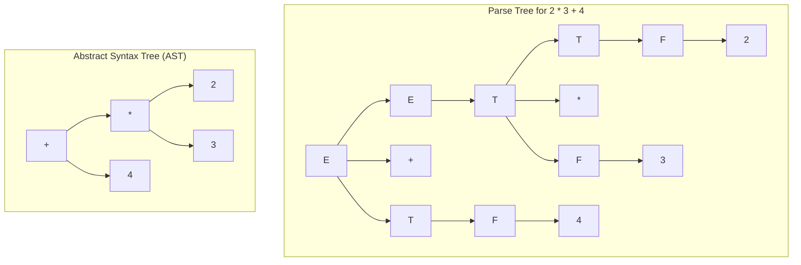

> [!definition]
> - **Parse Tree (Concrete Syntax Tree)**: An explicit pictorial derivation representation where every internal node is a non-terminal ($V_N$), children represent RHS production symbols, and leaves are terminals ($V_T$) or $\epsilon$.
> - **Syntax Tree (Abstract Syntax Tree / AST)**: A condensed, non-procedural expression tree where internal nodes are operator symbols and leaves are operands.

> [!theorem]
> **Grammar Ambiguity**:
> A grammar $G$ is **ambiguous** if there exists at least one string $w \in \mathcal{L}(G)$ that permits:
> 1. Two or more distinct parse trees, OR
> 2. Two or more distinct Leftmost Derivations (LMD), OR
> 3. Two or more distinct Rightmost Derivations (RMD).
>
> *Structural Rule*: If an operator grammar defines equal priority for an operator along both left- and right-associative derivations, or fails to stratify operators with distinct precedence levels, the grammar is ambiguous.

> [!trap]
> No deterministic parser ($LL(k)$, $LR(k)$, $SLR(k)$, $LALR(k)$) can be constructed for an ambiguous grammar. The only exception in parsing paradigms is an **Operator Precedence Parser**, which can resolve specified ambiguities using external precedence and associativity tables.

> [!question]
> Consider the grammar $G$: $S \to aSb \mid bSa \mid a \mid b$. Which of the following statements is TRUE?
> - (A) $G$ is ambiguous and can be parsed by an $LL(1)$ parser.
> - (B) $G$ generates odd-length palindromes, is unambiguous, but has no deterministic parser.
> - (C) $G$ is an operator grammar.
> - (D) $G$ is regular and can be converted into a DFA.
>
> **Correct Option**: **(B)**
> **Explanation**: $G$ generates non-deterministic odd-length palindromes $\mathcal{L}(G) = \{w \in \{a,b\}^+ \mid w = w^R \text{ and } |w| \text{ is odd}\}$. The language is a non-deterministic CFL (NCFL). Since deterministic parsers require a Deterministic CFL (DCFL), no $LL(k)$ or $LR(k)$ parser can parse $G$, even though $G$ is unambiguous.
