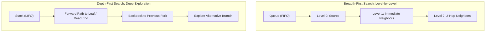
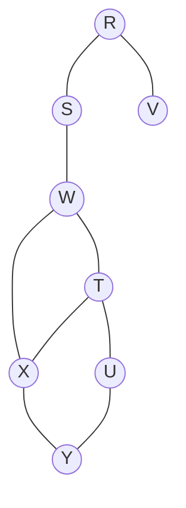

## 1. Algorithmic Fundamentals

* **Breadth-First Search (BFS):** Traverses the graph level-by-level radiating outward from the source using a **FIFO Queue**. It is guaranteed to compute the single-source shortest path (minimum edge count) on unweighted graphs in $O(V + E)$ time.
* **Depth-First Search (DFS):** Explores as deep as possible along each branch before backtracking, driven by a **LIFO Stack** or runtime call stack recursion. It is foundational for structural connectivity analysis (bridges, articulation points, topological ordering).

---

## 2. Complexity & Representation Invariants

| Graph Representation | BFS Time Complexity | DFS Time Complexity | Space Complexity |
| :------------------- | :-----------------: | :-----------------: | :--------------: |
| **Adjacency List**   |     $O(V + E)$      |     $O(V + E)$      |      $O(V)$      |
| **Adjacency Matrix** |      $O(V^2)$       |      $O(V^2)$       |     $O(V^2)$     |

* **Spanning Forest Invariant:** Running BFS or DFS on any connected undirected graph of $V$ vertices constructs a spanning tree with exactly $V - 1$ tree edges.
* **Edge Classification in Undirected Graphs:**
  * **BFS Trees** contain only **Tree edges** and **Cross edges** (no back edges).
  * **DFS Trees** contain only **Tree edges** and **Back edges** (no cross edges).

---

## 3. Algorithmic Applications Comparison

| Problem / Routine                 |     BFS Suitability      | DFS Suitability | Key Algorithmic Mechanism                                                                       |
| :-------------------------------- | :----------------------: | :-------------: | :---------------------------------------------------------------------------------------------- |
| **Shortest Path (Unweighted)**    | **Optimal** ($O(V + E)$) |   Unsuitable    | Level-order expansion guarantees minimal edge traversal.                                        |
| **Connected Components**          |           Yes            |       Yes       | Identifies all vertices reachable from a component root.                                        |
| **Cycle Detection (Undirected)**  |           Yes            |       Yes       | **BFS:** Cross edge to visited non-parent. **DFS:** Back edge to an ancestor.                |
| **Cycle Detection (Directed)**    |    Yes (Kahn's Alg.)     |       Yes       | **BFS:** Processed count $< V$. **DFS:** Back edge to node currently on the recursion stack. |
| **Topological Sorting (DAG)**     |       Yes (Kahn's)       |       Yes       | **BFS:** In-degree 0 queue tracking. **DFS:** Reverse of post-order finishing times.         |
| **Bipartite Graph 2-Coloring**    |           Yes            |       Yes       | Detects existence of odd-length cycles ($BF \ge 2$ cross-level check).                          |
| **Bridges & Articulation Points** |            No            |     **Yes**     | Uses Tarjan's discovery times and low-link values ($\text{low}[v]$).                            |

---

## 4. Traversal Traps

> [!trap] Non-Uniqueness of Traversal Sequences
> Neither BFS nor DFS yields a unique output sequence for a given graph unless:
> 1. The starting vertex is explicitly declared.
> 2. A deterministic tie-breaking invariant (such as ascending/alphabetical neighbor iteration) is strictly enforced.
> 
> Different queue/stack insertion sequences of peer vertices produce different, fully valid traversal orders and spanning tree topologies.

---

## 5. Practice Drill: Deterministic BFS Trace

> [!question] PSU CBT Practice Drill
> Starting from vertex **$R$**, if adjacent vertices are visited in **alphabetical order**, find the BFS traversal sequence for the undirected graph containing vertices $\{R, S, T, U, V, W, X, Y\}$ with edges:
> $$(R, S), (R, V), (S, W), (W, T), (W, X), (T, U), (T, X), (X, Y), (U, Y)$$
> 
> * (A) $R, S, V, W, T, X, U, Y$
> * (B) $R, V, S, W, X, T, Y, U$
> * (C) $R, S, W, V, T, X, U, Y$
> * (D) $R, S, V, W, X, T, U, Y$

### Step-by-Step State Trace

| Step | Active Operation | Vertex Visited | Queue State (Front $\to$ Rear) | Traversal Sequence |
| :---: | :--- | :---: | :--- | :--- |
| **0** | Initialize at root $R$ | $R$ | `[R]` | $R$ |
| **1** | Dequeue $R$; enqueue unvisited neighbors in alphabetical order: $\{S, V\}$ | — | `[S, V]` | $R$ |
| **2** | Dequeue $S$; mark visited; enqueue unvisited neighbor $\{W\}$ | $S$ | `[V, W]` | $R, S$ |
| **3** | Dequeue $V$; mark visited; no unvisited neighbors ($R$ already visited) | $V$ | `[W]` | $R, S, V$ |
| **4** | Dequeue $W$; mark visited; enqueue unvisited neighbors $\{T, X\}$ | $W$ | `[T, X]` | $R, S, V, W$ |
| **5** | Dequeue $T$; mark visited; enqueue unvisited neighbor $\{U\}$ ($X$ already queued) | $T$ | `[X, U]` | $R, S, V, W, T$ |
| **6** | Dequeue $X$; mark visited; enqueue unvisited neighbor $\{Y\}$ | $X$ | `[U, Y]` | $R, S, V, W, T, X$ |
| **7** | Dequeue $U$; mark visited; all neighbors $\{T, Y\}$ visited/queued | $U$ | `[Y]` | $R, S, V, W, T, X, U$ |
| **8** | Dequeue $Y$; mark visited; all neighbors $\{X, U\}$ visited | $Y$ | `[]` | $R, S, V, W, T, X, U, Y$ |

**Final Traversal Sequence:** $R \to S \to V \to W \to T \to X \to U \to Y$

**Correct Answer:** **(A) R, S, V, W, T, X, U, Y**