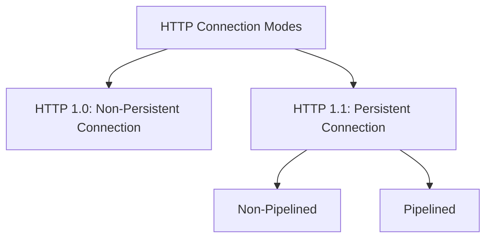

Hypertext Transfer Protocol (HTTP) serves as the primary foundational protocol of the World Wide Web (WWW) for transferring multi-format web resources (HTML, media, JSON, text) between clients and servers[cite: 1].

> [!definition] HTTP Properties
> * **Transport Layer Protocol**: Relies on TCP for reliable, ordered byte-stream delivery[cite: 1].
> * **Default Server Port**: Port 80 (standard HTTP)[cite: 1].
> * **Stateless Architecture**: HTTP is inherently stateless[cite: 1]. The server stores no persistent knowledge or historical session state concerning past client requests; each request-response transaction is evaluated independently[cite: 1].

### Connection Modes: HTTP 1.0 vs. HTTP 1.1

#### 1. HTTP 1.0 (Non-Persistent Connection)
* A distinct, individual TCP connection is established for **every single** request/response pair[cite: 1].
* Once the server sends the requested object's reply, the connection is immediately closed[cite: 1].
* **Connection Overhead**: To download an HTML base page referencing $N$ embedded inline objects (e.g., images), the client must establish $1 + N$ separate TCP connections[cite: 1]. Each object requires a distinct 3-way TCP handshake, introducing substantial latency and network overhead[cite: 1].

#### 2. HTTP 1.1 (Persistent Connection)
* A single TCP connection remains open across multiple consecutive requests and responses between the same client-server pair[cite: 1].
* Subdivided into two operational styles:
  * **Non-Pipelined Persistent**: The client transmits a request and must wait to receive the full server response before issuing the next consecutive request[cite: 1].
  * **Pipelined Persistent**: The client sends multiple back-to-back requests over the open TCP channel without waiting for intervening responses[cite: 1]. The server transmits responses back in the order requests were received[cite: 1].

> [!trap] Non-Persistent Connection Overhead
> In non-persistent HTTP 1.0, fetching an HTML document containing $N$ objects requires at least $2 \times (1 + N)$ Round Trip Times (RTTs) plus data transmission latency ($1\text{ RTT}$ for TCP connection establishment and $1\text{ RTT}$ for the HTTP object request per object), creating severe throughput degradation over high-latency channels.
