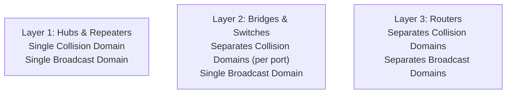

## Networking Devices, Collision Domains, and Broadcast Domains

> [!definition] Domain Types
> * **Collision Domain**: The set of connected network interfaces where simultaneous packet transmissions collide on the physical medium[cite: 1].
> * **Broadcast Domain**: The set of all network devices that receive a broadcast frame sent by any one node within the segment (e.g., destination `FF:FF:FF:FF:FF:FF`)[cite: 1].

### Device Taxonomy

| Device | Layer[cite: 1] | Collision Domain Separation[cite: 1] | Broadcast Domain Separation[cite: 1] | Operational Logic[cite: 1] |
| :--- | :--- | :--- | :--- | :--- |
| **Repeater**[cite: 1] | Layer 1[cite: 1] | No (Extends domain)[cite: 1] | No[cite: 1] | Cleans, amplifies, and regenerates attenuated signals across distances[cite: 1]. |
| **Hub**[cite: 1] | Layer 1[cite: 1] | No (1 domain for all ports)[cite: 1] | No[cite: 1] | Multi-port repeater; blindly broadcasts signals arriving on one port out all other ports[cite: 1]. |
| **Bridge**[cite: 1] | Layer 2[cite: 1] | Yes (Each port is a domain)[cite: 1] | No[cite: 1] | 2-port filtering device; dynamically learns source MAC addresses to filter unicast frames[cite: 1]. |
| **Switch**[cite: 1] | Layer 2[cite: 1] | Yes (Each port is an independent domain)[cite: 1] | No (Passes broadcasts)[cite: 1] | Multi-port bridge maintaining an internal MAC forwarding table (CAM table)[cite: 1]. |
| **Router**[cite: 1] | Layer 3[cite: 1] | Yes[cite: 1] | Yes (Terminates broadcasts)[cite: 1] | Forwards packets between disparate subnets using routing tables and IP prefixes[cite: 1]. |

> [!theorem] Subnet and Interface Invariant
> Every active physical interface of an operational router resides in a distinct IP subnet and forms an independent broadcast and collision domain boundary[cite: 1]. Switches do not partition broadcast domains unless configured into Virtual LANs (VLANs)[cite: 1].
