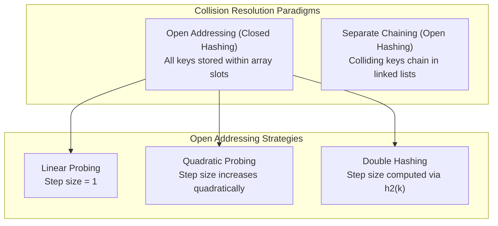

## 1. Mathematical Fundamentals

A **Hash Function** $h(k)$ maps an arbitrary universe of keys $U$ into discrete table slots $\{0, 1, \dots, m - 1\}$:

$$h: U \to \{0, 1, \dots, m - 1\}$$

* **Collision Invariant:** By the Pigeonhole Principle, if $|U| > m$, there exist distinct keys $k_1 \neq k_2$ such that $h(k_1) = h(k_2)$.
* **Load Factor ($\alpha$):** Denotes the average density of stored elements across hash table slots:
  $$\alpha = \frac{n}{m}$$
  where $n$ is the count of stored keys and $m$ is the total slot capacity.
* **Primary Clustering:** The formation of continuous occupied slot blocks in **Linear Probing**. Any key hashing into or immediately before the run extends the block, causing probe lengths to cascade and degrade performance.
* **Secondary Clustering:** In **Quadratic Probing**, distinct keys sharing the same primary hash value $h(k_1) = h(k_2)$ follow the exact same probe trajectory, creating redundant collision paths.

| **Term**              | **Break Down the Words**                            | **The Meaning**                                                          |
| --------------------- | --------------------------------------------------- | ------------------------------------------------------------------------ |
| **Open Addressing**   | "The addresses are not coupled; chose what is free" | If slot 2 is taken, go steal slot 3 or 4. Everything stays in the array. |
| **Closed Hashing**    | "The table is closed/sealed"                        | Same thing: No external heap nodes allowed outside the array.            |
| **Separate Chaining** | "Chains of nodes"                                   | Linked lists hanging off each bucket.                                    |
| **Open Hashing**      | "Open to external memory"                           | Same thing: Nodes live outside the table on the heap.                    |

---

## 2. Probing Formulations & Complexity Bounds

Let $i \in \{0, 1, \dots, m - 1\}$ denote the trial probe iteration.

### Probing Invariants

* **Linear Probing:**
  $$h(k, i) = \Big(h(k) + i\Big) \pmod m$$
* **Quadratic Probing:**
  $$h(k, i) = \Big(h(k) + c_1 i + c_2 i^2\Big) \pmod m$$
* **Double Hashing:**
  $$h(k, i) = \Big(h_1(k) + i \cdot h_2(k)\Big) \pmod m$$

> [!theorem] Double Hashing Coprimality Invariant
> For Double Hashing to cycle through all $m$ slots without trapping in an infinite partial cycle, the secondary step size $h_2(k)$ must be **coprime** to the table capacity $m$:
> $$\gcd\big(h_2(k), m\big) = 1 \quad \land \quad h_2(k) \neq 0$$
> Standard implementation convention: Choose $m$ as prime, and define $h_2(k) = 1 + (k \pmod{m'})$ where $m' < m$.

### Asymptotic Search Time

| Resolution Method | Successful Search Time | Unsuccessful Search Time | Space Bound |
| :--- | :---: | :---: | :---: |
| **Separate Chaining** | $\Theta(1 + \alpha)$ | $\Theta(1 + \alpha)$ | $O(m + n)$ |
| **Open Addressing (General)** | $\frac{1}{\alpha} \ln \left(\frac{1}{1 - \alpha}\right)$ | $\frac{1}{1 - \alpha}$ | $O(m)$ |

---

## 3. Collision Resolution Strategy Matrix

| Collision Strategy | Primary Clustering | Secondary Clustering | Permissible Load Factor ($\alpha$) | Table Constraints |
| :--- | :---: | :---: | :---: | :--- |
| **Linear Probing** | **Severe** | **Present** | $\alpha < 1$ (degrades heavily for $\alpha > 0.7$) | Any integer capacity |
| **Quadratic Probing** | **Eliminated** | **Present** | $\alpha \le 0.5$ | Prime $m \equiv 3 \pmod 4$ ensures half table probed |
| **Double Hashing** | **Eliminated** | **Eliminated** | $\alpha < 1$ | $\gcd(h_2(k), m) = 1$ |
| **Separate Chaining** | **None** | **None** | $\alpha > 1$ permissible | Any integer capacity |

> [!trap] Load Factor Limit in Open Addressing
> In open addressing, the condition $\alpha \le 1.0$ is a strict upper bound. Once $n = m$, the table is completely saturated; any further insertion triggers an infinite loop unless dynamic rehashing doubles the table size.
> In separate chaining, $\alpha$ can exceed $1.0$ arbitrarily because element nodes reside in dynamically allocated heap space external to the table pointer array.

---

## 4. Practice Drill: Double Hashing Probe Sequence

> [!question] PSU CBT Practice Drill
> A hash table of capacity $m = 13$ uses Double Hashing with:
> $$h_1(k) = k \pmod{13} \quad \text{and} \quad h_2(k) = 1 + (k \pmod{11})$$
> What is the probe sequence for inserting key $k = 41$?
> * (A) $2, 11, 7, 3$
> * (B) $2, 7, 12, 4$
> * (C) $3, 12, 8, 4$
> * (D) $3, 8, 0, 5$

### Step-by-Step Resolution

1. **Calculate Base Hash ($h_1$):**
   $$h_1(41) = 41 \pmod{13} = 2 \quad (13 \times 3 = 39, \text{ remainder } 2)$$

2. **Calculate Step Size ($h_2$):**
   $$h_2(41) = 1 + (41 \pmod{11}) = 1 + 8 = 9 \quad (11 \times 3 = 33, \text{ remainder } 8)$$
   *Check Coprimality:* $\gcd(9, 13) = 1$. The step size covers all slots.

3. **Compute Probe Iterations $h(41, i) = \big(2 + i \times 9\big) \pmod{13}$:**
   * **Probe $i = 0$:**
     $$(2 + 0 \times 9) \pmod{13} = 2 \pmod{13} = \mathbf{2}$$
   * **Probe $i = 1$:**
     $$(2 + 1 \times 9) \pmod{13} = 11 \pmod{13} = \mathbf{11}$$
   * **Probe $i = 2$:**
     $$(2 + 2 \times 9) \pmod{13} = 20 \pmod{13} = \mathbf{7}$$
   * **Probe $i = 3$:**
     $$(2 + 3 \times 9) \pmod{13} = 29 \pmod{13} = \mathbf{3}$$

**Probe Sequence:** $2, 11, 7, 3$

**Correct Answer:** **(A) 2, 11, 7, 3**

# extra points
The probe sequence parameter $i$ in the mathematical formulas is **0-indexed** ($i = 0, 1, 2, \dots, m-1$), but the **count/number of probes** is **1-indexed** (1st probe, 2nd probe, 3rd probe).

  

### 1. In the Formula: $i$ is Always 0-Indexed

In standard computer science textbooks (CLRS) and GATE, the variable $i$ starts at **$0$**:

  

$$h(k, i) = \big(h(k) + i\big) \pmod m \quad \text{for } i = 0, 1, 2, \dots, m-1$$

- **$i = 0$ is the 1st probe:**
    
      
    
    $$h(k, 0) = h(k) \pmod m$$
    
    This gives the original hash location where you first attempt to place or find the key without any offset.
    
      
    
- **$i = 1$ is the 2nd probe:**
    
    First collision encountered $\implies$ jump to the next slot.
    
      
    
- **$i = 2$ is the 3rd probe:**
    
    Second collision encountered $\implies$ jump again.
    
      
    

### 2. In GATE / Exam Questions: Watch the Phrasing

Questions trip students up by mixing the mathematical variable $i$ with the physical count of attempts:

  

|**What the Question Asks**|**What to Calculate**|
|---|---|
|_"Find the probe sequence"_|Calculate locations for $i = 0, 1, 2, 3\dots$|
|_"What is the location on the 1st probe?"_|Evaluate at **$i = 0$**|
|_"What is the location on the 3rd probe?"_|Evaluate at **$i = 2$**|
|_"How many probes were required to insert?"_|Count the total attempts ($1, 2, 3\dots$). If it fit on the first try ($i = 0$), the probe count is **$1$**.|

> **Mental Rule:** The index offset $i$ represents **"how many collisions have already occurred"**. Before you even check the table, you have had $0$ collisions, so $i = 0$. Once you try and fail, that's $1$ collision, so $i = 1$.