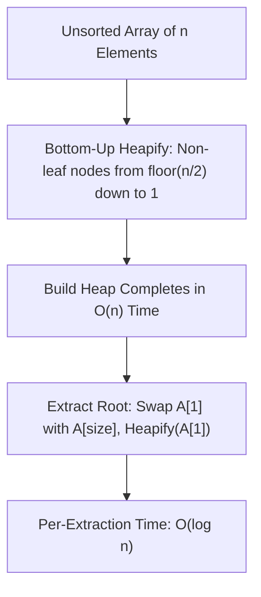

## 1. Structural Definition & Heap Invariant

A **Binary Heap** is a complete binary tree (CBT) stored contiguously in an array to achieve optimal cache locality without explicit left/right child pointers.

* **Max Heap Property:** $\text{Key}(\text{Parent}) \ge \text{Key}(\text{Children})$ across all non-root nodes.
* **Min Heap Property:** $\text{Key}(\text{Parent}) \le \text{Key}(\text{Children})$ across all non-root nodes.
* **Shape Property:** Every level is completely filled except possibly the last level, which fills strictly from left to right.

---

## 2. Array Coordinate Mapping Formulas

| Relationship | 1-Based Indexing ($i \in [1, n]$) | 0-Based Indexing ($i \in [0, n-1]$) |
| :--- | :---: | :---: |
| **Parent Index** | $\lfloor i / 2 \rfloor$ | $\lfloor (i - 1) / 2 \rfloor$ |
| **Left Child Index** | $2i$ | $2i + 1$ |
| **Right Child Index** | $2i + 1$ | $2i + 2$ |
| **First Leaf Node Index** | $\lfloor n / 2 \rfloor + 1$ | $\lfloor n / 2 \rfloor$ |
| **Last Internal Node Index** | $\lfloor n / 2 \rfloor$ | $\lfloor n / 2 \rfloor - 1$ |

---

## 3. Operational Complexities

| Operation                   | Time Complexity | Auxiliary Space | Mechanism                                                                   |
| :-------------------------- | :-------------: | :-------------: | :-------------------------------------------------------------------------- |
| **Find Min / Max**          |     $O(1)$      |     $O(1)$      | Direct access to the root element (`A[1]` or `A[0]`).                       |
| **Insert Key**              |   $O(\log n)$   |     $O(1)$      | Insert at end (`size++`), then shift up / sift-up.                          |
| **Extract Min / Max**       |   $O(\log n)$   |     $O(1)$      | Overwrite root with last leaf (`A[size--]`), then `Heapify` downward.       |
| **Decrease / Increase Key** |   $O(\log n)$   |     $O(1)$      | Modify key value, then sift-up or sift-down as needed.                      |
| **Delete Arbitrary Node**   |   $O(\log n)$   |     $O(1)$      | Sift target to root (via key change), extract root.                         |
| **Search Arbitrary Key**    |     $O(n)$      |     $O(1)$      | Must traverse entire unsorted levels (no BST property).                     |
| **Build Heap (Bottom-Up)**  |     $O(n)$      |     $O(1)$      | Apply `Heapify` iteratively from index $\lfloor n / 2 \rfloor$ down to $1$. |
| **Heap Sort**               |  $O(n \log n)$  |     $O(1)$      | In-place, unstable sort using repeated root extraction.                     |

---

## 4. Build Heap: Why $O(n)$ Beats $O(n \log n)$

Successive insertion of $n$ elements yields $O(n \log n)$ total time. In contrast, Floyd's **Bottom-Up Heapify** processes nodes level by level starting from the lowest internal nodes up to the root:

The maximum height of a node at level $h$ is $h$, and at most $\lceil n / 2^{h+1} \rceil$ nodes exist at height $h$:

$$T(n) = \sum_{h=0}^{\lfloor \log_2 n \rfloor} \left\lceil \frac{n}{2^{h+1}} \right\rceil O(h) = O\left( n \sum_{h=0}^{\infty} \frac{h}{2^h} \right)$$

Using the arithmetic-geometric progression summation:
$$\sum_{h=0}^{\infty} \frac{h}{2^h} = 2 \implies T(n) = O(n)$$

---

## 5. Architectural Distinctions & Traps

> [!trap] BST vs. Binary Heap Misconceptions
> * **Sibling Invariance:** In a Max Heap, the left child is **not** required to be smaller than the right child. Both $[80, 50, 60]$ and $[80, 60, 50]$ are valid Max Heaps.
> * **Search Performance:** A Binary Heap does **not** support $O(\log n)$ arbitrary key searches. Locating a value requires an exhaustive linear scan taking $O(n)$ time.
> * **Stability:** Heap Sort is inherently **unstable** due to non-adjacent boundary swaps across long array spans during the extraction phase.

---

## 6. Practice Drill: Root Deletion

> [!question] GATE / PSU Practice Drill
> A Max Heap is stored in an array: `[90, 70, 80, 40, 50, 60, 30]`. If the maximum element is deleted, what is the resulting level-order array?
> * (A) `[80, 70, 60, 40, 50, 30]`
> * (B) `[80, 70, 30, 40, 50, 60]`
> * (C) `[70, 80, 60, 40, 50, 30]`
> * (D) `[80, 60, 70, 40, 50, 30]`

### Step-by-Step Resolution

1. **Delete Root & Substitute Last Element:**
   * Evict root $90$.
   * Replace with the last leaf element ($30$ at index $7$):
   $$\text{Initial State: } [30, 70, 80, 40, 50, 60]$$

2. **Heapify from Index 1:**
   * Node at index $1$ has value $30$.
   * Left child: index $2$ (value $70$).
   * Right child: index $3$ (value $80$).
   * Largest child is $80$ at index $3$ ($80 > 30$).
   * Swap $30$ with $80$:
   $$\text{Array after Step 1: } [80, 70, 30, 40, 50, 60]$$

3. **Continue Downward Heapify at Index 3:**
   * Node at index $3$ now holds $30$.
   * Left child: index $2 \times 3 = 6$ (value $60$).
   * Right child: index $2 \times 3 + 1 = 7$ (out of bounds, array size is now $6$).
   * Compare parent $30$ with single child $60$: $60 > 30$.
   * Swap $30$ with $60$:
   $$\text{Final Result: } [80, 70, 60, 40, 50, 30]$$

**Correct Answer:** **(A) [80, 70, 60, 40, 50, 30]**