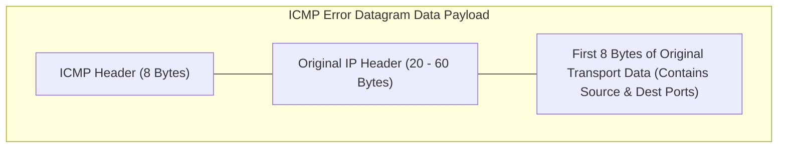

ICMP error messages use specific Type and Code values to indicate different failure conditions[cite: 1]:

|  Type  | Name                        | Cause / Trigger Condition                                                                                                    |
| :----: | :-------------------------- | :--------------------------------------------------------------------------------------------------------------------------- |
| **3**  | **Destination Unreachable** | Destination network, host, port, or protocol is unavailable, or MTU is exceeded with $\text{DF} = 1$[cite: 1].               |
| **4**  | **Source Quench**           | Sent by a congested router when its queues fill up, requesting the sender to reduce its transmission rate[cite: 1].          |
| **5**  | **Redirection**             | Informs a sender that another local gateway router provides a shorter path for the destination[cite: 1].                     |
| **11** | **Time Exceeded**           | `Code 0`: TTL decremented to 0 in transit[cite: 1]. `Code 1`: Fragment reassembly timer expired at destination[cite: 1]. |
| **12** | **Parameter Problem**       | Header contains syntax errors, corrupted header fields, or unsupported options[cite: 1].                                     |

### Internal Payload of ICMP Error Messages
To help the sender identify which packet failed, every ICMP error message contains:
* The $8\text{-byte}$ ICMP header (Type, Code, Checksum, and parameters)[cite: 1].
* The **complete original IPv4 header** of the failed datagram[cite: 1].
* The **first 8 bytes of the original datagram's data payload**[cite: 1].

> [!theorem] Importance of the First 8 Payload Bytes
> The first 8 bytes of a TCP or UDP transport segment contain the Source Port and Destination Port numbers[cite: 1]. Including these bytes allows the sender host to identify which process or socket produced the dropped packet and pass the error back to the appropriate application[cite: 1].

> [!trap] Suppression Rules for ICMP Error Messages
> To prevent network loops and broadcast storms, an ICMP error message is **never generated** for[cite: 1]:
> 1. Discarding another ICMP error message[cite: 1].
> 2. Discarding any fragment other than the first fragment ($\text{Offset} > 0$)[cite: 1].
> 3. Discarding datagrams directed to multicast, broadcast, or loopback (`127.0.0.1`) addresses[cite: 1].
> 4. Packets whose source address is `0.0.0.0` or invalid[cite: 1].
