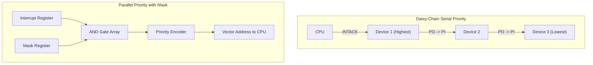

> [!definition]
> - **Programmed I/O**: The CPU initiates I/O and remains in a busy-waiting software loop testing interface status flags ($F$) until the device is ready.
> - **Interrupt-Driven I/O**: The CPU issues a command, continues normal execution, and is asynchronously interrupted by the device when ready.
> - **Direct Memory Access (DMA)**: A dedicated hardware controller manages high-speed data block transfers directly between peripherals and RAM, bypassing CPU registers.

| Transfer Mode | CPU Overhead | Hardware Complexity | Transfer Speed | Primary Application |
| :--- | :--- | :--- | :--- | :--- |
| **Programmed I/O** | 100% (CPU busy-waits) | Minimal | Slow | Dedicated embedded polling |
| **Interrupt-Driven** | Medium (Context switch overhead) | Moderate | Medium | Keyboards, mice, real-time events |
| **DMA (Cycle Stealing)**| Low (CPU pauses 1 memory bus cycle)| High | High | Networking, audio streaming |
| **DMA (Burst Mode)** | High during transfer (CPU blocked) | High | Maximum | Disk blocks, bulk memory transfers |

> [!theorem]
> **Priority Interrupt Architecture**:
> 1. **Daisy-Chaining**: Serial hardware scheme. The device physically closest to the CPU on the `INTACK` line has the highest priority. It blocks the acknowledge signal ($PO = 0$) and places its vector address (VAD) on the bus.
> 2. **Parallel Priority Encoder**: Hardware scheme where all request lines enter an $N$-to-$\log_2 N$ Priority Encoder in parallel. A programmable **Mask Register** enables software to mask (suppress) lower-priority interrupt lines dynamically.

> [!trap]
> In DMA:
> - **Cycle Stealing Mode**: DMA steals **one bus cycle** from the CPU, transfers one word, and releases the bus. The CPU is slowed down marginally, not halted.
> - **Burst Mode**: DMA seizes the bus and retains control until the **entire block of data** is transferred ($Word Count = 0$). The CPU is completely isolated from main memory during this time.

> [!question]
> In a 4-device parallel priority interrupt system (Device 0: Disk [highest], Device 1: Network, Device 2: Printer, Device 3: Keyboard [lowest]), the CPU is currently executing the ISR for Device 1. How should the software Mask Register bits ($M_0, M_1, M_2, M_3$) be set to allow only higher-priority devices to interrupt?
> - (A) $M_0 M_1 M_2 M_3 = 0111$
> - (B) $M_0 M_1 M_2 M_3 = 1000$
> - (C) $M_0 M_1 M_2 M_3 = 1100$
> - (D) $M_0 M_1 M_2 M_3 = 1111$
>
> **Correct Option**: **(B)**
> **Explanation**: While servicing Device 1, only devices with higher priority than Device 1 (i.e., Device 0) should be permitted to preempt. Lower or equal priority devices (Devices 1, 2, 3) must be masked out. Hence, $M_0 = 1$ and $M_1 = M_2 = M_3 = 0$, giving `1000`.
