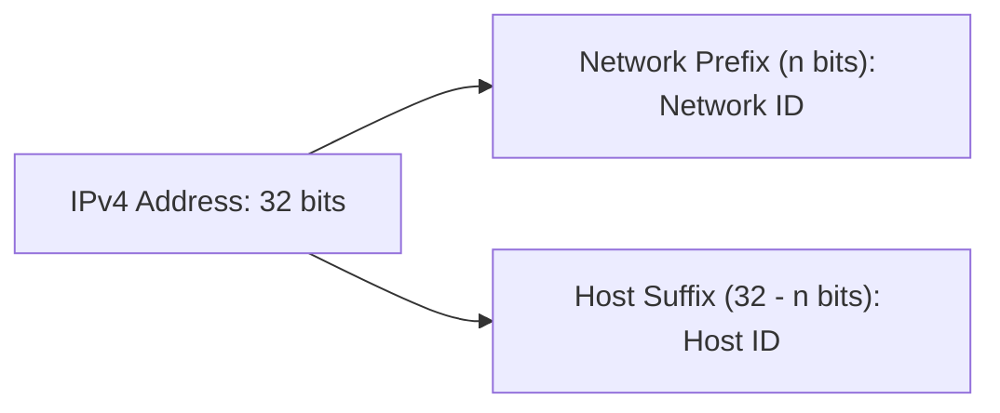

> [!definition] IPv4 Address
> An IPv4 address is an identifier of length $32\text{ bits}$ ($4\text{ bytes}$) used to uniquely identify a device's **connection interface** to a network, rather than identifying the physical host hardware itself[cite: 1].
> * If a host moves from one network to another, its IP address changes[cite: 1].
> * Analogous to a cellular SIM card: a mobile phone number belongs to the SIM subscription/connection, not the mobile phone device[cite: 1].
> * If a router or multihomed host has multiple physical interface connections to distinct networks, it requires a separate IP address for each interface connection[cite: 1].

> [!formula] Two-Level Address Hierarchy
> An IPv4 address is split into two logical parts:
> $$\text{Total Address Width} = 32\text{ bits} = \text{Network ID (Prefix, } n \text{ bits)} + \text{Host ID (Suffix, } 32 - n \text{ bits)}$$[cite: 1]
> * **Prefix (Network ID)**: $n$ bits that identify the specific network[cite: 1].
> * **Suffix (Host ID)**: $(32 - n)$ bits that define the individual host node within that network[cite: 1].

> [!question] Dotted Decimal to Binary Conversion
> Convert the dotted-decimal IP address `128.11.3.248` into its underlying 32-bit binary representation[cite: 1].
> 
> * First Byte: $128_{10} = 10000000_2$[cite: 1]
> * Second Byte: $11_{10} = 00001011_2$[cite: 1]
> * Third Byte: $3_{10} = 00000011_2$[cite: 1]
> * Fourth Byte: $248_{10} = 11111000_2$[cite: 1]
> 
> Result: `10000000.00001011.00000011.11111000`[cite: 1].
