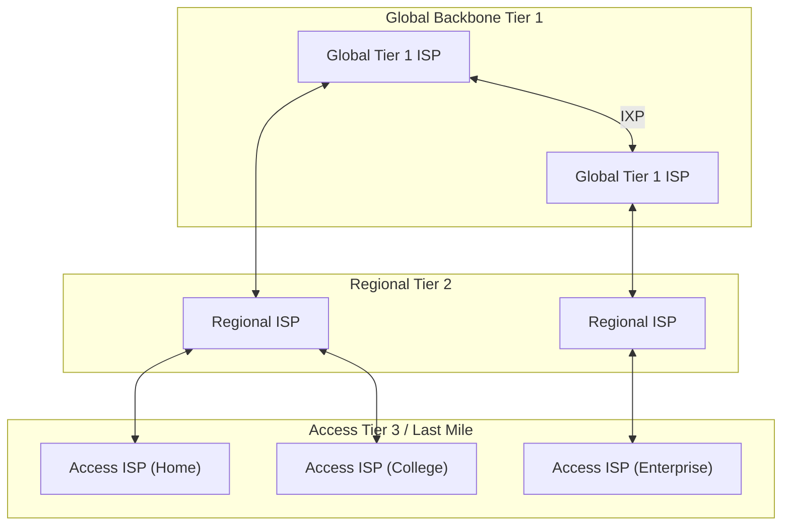

> [!definition] Internetwork and The Internet
> An **internetwork** (or **internet** with lowercase "i") is an interconnected system formed when multiple distinct computer networks are joined together to exchange data[cite: 1].
> 
> **The Internet** (noun, capitalized "I") refers to the specific, globally interconnected public network that uses the TCP/IP protocol suite to exchange data worldwide[cite: 1].

> [!theorem] ISP Interconnection Invariants
> Connecting millions of individual Access ISPs directly point-to-point via a full mesh would require $O(n^2)$ physical links, which is practically and economically infeasible[cite: 1].
> * **Access ISPs** connect to **Regional ISPs**, which in turn aggregate traffic up to **Global (Tier 1) ISPs**[cite: 1].
> * Global ISPs interconnect and peer with each other through **Internet Exchange Points (IXPs)** based on commercial and economic peering agreements[cite: 1].
