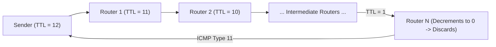

### Time-to-Live (TTL - 8 Bits)
Prevents undeliverable datagrams from circulating endlessly inside routing loops[cite: 1].

* Initialized by the source sender host (e.g., 64, 128, 255)[cite: 1].
* Every router along the path decrements the TTL field by at least $1$ before forwarding[cite: 1].
* If $\text{TTL} = 0$, the router discards the datagram and returns an ICMP Time Exceeded (Type 11) message to the source host[cite: 1].
* The destination host accepts packets arriving with $\text{TTL} \ge 0$; the destination host never discards packets solely due to TTL expiration[cite: 1].

### Protocol Field (8 Bits)
Acts as a demultiplexing key at the destination network layer, specifying which upper-layer protocol must receive the extracted payload[cite: 1]:
When an IP datagram arrives at your computer's Network Interface Card (NIC), the **OS Kernel's IP layer** processes it first. The kernel needs to decide _which protocol handler module_ to pass the payload to.
- **The OS Needs to Know Who Handles the Data:**
    - If it's **TCP (6)**, the kernel sends it to the TCP stack to manage sequence numbers, acknowledgments, and window buffers.
    - If it's **UDP (17)**, the kernel sends it to the lightweight UDP queue.
    - If it's **ICMP (1)**, the kernel handles it directly (e.g., answering a `ping` or reporting an unreachable port) without waking up any user application.
    - If it's **OSPF (89)**, it goes straight to the routing engine daemon.

| **Protocol** | **Decimal ID** | **Mental Hook**                                           |
| ------------ | -------------- | --------------------------------------------------------- |
| **ICMP**     | **1**          | **#1 Diagnostic Tool** (`ping` / baseline network health) |
| **IGMP**     | **2**          | **"G" = Group** $\to$ Minimum **2** members needed        |
| **TCP**      | **6**          | **3-way handshake** $\times$ 2 $= \mathbf{6}$             |
| **UDP**      | **17**         | **Wild, unconstrained teenager at age 17**                |
| **OSPF**     | **89**         | **Old Soldiers Protect Frontiers** at age **89**          |

### Header Checksum (16 Bits)
Guarantees packet header integrity[cite: 1]. Calculated by dividing the header into 16-bit sections, taking the 1's complement sum, and inverting the result[cite: 1]. Because TTL decrements at each hop, the checksum must be recalculated and verified by every intermediate router[cite: 1].

### IPv4 Options Field (0 to 40 Bytes)
Optional field used for network testing and security management[cite: 1]:
* **Record Route**: Allocates space for routers to append their outgoing IP interfaces as the packet moves through the network (stores up to $9$ IP addresses: $9 \times 4\text{ B} = 36\text{ B}$, plus 3 bytes of overhead and 1 byte padding)[cite: 1].
* **Timestamp**: Records the outgoing interface IP address along with a 32-bit millisecond timestamp added by each processing router[cite: 1].
* **Strict Source Routing**: The source specifies the exact list of routers the packet must visit sequentially without skipping[cite: 1].
* **Loose Source Routing**: The packet must traverse the listed routers in order, but it is permitted to pass through unlisted intermediate hops between them[cite: 1].
