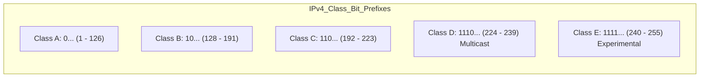

> [!definition]
> An **IPv4 Address** is a 32-bit identifier divided into a Network Identifier (NID) and a Host Identifier (HID), rendered in dotted decimal format ($W.X.Y.Z$)[cite: 1, 2].

| Class | Leading Bits | 1st Octet Range | NID Bits | HID Bits | Number of Networks | Usable Hosts per Network | Default Mask |
| :--- | :--- | :--- | :--- | :--- | :--- | :--- | :--- |
| **A** | `0` | $1 - 126$[cite: 2] | 8 | 24 | $2^7 - 2 = 126$[cite: 2] | $2^{24} - 2 = 16,777,214$[cite: 2] | `255.0.0.0`[cite: 2] |
| **B** | `10` | $128 - 191$[cite: 2] | 16 | 16 | $2^{14} = 16,384$[cite: 2] | $2^{16} - 2 = 65,534$[cite: 2] | `255.255.0.0`[cite: 2] |
| **C** | `110` | $192 - 223$[cite: 2] | 24 | 8 | $2^{21} = 2,097,152$[cite: 1, 2] | $2^8 - 2 = 254$[cite: 1, 2] | `255.255.255.0`[cite: 2] |
| **D** | `1110` | $224 - 239$[cite: 2] | — | — | Multicast Groups ($2^{28}$ addresses)[cite: 2] | — | None[cite: 2] |
| **E** | `1111` | $240 - 255$[cite: 2] | — | — | Reserved for Research / Future use[cite: 2] | — | None[cite: 2] |

> [!formula]
> **Subnet Calculations & Host Counts:**
> 1. Subnet Bit Borrowing: Borrowing $s$ bits from the host field creates:
>    $$\text{Number of Subnets} = 2^s$$
> 2. Remaining Host Bits $h = (\text{Original HID bits}) - s$:
>    $$\text{Usable Hosts per Subnet} = 2^h - 2$$
> 3. **The Subtract-2 Invariant:** 2 addresses are permanently reserved in any subnet[cite: 1, 2]:
>    - **Network ID (NID):** All host bits set to `0`[cite: 1, 2].
>    - **Direct Broadcast Address (DBA):** All host bits set to `1`[cite: 1, 2].

> [!trap]
> In Class C networks, the first 3 bits (`110`) are strictly fixed by RFC standards[cite: 1, 2]. Consequently, the total number of allocatable Class C networks is $2^{24 - 3} = 2^{21}$, **not** $2^{24}$[cite: 1, 2].

> [!question]
> **Q:** An organization holds a Class B network address and requires 64 distinct departmental subnets. What is the customized subnet mask, and how many usable hosts can each subnet accommodate?  
> (A) `255.255.192.0` and 1022 hosts  
> (B) `255.255.252.0` and 1022 hosts  
> (C) `255.255.248.0` and 2046 hosts  
> (D) `255.255.252.0` and 1024 hosts  
>
> **Answer:** **(B)**  
> **Explanation:**  
> 1. In Class B, default NID is 16 bits and HID is 16 bits[cite: 1, 2].  
> 2. To build 64 subnets: $2^s \ge 64 \implies s = 6\text{ bits}$ borrowed from the 3rd octet[cite: 1].  
> 3. Subnet mask binary for 3rd octet: $11111100_2 = 128 + 64 + 32 + 16 + 8 + 4 = 252$[cite: 1].  
>    Full Subnet Mask $= \mathbf{255.255.252.0}$[cite: 1].  
> 4. Remaining host bits: $h = 16 - 6 = 10\text{ bits}$[cite: 1].  
>    Usable hosts $= 2^{10} - 2 = 1024 - 2 = \mathbf{1022\text{ hosts}}$[cite: 1, 2].
