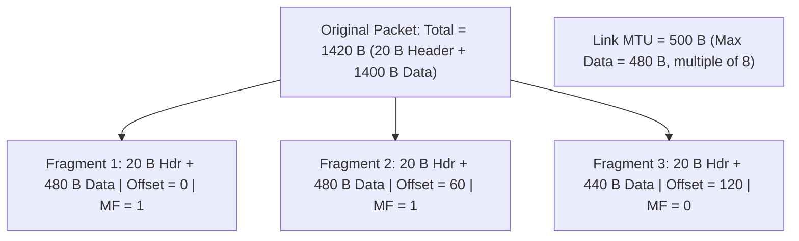

> [!definition]
> **IPv4 Fragmentation** occurs when an IP packet encounters a link whose **Maximum Transmission Unit (MTU)** is smaller than the datagram's total size[cite: 1, 2]. Routers split the payload into fragments, each containing a replica of the original IP header (with adjusted flags and offset fields)[cite: 1, 2].

> [!theorem]
> **The 8-Byte Alignment Rule:**  
> Because the Fragment Offset field in the IPv4 header is scaled by a factor of 8, every intermediate fragment's data payload **must be a strict multiple of 8 bytes**[cite: 1]. Only the final fragment ($\text{MF} = 0$) is allowed to carry a non-multiple payload[cite: 1].

> [!formula]
> 1. $\text{Max Data per Fragment} = \left\lfloor \frac{\text{MTU} - 20}{8} \right\rfloor \times 8$[cite: 1]
> 2. $\text{Fragment Offset}_i = \frac{\sum_{j=1}^{i-1} \text{Payload}_j}{8}$[cite: 1]
> 3. More Fragments Flag:
>    $$\text{MF} = \begin{cases} 1 & \text{if more fragments follow}[cite: 1] \\ 0 & \text{for the terminal (last) fragment}[cite: 1] \end{cases}$$

> [!trap]
> If a datagram with **$\text{DF} = 1$ (Don't Fragment)** exceeds a link's MTU, the router **drops the packet** and generates an **ICMP Destination Unreachable - Fragmentation Needed (Type 3, Code 4)** alert[cite: 1, 2].

> [!question]
> **Q:** An IPv4 packet with a total length of $1420\text{ bytes}$ (including a standard $20\text{ byte}$ IP header) enters a network link with an MTU of $500\text{ bytes}$. What are the Fragment Offset and More Fragment (MF) flag values for the second fragment?  
> (A) $\text{Offset} = 60, \text{MF} = 1$  
> (B) $\text{Offset} = 480, \text{MF} = 1$  
> (C) $\text{Offset} = 60, \text{MF} = 0$  
> (D) $\text{Offset} = 120, \text{MF} = 1$  
>
> **Answer:** **(A)**[cite: 1]  
> **Explanation:**  
> 1. Total payload $= 1420 - 20 = 1400\text{ bytes}$[cite: 1].  
> 2. Available data room per fragment $= 500 - 20 = 480\text{ bytes}$[cite: 1].  
>    $480 \pmod 8 = 0$, so $480\text{ bytes}$ is valid[cite: 1].  
> 3. Fragment distribution:  
>    - **Frag 1:** Data $= 480\text{ bytes}$ (bytes $0 - 479$), $\text{Offset} = \frac{0}{8} = 0, \text{MF} = 1$[cite: 1].  
>    - **Frag 2:** Data $= 480\text{ bytes}$ (bytes $480 - 959$), $\text{Offset} = \frac{480}{8} = 60, \text{MF} = 1$[cite: 1].  
>    - **Frag 3:** Data $= 440\text{ bytes}$ (bytes $960 - 1399$), $\text{Offset} = \frac{960}{8} = 120, \text{MF} = 0$[cite: 1].
