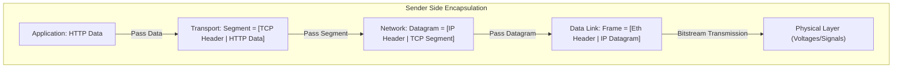

## Architectural Principles and Protocol Stacks

Computer networks structure complex tasks (such as bit encoding, voltage signaling, physical transmission, error control, packet routing, and addressing) by organizing protocols into hierarchical functional layers[cite: 1]. Each layer performs an assigned service, prepends its own control metadata (header), and passes the resulting Protocol Data Unit (PDU) down to the adjacent layer[cite: 1]. 

> [!definition] Layering and Modularity
> **Layering** decomposes a network system into a vertical hierarchy where each layer abstracts away the mechanics of its implementation, offering predefined services to the layer above through well-defined interfaces[cite: 1].
> 
> A **Protocol** is an agreed-upon, unambiguous set of rules and conventions governing communication between peer layers at two or more endpoints[cite: 1].

### OSI Model vs. TCP/IP Suite

| OSI 7-Layer Reference Model[cite: 1] | TCP/IP Practical 5-Layer Suite[cite: 1]                         | Primary Protocol Unit (PDU)[cite: 1] |
| :----------------------------------- | :-------------------------------------------------------------- | :----------------------------------- |
| 7. Application Layer[cite: 1]        | \multirow{3}{*}{1. Application Layer (HTTP, FTP, DNS)[cite: 1]} | Message / Application Data[cite: 1]  |
| 6. Presentation Layer[cite: 1]       |                                                                 |                                      |
| 5. Session Layer[cite: 1]            |                                                                 |                                      |
| 4. Transport Layer[cite: 1]          | 2. Transport Layer (TCP, UDP)[cite: 1]                          | Segment[cite: 1]                     |
| 3. Network Layer[cite: 1]            | 3. Network Layer (IP)[cite: 1]                                  | Datagram / Packet[cite: 1]           |
| 2. Data Link Layer (DLL)[cite: 1]    | 4. Data Link Layer (Ethernet, Wi-Fi)[cite: 1]                   | Frame[cite: 1]                       |
| 1. Physical Layer[cite: 1]           | 5. Physical Layer[cite: 1]                                      | Bits / Physical Signals[cite: 1]     |

* **Physical Layer Role**: Coordinates the transmission of unstructured raw bitstreams over a physical medium, defining signal levels, timing, bit duration, and physical connector hardware[cite: 1].
* **Encapsulation Invariant**: Each layer treats all data received from the layer above as an opaque data payload[cite: 1]. It prepends its own control header to form its layer-specific PDU before passing it downwards[cite: 1].
