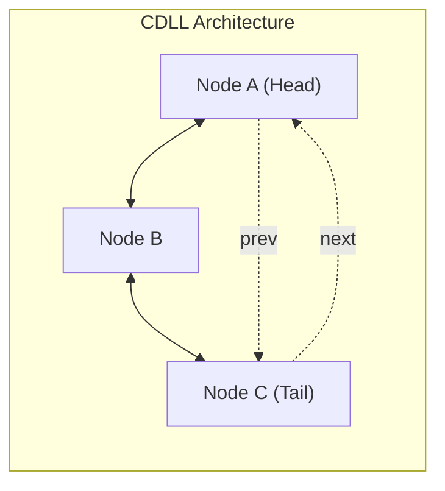

## 1. Structural Classifications

| Linked List Variant | Link Pointers per Node | Traversal Direction | Boundary Terminus |
| :--- | :--- | :--- | :--- |
| **Singly Linked List (SLL)** | `next` (1 pointer) | Unidirectional (forward-only) | `tail->next == NULL` |
| **Doubly Linked List (DLL)** | `prev`, `next` (2 pointers) | Bidirectional (forward & backward) | `head->prev == NULL`, `tail->next == NULL` |
| **Circular Singly Linked List (CSLL)** | `next` (1 pointer) | Unidirectional (cyclic) | `tail->next == head` (No `NULL`) |
| **Circular Doubly Linked List (CDLL)** | `prev`, `next` (2 pointers) | Bidirectional (cyclic) | `head->prev == tail`, `tail->next == head` |



---

## 2. Operation Complexities in a Tail-Maintained CSLL

When maintaining solely a pointer to `tail`:
* **`head` Access:** Resolved in $O(1)$ time via `tail->next`.
* **Insert at Beginning:** $O(1)$ by updating `newNode->next = tail->next` and `tail->next = newNode`.
* **Insert at End:** $O(1)$ by inserting at beginning and updating `tail = newNode`.
* **Delete First Node:** $O(1)$ by unlinking `tail->next`.
* **Delete Last Node:** **$O(n)$** because finding the node preceding `tail` requires traversing the cycle from `tail->next`.

| Operation               | Head Pointer Only | Tail Pointer Only |
| :---------------------- | :---------------- | :---------------- |
| **Insert at Beginning** | $O(n)$            | $O(1)$            |
| **Insert at End**       | $O(n)$            | $O(1)$            |
| **Delete at Beginning** | $O(n)$            | $O(1)$            |
| **Delete at End**       | $O(n)$            | $O(n)$            |

---

## 3. Pointer Dereference Invariants

> [!trap] Unlinking Without Boundary Checks
> The standard three-step node deletion snippet:
> ```c
> p->prev->next = p->next;
> p->next->prev = p->prev;
> free(p);
> ```
> Causes a *segmentation fault* in a standard **DLL** if:
> * $p$ is the first node (`p->prev == NULL`)
> * $p$ is the last node (`p->next == NULL`)
>
> In a **CDLL**, this exact routine executes without boundary checks for any arbitrary node because references loop continuously without evaluating to `NULL`.

---

## 4. Practice Drill: Memory Efficiency

> [!question] IOCL / PSU Practice Drill
> A 64-bit system uses 8-byte pointers and stores 4-byte data payloads with 4-byte compiler structure padding (total payload = 8 bytes per node). What is the ratio of memory efficiency $(\text{Data Payload} / \text{Total Node Size})$ for a **Doubly Linked List** compared to a **Singly Linked List**?
> 
> * (A) $1:2$
> * (B) $2:3$
> * (C) $3:4$
> * (D) $1:1$

### Step-by-Step Resolution

1. **Singly Linked List (SLL) Node Layout:**
   $$\text{Payload} = 8\text{ bytes}, \quad \text{Pointer } (next) = 8\text{ bytes}$$
   $$\text{Total SLL Node Size} = 8 + 8 = 16\text{ bytes}$$
   $$\text{Efficiency}_{\text{SLL}} = \frac{8}{16} = \frac{1}{2} \quad (50\%)$$

2. **Doubly Linked List (DLL) Node Layout:**
   $$\text{Payload} = 8\text{ bytes}, \quad \text{Pointers } (prev + next) = 8 + 8 = 16\text{ bytes}$$
   $$\text{Total DLL Node Size} = 8 + 16 = 24\text{ bytes}$$
   $$\text{Efficiency}_{\text{DLL}} = \frac{8}{24} = \frac{1}{3} \quad (33.33\%)$$

3. **Ratio of Efficiency ($\text{DLL} : \text{SLL}$):**
   $$\text{Ratio} = \frac{\text{Efficiency}_{\text{DLL}}}{\text{Efficiency}_{\text{SLL}}} = \frac{\frac{1}{3}}{\frac{1}{2}} = \frac{2}{3}$$

**Correct Answer:** **(B) $2:3$**