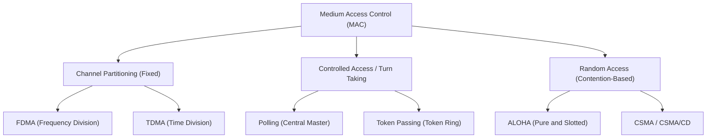

## Media Access Control Sublayer Taxonomies

When multiple nodes share a broadcast transmission medium, the MAC sublayer arbitrates access to eliminate or resolve collisions[cite: 1].

### Channel Access Classification

| Strategy                    | Channel Partitioning[cite: 1]               | Controlled Access[cite: 1]                        | Random Access[cite: 1]                          |
| :-------------------------- | :------------------------------------------ | :------------------------------------------------ | :---------------------------------------------- |
| **Operational Model**       | Static channel division (TDM, FDM)[cite: 1] | Scheduled turns (Polling, Token passing)[cite: 1] | Contention-based; transmit dynamically[cite: 1] |
| **Collisions**              | Zero collisions[cite: 1]                    | Zero collisions[cite: 1]                          | Collisions can occur[cite: 1]                   |
| **Efficiency at Low Load**  | Low (unused slices remain idle)[cite: 1]    | Low (polling/token passing overhead)[cite: 1]     | High (immediate channel access)[cite: 1]        |
| **Efficiency at High Load** | High and stable[cite: 1]                    | High and fair[cite: 1]                            | Degrades due to contention collisions[cite: 1]  |

1. **Polling**: A designated primary master polls each secondary node cyclically[cite: 1]. Drawbacks include master polling overhead latency and single-point-of-failure vulnerability[cite: 1].
2. **Token Passing**: A small control frame (token) circulates through nodes in a physical or logical ring[cite: 1]. A node may transmit only while holding the token[cite: 1].
