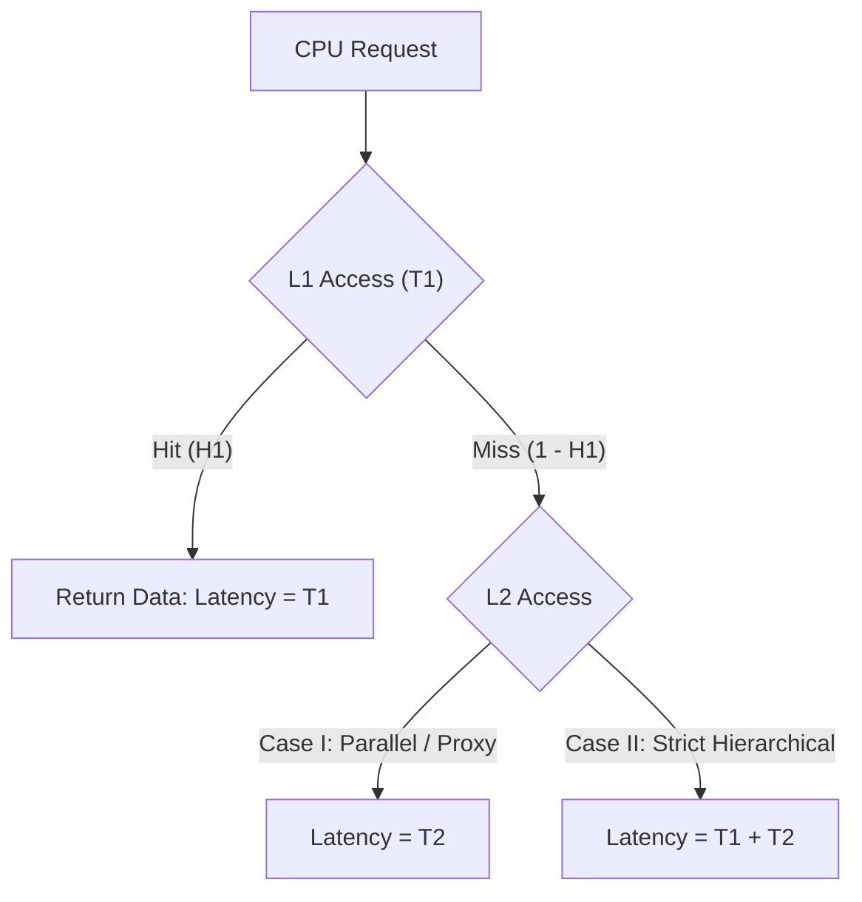

> [!definition]
> - **Average Memory Access Time (AMAT)**: The statistical expected time the CPU spends resolving memory references across cache, main memory, and secondary storage layers.
> - **Average Cost Per Bit ($C_{\text{avg}}$)**: The weighted average cost of a multi-level storage hierarchy:
>   $$C_{\text{avg}} = \frac{C_1 S_1 + C_2 S_2}{S_1 + S_2}$$

> [!formula]
> **Two-Level Memory AMAT Equations**:
> - **Case I: Simultaneous / Proxy Access** (CPU checks in parallel or reads directly from L2):
>   $$T_{\text{avg}} = H_1 T_1 + (1 - H_1) T_2$$
> - **Case II: Strict Hierarchical Access** (CPU checks L1 first, misses, fetches block to L1, then serves):
>   $$T_{\text{avg}} = H_1 T_1 + (1 - H_1)(T_1 + T_2) = T_1 + (1 - H_1) T_2$$
>
> **Three-Level Memory AMAT Equations**:
> - **Case I (Simultaneous)**:
>   $$T_{\text{avg}} = H_1 T_1 + (1 - H_1) H_2 T_2 + (1 - H_1)(1 - H_2) T_3$$
> - **Case II (Strict Hierarchical)**:
>   $$T_{\text{avg}} = T_1 + (1 - H_1) T_2 + (1 - H_1)(1 - H_2) T_3$$

> [!trap]
> In strict hierarchical access, $T_1$ is **always paid**, regardless of hit or miss. Watch for exam wording: "Hierarchical / Sequential Access" mandates Case II ($T_1 + (1 - H_1) T_2$), while "Simultaneous / Parallel Access" mandates Case I ($H_1 T_1 + (1 - H_1) T_2$).

> [!question]
> A computer has a 2-level cache hierarchy. L1 access time is $1\text{ ns}$ with hit rate $0.95$. L2 access time is $10\text{ ns}$ with hit rate $0.80$. Main memory access time is $100\text{ ns}$. Assuming a strict hierarchical structure, what is the total average memory access time?
> - (A) $2.45\text{ ns}$
> - (B) $2.50\text{ ns}$
> - (C) $3.45\text{ ns}$
> - (D) $1.50\text{ ns}$
>
> **Correct Option**: **(B)**
> **Step-by-Step Calculation**:
> 1. Identify parameters:
>    - $T_1 = 1\text{ ns}, \; (1 - H_1) = 0.05$
>    - $T_2 = 10\text{ ns}, \; (1 - H_2) = 0.20$
>    - $T_3 = 100\text{ ns}$
> 2. Apply the strict hierarchical 3-level equation:
>    $$T_{\text{avg}} = T_1 + (1 - H_1) T_2 + (1 - H_1)(1 - H_2) T_3$$
> 3. Substitute values:
>    $$T_{\text{avg}} = 1 + (0.05 \times 10) + (0.05 \times 0.20 \times 100)$$
>    $$T_{\text{avg}} = 1 + 0.5 + 1.0 = \mathbf{2.50\text{ ns}}$$
