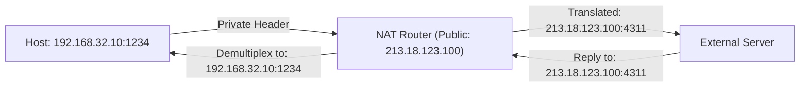

IPv4 address depletion made it impractical to allocate a globally unique public IP address to every device connected to the Internet[cite: 1]. Network Address Translation (NAT) allows an entire local network to share one public IP address[cite: 1].

### Reserved Private IPv4 Address Blocks (RFC 1918)
Private IP addresses are non-routable on the public Internet and can be reused inside independent private networks[cite: 1]:
* **Class A**: `10.0.0.0` to `10.255.255.255` ($10.0.0.0/8$)[cite: 1]
* **Class B**: `172.16.0.0` to `172.31.255.255` ($172.16.0.0/12$)[cite: 1]
* **Class C**: `192.168.0.0` to `192.168.255.255` ($192.168.0.0/16$)[cite: 1]

### Network Address Port Translation (NAPT)
Because multiple local hosts share a single public IP address, the NAT router uses transport-layer port numbers to differentiate between different connections[cite: 1].

### NAT Translation State Table
The NAT router maintains a dynamic mapping table connecting internal IP-port pairs to its external public port assignments[cite: 1]:

| Private IP:Port | Public Translated IP:Port | Remote Destination |
| :---: | :---: | :---: |
| `192.168.32.10:1200`[cite: 1] | `1.2.3.4:1234`[cite: 1] | `2.2.2.2:80` |
| `192.168.32.14:1400`[cite: 1] | `1.2.3.4:4312`[cite: 1] | `2.2.2.2:80`[cite: 1] |
| `192.168.32.14:1410`[cite: 1] | `1.2.3.4:1233`[cite: 1] | `7.7.7.7:443` |

### Packet Modification Flow
1. **Outbound Traffic**: The NAT router replaces the packet's private source IP and port (`192.168.32.14:1400`) with its public IP and an assigned external port (`1.2.3.4:4312`), updates the IP and TCP/UDP checksums, and forwards the packet[cite: 1].
2. **Inbound Response**: Incoming responses addressed to `1.2.3.4:4312` are matched against the translation table to look up the original host[cite: 1]. The destination address is rewritten to `192.168.32.14:1400` before forwarding the packet to the local LAN[cite: 1].

### The Big Difference Between TCP and UDP in NAT

- **With TCP:** Connections have clear endpoints (`FIN` or `RST` packets). The router observes the teardown and purges the table entry immediately.
    
- **With UDP:** There is no handshake or termination flag. The NAT router cannot know when an application has finished communicating.
    
**How NAT solves this:** The router starts an **Inactivity / Idle Timer** (typically **30 to 120 seconds** for UDP).

> [!theorem] NAT Architectural Characteristics
> * **Topology Hiding**: Remote hosts see only the NAT gateway's public IP; internal network structures and client IP addresses are hidden from the Internet[cite: 1].
> * **Layer Violation**: Modifying transport-layer port numbers inside a network-layer gateway router breaks end-to-end layering abstractions[cite: 1].
