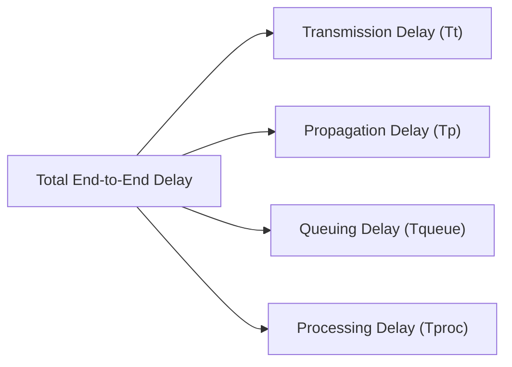

## Physical Link Latencies and End-to-End Delay

Network latency across a transmission link is governed by four primary components[cite: 1]:

> [!formula] Link Delay Formulations
> 1. **Transmission Delay ($T_t$)**: Time required to push all packet bits onto the physical transmission line[cite: 1]:
>    $$T_t = \frac{L}{B}$$[cite: 1]
>    Where $L$ is packet length in bits, and $B$ is bandwidth / link transmission capacity in bps[cite: 1].
> 2. **Propagation Delay ($T_p$)**: Time required for a single bit to travel from sender to receiver across the medium[cite: 1]:
>    $$T_p = \frac{d}{v}$$[cite: 1]
>    Where $d$ is link distance in meters, and $v$ is signal propagation velocity in the medium ($v \approx 2 \times 10^8\text{ m/s}$ in copper/fiber, $3 \times 10^8\text{ m/s}$ in vacuum/air)[cite: 1].
> 3. **Total Latency (Single Hop)**:
>    $$\text{Latency} = T_t + T_p + T_{\text{proc}} + T_{\text{queue}}$$[cite: 1]

> [!question] Pipelined Multi-Hop Delay: 20 KB File
> Transfer a $20\text{ KB}$ file ($1\text{ KB} = 1000\text{ B}$) from node A to node F across $5$ identical links via $4$ intermediate store-and-forward routers[cite: 1].
> * Packet size $= 1\text{ KB}$[cite: 1]
> * Bandwidth $B = 10\text{ Mbps}$ per link[cite: 1]
> * Link distance $d = 10\text{ km}$, propagation speed $v = 2 \times 10^8\text{ m/s}$[cite: 1]
> * Queuing and processing delays are zero[cite: 1].

1. Number of packets:
   $$N = \frac{20\text{ KB}}{1\text{ KB}} = 20\text{ packets}$$
[cite: 1]
2. Per-link transmission time:
   $$T_t = \frac{1000 \times 8\text{ bits}}{10 \times 10^6\text{ bps}} = \frac{8000}{10^7}\text{ s} = 800\text{ }\mu\text{s}$$
[cite: 1]
3. Per-link propagation time:
   $$T_p = \frac{10 \times 10^3\text{ m}}{2 \times 10^8\text{ m/s}} = 50\text{ }\mu\text{s}$$
[cite: 1]
4. Pipelining formulation (source transmits all $20$ packets; after packet $20$ leaves source, it traverses $5$ links and $4$ intermediate hops)[cite: 1]:
   $$\text{Total Time} = 20 \cdot T_t + 5 \cdot T_p + 4 \cdot T_t = 24 \cdot T_t + 5 \cdot T_p$$
[cite: 1]
   $$\text{Total Time} = (24 \times 800\text{ }\mu\text{s}) + (5 \times 50\text{ }\mu\text{s}) = 19200\text{ }\mu\text{s} + 250\text{ }\mu\text{s} = 19450\text{ }\mu\text{s} = 19.45\text{ ms}$$
[cite: 1]

> [!theorem] Queuing Condition Invariant
> For two cascaded links with parameters $(T_{t1}, T_{p1})$ and $(T_{t2}, T_{p2})$: A queue forms at the intermediate node if and only if the second packet arrives before the first packet finishes transmitting onto link 2[cite: 1]:
> $$\text{No Queuing Delay} \iff T_{t1} \ge T_{t2}$$[cite: 1]
