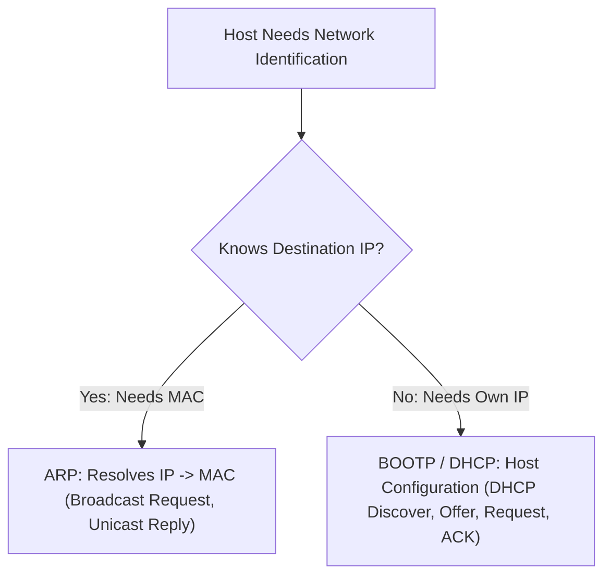
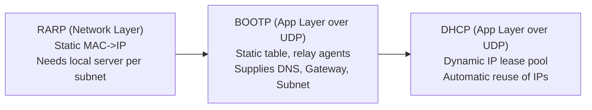

## Address Resolution and Configuration Protocols



### Address Resolution Protocol (ARP)

ARP maps a known layer-3 logical IP address to a physical layer-2 MAC address within a local link[cite: 1].

* **ARP Request**: Broadcast to all hosts in the local network segment using destination MAC `FF:FF:FF:FF:FF:FF`[cite: 1].
* **ARP Reply**: The target host owning the requested IP address responds via a **unicast** frame containing its hardware MAC address directly to the requester[cite: 1].
* **Encapsulation**: ARP packets are encapsulated directly inside Data Link layer frames (Ethernet type `0x0806`), operating between the network and data link layers[cite: 1].
* **Cross-Network Traversal**: ARP requests cannot cross routers[cite: 1]. If the target IP resides on a remote subnet, the source node uses ARP to discover the MAC address of its **default gateway (router interface)**[cite: 1].

### IPv4 Address Special Categories

| Address Block                 | Nomenclature / Usage                                                                                                        |
| :---------------------------- | :-------------------------------------------------------------------------------------------------------------------------- |
| `0.0.0.0/32`[cite: 1]         | **This Host Address**: Used as source IP when a host does not yet know its assigned IP[cite: 1].                            |
| `255.255.255.255/32`[cite: 1] | **Limited Broadcast Address (LBA)**: Broadcasts to all hosts within the local subnet; never forwarded by routers[cite: 1].  |
| `127.0.0.0/8`[cite: 1]        | **Loopback Address Block**: Packets never touch physical wire; used for inter-process communication on local host[cite: 1]. |
| `224.0.0.0/4`[cite: 1]        | **Multicast Address Range** (Class D): Reserved for multicast group transmissions[cite: 1].                                 |
| Private Ranges[cite: 1]       | `10.0.0.0/8`, `172.16.0.0/12`, `192.168.0.0/16`, `169.254.0.0/16` (APIPA / Link-local)[cite: 1].                            |

### RARP, BOOTP, and DHCP Evolution



> [!note] The Hotel Analogy: Passport (MAC) $\rightarrow$ Room Number (IP)

### 1. RARP (Reverse ARP)
* **Analogy:** Shouting your passport number in a single hotel lobby.
* **How it works:** Asks *"My MAC is X, what is my IP?"*
* **Flaws:** Works at Layer 2 (can't cross routers $\implies$ needs a server in *every* lobby) and *only* returns an IP address. *(Obsolete)*
```
[ Diskless Host ] ──── 1. RARP Broadcast ───► [ Local RARP Server ]
        │                                             │
        │◄── 2. RARP Reply (Host gets IP: 192.168.1.50)
        │
        ├── 3. Sends Gratuitous ARP / Initial Traffic ──► [ Router ]
                                                           (Router updates ARP Table)
```

### 2. BOOTP (Bootstrap Protocol)
Both BOOTP and DHCP return the **four required network parameters** needed for a host to begin communication:
1. **Host IP Address**
2. **Subnet Mask**
3. **Default Gateway (Router) IP Address**
4. **DNS (Domain Name) Server IP Address**

* **Analogy:** Giving your passport to a mail clerk who carries it to central HQ, returning a full welcome packet with a hardcoded room key.
* **How it works:** Layer 7 over UDP (ports 67/68). Uses **Relay Agents** to cross routers and gives IP, Subnet Mask, Gateway, and DNS.
* **Flaws:** **Strictly Static.** Invented in 1985 for diskless PCs that needed the exact same IP to boot; has no lease timers or automatic pools.

### 3. DHCP (Dynamic Host Configuration Protocol)
* **Analogy:** Modern automated kiosk that hands you a temporary room keycard for 24 hours.
* **How it works:** Extends BOOTP (1993). Dynamically rents IPs from a central pool using **Leases**. When you leave/expire, the IP goes back to the pool.

> [!tip] High-Level Packet Encapsulation
> * **ARP / RARP:** `[ Ethernet Header ] ──▶ [ ARP / RARP Data ]`
>   * *Directly inside Ethernet (No IP / No UDP).*
> * **BOOTP / DHCP:** `[ Ethernet Header ] ──▶ [ IP Header ] ──▶ [ UDP Header (67/68) ] ──▶ [ BOOTP/DHCP Payload ]`
>   * *Full application payload carrying Your IP + Options (Mask, Gateway, DNS, Lease).*
### The Four-Step "Wine and Dine" Exchange: D-O-R-A
WIne and dine and 69! 6 8 7.
DHCP works through a four-message courtship known by the acronym **DORA**:

```
[Guest / Client :68]                                 [Host / Server :67]
         |                                                    |
         | -------- 1. DISCOVER ("Is anyone free tonight?") ->|
         |                                                    |
         |<-------- 2. OFFER ("I can offer you this table") --|
         |                                                    |
         | -------- 3. REQUEST ("Yes, lock that table in!") ->|
         |                                                    |
         |<-------- 4. ACKNOWLEDGE ("Table is yours, enjoy") -|
         v                                                    v
```


### The "All Zeros" to "All Ones" Trick

When a host has no IP address, it uses **special placeholder IP addresses** at Layer 3
- **Source IP = `0.0.0.0`** _(This means: "This host on this network without an IP yet")_
- **Destination IP = `255.255.255.255`** _(This means: "Limited Broadcast — deliver to EVERY device on this local segment")_
At the hardware layer (Layer 2), it broadcasts to every network interface card on the wire:
- **Destination MAC = `FF:FF:FF:FF:FF:FF`**

**How the Server reaches the Client without an IP:**

- **In the DHCP Payload:** The server places the proposed IP inside the **"Your IP" (`yiaddr`)** field, and copies the client's physical hardware address into the **"Client Hardware Address" (`chaddr`)** field.
    
- **At Layer 2:** The server sends the reply directly to the client's physical MAC address (or broadcasts it to `FF:FF:FF:FF:FF:FF`), ensuring the client's network card picks it up even though the client doesn't have an active IP address yet!
---

### 📍 Where Do Servers Live?
* **Home:** Embedded inside your Wi-Fi router.
* **Enterprise:** Dedicated Windows/Linux server (reached via router Relay Agents).