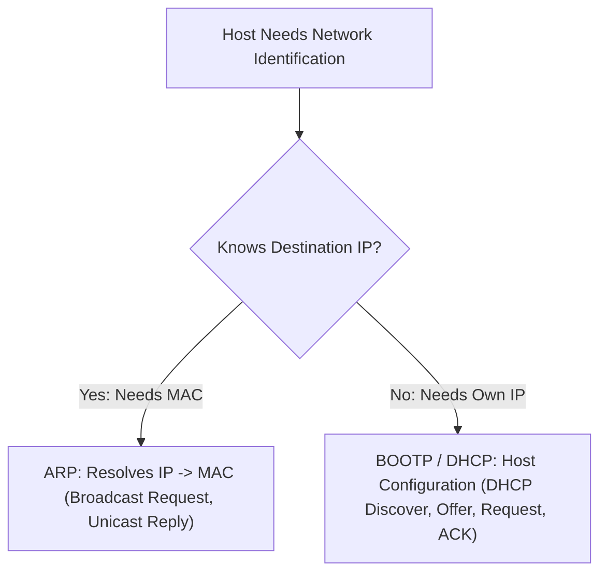
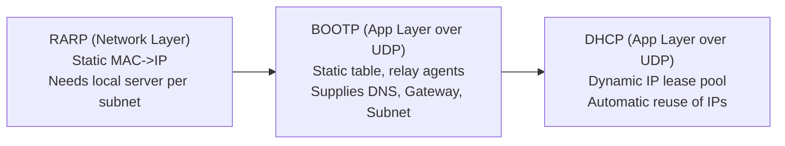

## Address Resolution and Configuration Protocols

### Address Resolution Protocol (ARP)

ARP maps a known layer-3 logical IP address to a physical layer-2 MAC address within a local link[cite: 1].

* **ARP Request**: Broadcast to all hosts in the local network segment using destination MAC `FF:FF:FF:FF:FF:FF`[cite: 1].
* **ARP Reply**: The target host owning the requested IP address responds via a **unicast** frame containing its hardware MAC address directly to the requester[cite: 1].
* **Encapsulation**: ARP packets are encapsulated directly inside Data Link layer frames (Ethernet type `0x0806`), operating between the network and data link layers[cite: 1].
* **Cross-Network Traversal**: ARP requests cannot cross routers[cite: 1]. If the target IP resides on a remote subnet, the source node uses ARP to discover the MAC address of its **default gateway (router interface)**[cite: 1].

### IPv4 Address Special Categories

| Address Block | Nomenclature / Usage |
| :--- | :--- |
| `0.0.0.0/32`[cite: 1] | **This Host Address**: Used as source IP when a host does not yet know its assigned IP[cite: 1]. |
| `255.255.255.255/32`[cite: 1] | **Limited Broadcast Address (LBA)**: Broadcasts to all hosts within the local subnet; never forwarded by routers[cite: 1]. |
| `127.0.0.0/8`[cite: 1] | **Loopback Address Block**: Packets never touch physical wire; used for inter-process communication on local host[cite: 1]. |
| `224.0.0.0/4`[cite: 1] | **Multicast Address Range** (Class D): Reserved for multicast group transmissions[cite: 1]. |
| Private Ranges[cite: 1] | `10.0.0.0/8`, `172.16.0.0/12`, `192.168.0.0/16`, `169.254.0.0/16` (APIPA / Link-local)[cite: 1]. |

### RARP, BOOTP, and DHCP Evolution

1. **RARP (Reverse ARP)**: Broadcasts hardware MAC to obtain assigned IP[cite: 1]. Obsolete because it operates at the network layer, requires a dedicated RARP server on every physical segment, and provides only an IP address[cite: 1].
2. **BOOTP (Bootstrap Protocol)**: Application-layer protocol running over UDP (ports 67/68)[cite: 1]. Supports relay agents to traverse routers, and returns IP, subnet mask, default gateway, and DNS server addresses[cite: 1]. However, its mappings remain strictly static[cite: 1].
3. **DHCP (Dynamic Host Configuration Protocol)**: Provides dynamic IP address allocation from an address pool via temporary **leases**[cite: 1]. When a lease expires, the IP returns to the pool for reallocation[cite: 1].
