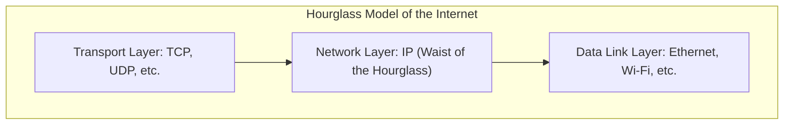

The Network Layer is situated between the Transport Layer and the Data Link Layer in the OSI/TCP-IP reference model[cite: 1]. While the link layer has multiple protocol implementations depending on the transmission medium (e.g., Ethernet, 802.11 Wireless LAN) and the transport layer provides protocols such as TCP and UDP, the network layer in the TCP/IP suite is built around a single unifying protocol: the Internet Protocol (IP)[cite: 1].

> [!definition] Hourglass Model of the Internet
> The Internet architecture is represented as an hourglass: IP sits at the narrow waist[cite: 1]. It serves as the common universal interface connecting heterogeneous applications/transport protocols above with diverse physical transmission media below[cite: 1].

The primary responsibilities of the network layer include:
* Host-to-host delivery across intermediate switching nodes[cite: 1].
* Logical addressing (IPv4 / IPv6 addresses)[cite: 1].
* Routing (path determination across autonomous systems)[cite: 1].
* Packet forwarding and fragmentation/reassembly mechanisms[cite: 1].
