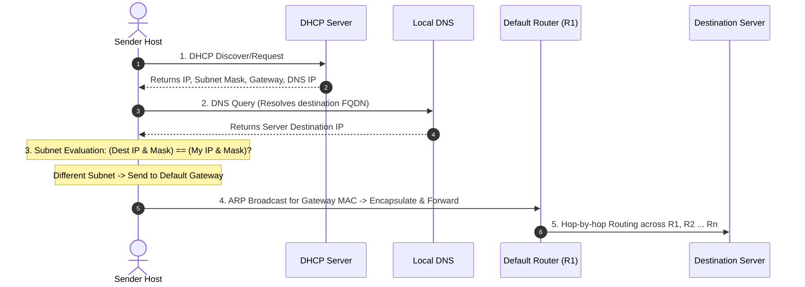

When an end host connects to a network and transmits a packet to a remote destination, protocols across multiple layers cooperate in sequence to establish identity, resolve addresses, and route data[cite: 1].

### Step-by-Step Resolution Trace

1. **Step 1: Configuration Bootstrap (DHCP)**:
   The sender host broadcasts a DHCP request to configure its local network stack[cite: 1]. It receives:
   * Assigned Host IP address[cite: 1].
   * Subnet Mask[cite: 1].
   * IP address of the Default Gateway (first-hop router)[cite: 1].
   * IP address of the Local DNS Server[cite: 1].
2. **Step 2: Destination Host Resolution (DNS)**:
   The client issues a DNS query to the Local DNS Server to obtain the IP address corresponding to the destination server's hostname[cite: 1].
3. **Step 3: Subnet Membership Evaluation**:
   The host evaluates whether the destination IP resides on the local subnet by calculating:
   $$\text{Local Subnet} = \text{Sender IP} \ \& \ \text{Subnet Mask}$$
   $$\text{Target Subnet} = \text{Destination IP} \ \& \ \text{Subnet Mask}$$
   * If both match: The destination is on the local network; transmit directly via local ARP[cite: 1].
   * If they differ: The destination is on a remote network; the packet must be forwarded through the default gateway router[cite: 1].
4. **Step 4: Next-Hop Link Layer Resolution (ARP)**:
   The sender performs an Address Resolution Protocol (ARP) query to obtain the physical MAC address of the default gateway router ($R_1$)[cite: 1]. The IP packet is encapsulated inside a data link frame and dispatched to $R_1$[cite: 1].
5. **Step 5: Multi-Hop Routing and Packet Decapsulation**:
   The packet travels across intermediate routers ($R_1 \to R_2 \to \dots \to R_n$) to the destination server[cite: 1]:
   * Intermediate routers process up to the **Network Layer (Layer 3)** to make routing decisions, modifying the Data Link headers at each physical interface[cite: 1].
   * If a router has $k$ physical network interfaces, it maintains $k$ distinct Data Link Layer and Physical Layer interfaces, all managed by a unified Network Layer routing engine[cite: 1].
   * At the destination server, the packet is decapsulated up through all layers: Data Link $\to$ Network $\to$ Transport $\to$ Application[cite: 1].
