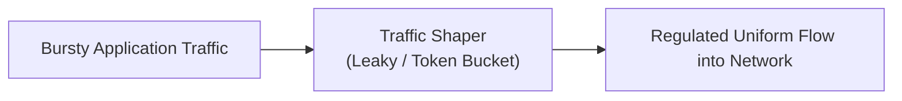
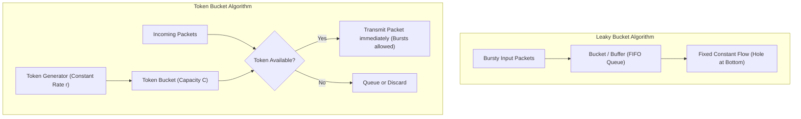

Application processes generate network traffic at bursty, unpredictable rates (alternating between periods of silence and high-volume bursts)[cite: 1]. Injecting bursty traffic directly into network links causes buffer overflows and packet drops at intermediate routers[cite: 1].

> [!definition] Traffic Shaping
> Traffic shaping regulates the rate and volume of traffic transmitted into the network, smoothing out bursty transmission spikes into a steady, predictable output stream[cite: 1].



### Leaky Bucket vs. Token Bucket



| Dimension           | Leaky Bucket                                                                          | Token Bucket                                                                   |
| :------------------ | :------------------------------------------------------------------------------------ | :----------------------------------------------------------------------------- |
| **Output Rate**     | Strictly fixed, constant rate[cite: 1].                                               | Variable average rate; permits controlled bursts up to bucket capacity.        |
| **Burst Handling**  | Eliminates all bursts; excess packets are queued or discarded[cite: 1].               | Allows traffic bursts if enough tokens have accumulated.                       |
| **Data Queuing**    | Packets are stored directly in a FIFO queue and leak out at a constant rate[cite: 1]. | Tokens are stored; packets are transmitted immediately upon consuming a token. |
| **Token Mechanism** | No tokens; operates purely on water-in-a-leaky-bucket physics[cite: 1].               | Tokens generate at rate $r$; bucket holds up to $C$ tokens.                    |

### 1. The Core Analogy: The Water Bucket vs. The Theme Park Arcade

Both algorithms regulate bursty traffic, but they store completely different things:

  

```
+-----------------------------------------------------------------------------------------+
| LEAKY BUCKET: Stores PACKETS (Water)     | TOKEN BUCKET: Stores TOKENS (Coins)          |
| Packets pour in unevenly;                | Packets arrive; if coins exist in the jar,   |
| they trickle out at a rigid speed.       | packets grab coins and burst out right away. |
+-----------------------------------------------------------------------------------------+
```

#### Leaky Bucket (The Hospital Drip / Water Bucket with a Hole)

- **What is in the bucket?** Actual data packets (bytes of traffic).
    
      
    
- **How it works:**
    
      
    - Application dumps a burst of packets into the bucket.
        
          
        
    - If the bucket fills to capacity $C$, any extra incoming packets overflow onto the floor (**dropped**).
        
          
        
    - At the bottom, there is a small hole of fixed size that leaks at a constant rate $r$.
        
          
        
- **The Result:** The output stream has **zero bursts**. Regardless of whether 100 packets arrived simultaneously or over 10 seconds, packets depart at a strictly fixed, monotonic drip.
    
      
    

#### Token Bucket (The Arcade Game Counter / Subway Turnstile)

- **What is in the bucket?** **Tokens (permission slips / coins)**, _not_ data packets!
    
      
    
- **How it works:**
    
      
    - A token generator deposits tokens into a bucket of maximum capacity $C$ at a steady rate $r$ (e.g., 2 tokens per second).
        
          
        
    - If no traffic arrives, tokens accumulate up to $C$. Any tokens beyond $C$ simply spill over and vanish.
        
          
        
    - When a packet arrives, it must **spend a token** to enter the network:
        
          
        - **Tokens available?** The packet grabs a token and **transmits immediately at wire speed** (a burst is permitted!).
            
              
            
        - **Bucket empty?** The packet must wait for a fresh token to generate, or gets queued/dropped.
            
              
            
- **The Result:** The average long-term transmission rate is bounded by $r$, but **controlled short bursts** are allowed at full wire line speed as long as saved-up tokens exist!
    
      
    

### 2. The Token Mechanism: Step-by-Step

Why save tokens instead of packets?

  

1. **Quiet Period (Saving Credits):**
    
      
    - Suppose the token bucket has capacity $C = 10\text{ MB}$, and tokens generate at $r = 2\text{ MB/s}$.
        
          
        
    - The computer sits idle for 10 seconds.
        
          
        
    - Tokens fill the bucket to the top: $10\text{ MB}$ worth of tokens accumulate.
        
          
        
2. **Burst Phase (Spending the Bank):**
    
      
    - The user suddenly clicks "Upload Video" ($10\text{ MB}$ file).
        
          
        
    - In a Leaky Bucket, this $10\text{ MB}$ file would be queued and dripped out painfully at $2\text{ MB/s}$ over 5 seconds.
        
          
        
    - In a Token Bucket, the $10\text{ MB}$ file sees $10\text{ MB}$ of tokens sitting in the jar. It consumes all of them and blasts onto the link at the physical interface speed ($M = 100\text{ Mbps}$) almost instantly!
        
          
        
3. **Throttled Phase (Credit Exhausted):**
    
      
    - Once the tokens are gone, the sender cannot burst anymore.
        
          
        
    - It is forced to transmit only as fast as new tokens drop into the jar ($r = 2\text{ MB/s}$).
        
          
        

### 3. The Math of Token Bucket (The Classic Exam Derivation)

This is the standard problem asked in networking exams: **"Given a burst of data, how long can the burst last, and how much total data is sent?"**

  

#### The Parameters

- $C$ = Capacity of token bucket (in bytes or bits).
    
      
    
- $r$ = Token generation rate (average rate, in bytes/s or bits/s).
    
      
    
- $M$ = Maximum transmission line speed (peak wire rate, where $M > r$).
    
      
    
- $S$ = Maximum burst duration (the time during which transmission occurs at peak rate $M$).
    
      
    

```
                  Tokens Available
                         ▲
                       C ┼───╮ (Bucket starts full)
                         │    \
                         │     \  Tokens spent at rate (M - r)
                         │      \
                       0 ┼───────┴───────────────► Time
                                 ◄─── S ───►
                               Burst Duration
```

#### Deriving the Maximum Burst Time ($S$)

During a burst lasting $S$ seconds, the sender transmits at the maximum wire speed $M$:

  

$$\text{Total Data Sent} = M \times S$$

Where did the tokens to send this data come from?

  

1. The tokens already sitting in the bucket at the start: $C$
    
      
    
2. The fresh tokens that generated while the burst was happening: $r \times S$
    
      
    

Because every byte transmitted requires one token:

  

$$\text{Total Data Transmitted} = \text{Total Tokens Used}$$

$$M \times S = C + (r \times S)$$

Rearranging for the burst time $S$:

  

$$M \cdot S - r \cdot S = C$$

$$S(M - r) = C$$

$$S = \frac{C}{M - r}$$

#### Maximum Burst Volume ($V$)

The total volume of data transmitted at the peak rate $M$ during this burst window is:

  

$$V = M \times S = \frac{C \cdot M}{M - r}$$

### 4. A Concrete Numerical Example

**Problem Statement:**

  

- Bucket Capacity ($C$) = $12\text{ Megabytes}$
    
      
    
- Token Generation Rate ($r$) = $2\text{ MB/s}$
    
      
    
- Network Link Peak Speed ($M$) = $10\text{ MB/s}$
    
      
    

If the bucket starts completely full ($12\text{ MB}$ of tokens) and the application floods the interface with data:

  

1. **How long can the sender transmit at the full wire speed of $10\text{ MB/s}$?**
    
      
    
    $$S = \frac{C}{M - r} = \frac{12\text{ MB}}{10\text{ MB/s} - 2\text{ MB/s}} = \frac{12}{8} = \mathbf{1.5\text{ seconds}}$$
    
2. **How much total data is transmitted during this burst?**
    
      
    
    $$V = M \times S = 10\text{ MB/s} \times 1.5\text{ s} = \mathbf{15\text{ Megabytes}}$$
    
    _(Notice: The bucket only held $12\text{ MB}$ of tokens initially, but because the burst lasted $1.5\text{ s}$, the generator added another $2\text{ MB/s} \times 1.5\text{ s} = 3\text{ MB}$ of fresh tokens while the burst was running, making $12 + 3 = 15\text{ MB}$ total)._
    
      
    
3. **What happens after $t = 1.5\text{ seconds}$?**
    
      
    - The bucket has zero tokens left.
        
          
        
    - If the app still has data to send, it can no longer transmit at $10\text{ MB/s}$.
        
          
        
    - It is throttled down to the steady token arrival speed: **$2\text{ MB/s}$**.
        
          
        

### 5. Side-by-Side Comparison

| **Feature**                       | **Leaky Bucket**                                   | **Token Bucket**                                                        |
| --------------------------------- | -------------------------------------------------- | ----------------------------------------------------------------------- |
| **What is stored in the bucket?** | **Packets** (data bytes).                          | **Tokens** (virtual permissions).                                       |
| **If the bucket overflows...**    | **Packets are dropped**.                           | Only **tokens are dropped** (zero data loss).                           |
| **Output Rate**                   | **Strictly constant** ($r$), rigid drip.           | **Variable**: allows fast bursts ($M$) up to capacity, averages to $r$. |
| **Burst Handling**                | Smooths away all bursts.                           | Accommodates short bursts safely.                                       |
| **Ideal For...**                  | Video/audio streaming where jitter ruins playback. | Web browsing and database queries where bursts are normal.              |