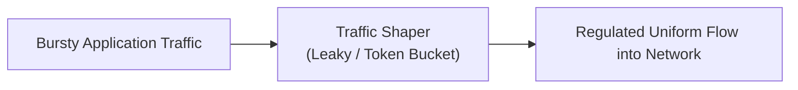
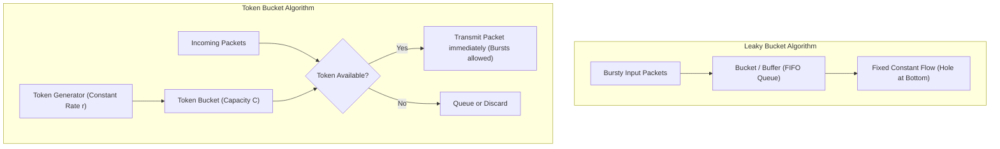

Application processes generate network traffic at bursty, unpredictable rates (alternating between periods of silence and high-volume bursts)[cite: 1]. Injecting bursty traffic directly into network links causes buffer overflows and packet drops at intermediate routers[cite: 1].

> [!definition] Traffic Shaping
> Traffic shaping regulates the rate and volume of traffic transmitted into the network, smoothing out bursty transmission spikes into a steady, predictable output stream[cite: 1].

### Leaky Bucket vs. Token Bucket

| Dimension | Leaky Bucket | Token Bucket |
| :--- | :--- | :--- |
| **Output Rate** | Strictly fixed, constant rate[cite: 1]. | Variable average rate; permits controlled bursts up to bucket capacity. |
| **Burst Handling** | Eliminates all bursts; excess packets are queued or discarded[cite: 1]. | Allows traffic bursts if enough tokens have accumulated. |
| **Data Queuing** | Packets are stored directly in a FIFO queue and leak out at a constant rate[cite: 1]. | Tokens are stored; packets are transmitted immediately upon consuming a token. |
| **Token Mechanism** | No tokens; operates purely on water-in-a-leaky-bucket physics[cite: 1]. | Tokens generate at rate $r$; bucket holds up to $C$ tokens. |
