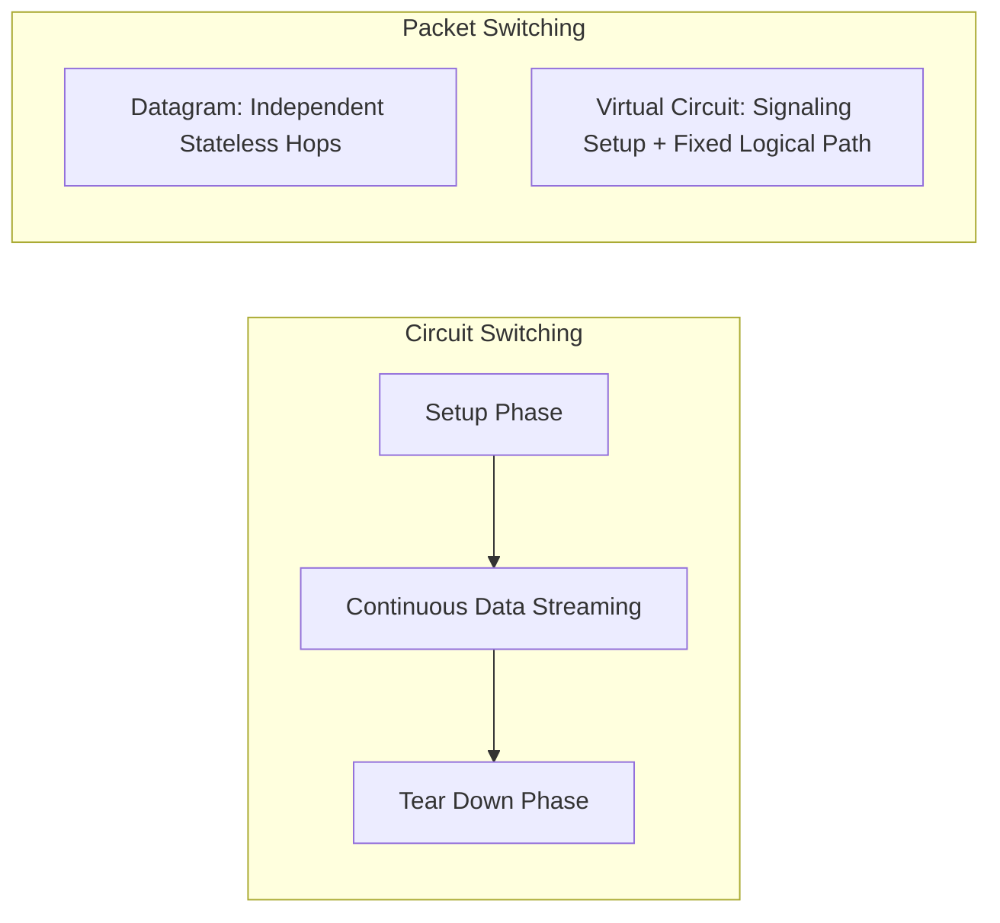

> [!definition]
> Network switching manages how intermediate nodes share link bandwidth between sources and destinations[cite: 2].
> - **Circuit Switching:** A three-phase operational model (Circuit Setup $\to$ Data Transfer $\to$ Circuit Teardown) establishing an exclusive physical circuit[cite: 1, 2].
> - **Packet Switching:** Connectionless (Datagram) or logical-connection (Virtual Circuit) forwarding where packets contain header metadata and compete dynamically for link capacity[cite: 2].

| Parameter | Circuit Switching | Datagram Packet Switching | Virtual Circuit (VC) Switching |
| :--- | :--- | :--- | :--- |
| **Operational Phases** | Setup, Transfer, Teardown[cite: 1, 2] | Single phase: Data transfer[cite: 2] | Setup, Transfer, Teardown[cite: 2] |
| **Dedicated Path** | Fixed physical path[cite: 1, 2] | No dedicated path (dynamic routing)[cite: 2] | Fixed logical virtual channel[cite: 2] |
| **Store & Forward Delay** | Absent (streamed physically)[cite: 2] | Mandatory at every intermediate hop[cite: 2] | Mandatory store & forward per packet |
| **Resource Reservation** | Full bandwidth reserved upfront[cite: 2] | Dynamic / No reservation[cite: 2] | Virtual circuit buffers/slots allocated[cite: 2] |
| **Packet Sequencing** | Strictly in-order[cite: 2] | Possible out-of-order arrival[cite: 2] | Guaranteed in-order arrival[cite: 2] |
| **Header Overhead** | None during data transfer[cite: 2] | High (full source/destination IP per packet)[cite: 2] | Low (small Virtual Circuit ID - VCID)[cite: 2] |
| **Primary Layer** | Physical Layer (Layer 1)[cite: 2] | Network Layer (Layer 3)[cite: 2] | Data Link Layer (ATM / Frame Relay)[cite: 2] |

> [!formula]
> 1. **Circuit Switching Total Latency:**
>    $$T_{\text{circuit}} = T_{\text{setup}} + \frac{L_{\text{msg}}}{B} + K \cdot \frac{d}{v} + T_{\text{teardown}}$$
> 2. **Packet Switching Total Latency ($N$ packets across $K$ hops):**
>    $$T_{\text{packet}} = K \cdot (T_t + T_p) + (K - 1)(T_{\text{proc}} + T_{\text{queue}}) + (N - 1) \cdot T_t$$
> 3. **Optimal Packet Size ($P$):** Given raw message size $M$, header size $h$, and $K$ hops[cite: 2]:
>    $$p_{\text{payload}} = \sqrt{\frac{M \cdot h}{K - 1}} \implies P_{\text{optimal}} = p_{\text{payload}} + h$$

> [!trap]
> In circuit switching, bandwidth is tied up for the entire call duration whether data is moving or idle[cite: 2]. In datagram packet switching, no bandwidth is wasted by idle senders, but each packet suffers independent per-hop routing and queuing delays[cite: 2].

> [!question]
> **Q:** What is the correct chronological sequence of phases executed in circuit switching?  
> (A) Data Transfer $\to$ Circuit Establishment $\to$ Teardown  
> (B) Circuit Establishment $\to$ Data Transfer $\to$ Circuit Disconnect  
> (C) Routing Setup $\to$ Packet Verification $\to$ Teardown  
> (D) Carrier Sense $\to$ Reservation $\to$ Transmission  
>
> **Answer:** **(B)**[cite: 1]  
> **Explanation:**  
> Circuit switching mandates an end-to-end signaling exchange to reserve resources (Establishment), continuous bitstream streaming (Transfer), and channel release signaling (Disconnect / Teardown)[cite: 1, 2].
