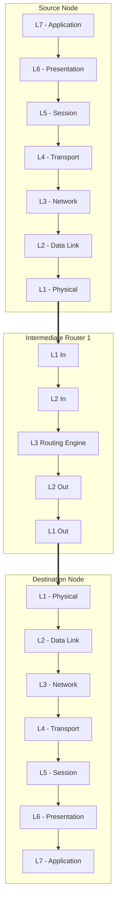

> [!revision] Revision
> The **Open Systems Interconnection (OSI) Reference Model** is a 7-layer theoretical framework established by the ISO to enable interoperability across heterogeneous computing systems[cite: 1, 2]. Data units scale down from messages to segments, packets, frames, and bits across the physical transmission medium[cite: 2].

| Layer                  | Protocol Data Unit (PDU) | Primary Responsibilities & Keywords                                                                                        | Key Protocols / Mechanisms                   |
| :--------------------- | :----------------------- | :------------------------------------------------------------------------------------------------------------------------- | :------------------------------------------- |
| **7. Application**     | Data / Message           | User interface, network access APIs, virtual terminal[cite: 1, 2]                                                          | HTTP, SMTP, FTP, DNS, Telnet[cite: 2]        |
| **6. Presentation**    | Data                     | Syntax/semantics translation, data compression, encryption/decryption[cite: 1, 2]                                          | SSL/TLS, ASCII, EBCDIC, MIME[cite: 2]        |
| **5. Session**         | Data                     | **Dialog control** (simplex/half-duplex/full-duplex), **token management**, **synchronization check-pointing**[cite: 1, 2] | NetBIOS, RPC, PPTP                           |
| **4. Transport**       | Segment                  | **End-to-end / Process-to-process delivery**, service point addressing (ports), flow control, error control[cite: 1, 2]    | TCP, UDP, SCTP[cite: 2]                      |
| **3. Network**         | Packet / Datagram        | **Host-to-host connectivity**, logical addressing (IP), routing, forwarding, fragmentation[cite: 2]                        | IPv4, IPv6, ICMP, OSPF, RIP[cite: 2]         |
| **2. Data Link (DLL)** | Frame                    | **Hop-to-hop / Node-to-node framing**, physical addressing (MAC), flow/error control, access control[cite: 2]              | Ethernet (IEEE 802.3), PPP, CSMA/CD[cite: 2] |
| **1. Physical**        | Bit stream               | Physical medium specs (electrical/optical), bit timing, bit rate control, transmission mode[cite: 2]                       | Manchester encoding, RJ-45, V.35[cite: 2]    |

> [!theorem]
> In an OSI traversal involving $N$ intermediate Layer-3 hops (routers) between a Source and a Destination:
> 1. **End-to-End Layers (Layers 4 to 7):** Visited exactly **1 time** at the Source (downward) and **1 time** at the Destination (upward)[cite: 1]. Intermediate routers do not process transport/application headers[cite: 1].
> 2. **Network Layer (Layer 3):** Visited at Source, Destination, and once per intermediate router[cite: 1].
> 3. **Data Link Layer (Layer 2) & Physical Layer (Layer 1):** Visited twice per router (inbound decapsulation + outbound encapsulation), once at Source egress, and once at Destination ingress[cite: 1].

> [!revision] Revision
> For a path with $K$ intermediate Layer-3 routers between Source and Destination:
> $$\text{Total Network Layer Visits} = K + 2$$
> $$\text{Total Data Link Layer Visits} = 2K + 2$$

> [!trap]
> Never confuse **Node-to-Node** delivery (responsibility of Layer 2 / DLL) with **Host-to-Host** delivery (Layer 3 / Network) and **Process-to-Process / End-to-End** delivery (Layer 4 / Transport)[cite: 1, 2]. Also, intermediate forwarding nodes (routers) only traverse up to Layer 3; they do not open TCP/UDP segments unless running transparent application gateways or NAT[cite: 1].

> [!question]
> **Q:** An application sends a message from Source host $S$ to Destination host $D$ passing through 2 intermediate Layer-3 routers ($R_1$ and $R_2$). How many times will the packet visit the Network Layer and Data Link Layer, respectively?  
> (A) Network Layer: 4, Data Link Layer: 4  
> (B) Network Layer: 2, Data Link Layer: 6  
> (C) Network Layer: 4, Data Link Layer: 6  
> (D) Network Layer: 3, Data Link Layer: 4  
>
> **Answer:** **(C)**  
> **Explanation:**  
> Using $K = 2$:  
> - $\text{Network Layer Visits} = K + 2 = 2 + 2 = 4$ (Source, $R_1$, $R_2$, Destination)[cite: 1].  
> - $\text{Data Link Layer Visits} = 2K + 2 = 2(2) + 2 = 6$ (Source outbound, $R_1$ in, $R_1$ out, $R_2$ in, $R_2$ out, Destination inbound)[cite: 1].
